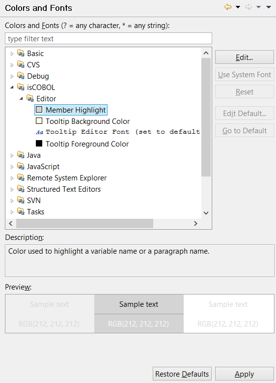
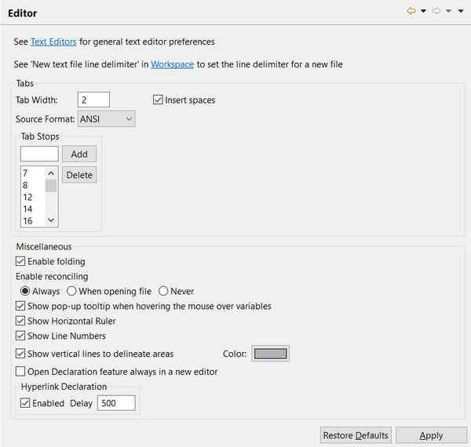
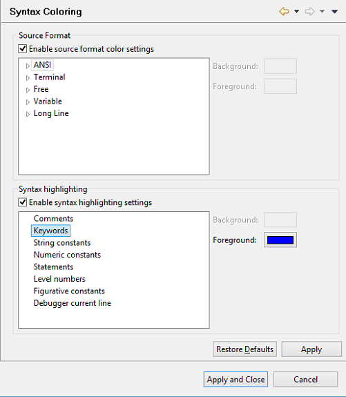
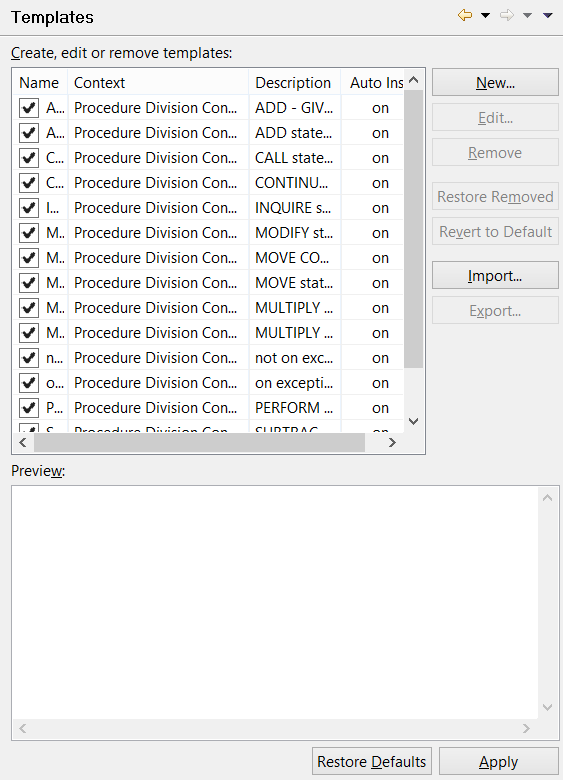
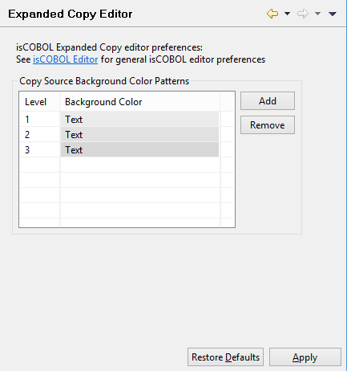
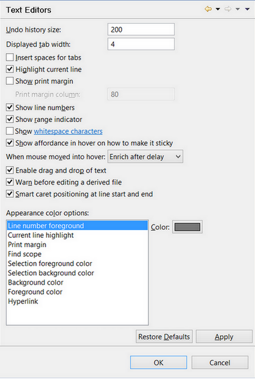

### Setting Editor preferences

```cobol
Preferences: General -> Appearence -> Colors and Fonts
```

The general Colors and Fonts panel allows you to configure fonts and colors for the variables highlight and tool-tips shown in the Code Editor

```cobol
Preferences: isCOBOL -> Editor
```

The Editor panel allows you to configure tab spacing, syntax coloring and templates for the code completion feature. It also allows you to activate the [Horizontal Ruler](../isCOBOL%20IDE/Chapter1-isCOBOL_IDE.3.046.html#ww1082158 "Code Editor").



**Note** - folding (ability to expand and collapse blocks of code) and reconciling (real time syntax checking) may cause long response times when editing huge source files (e.g. a source file with over 15.000 lines of code). If you experience bad response times while editing huge source files, you may think about disabling these features. Reconciling can be also performed on demand by pressing CTRL+R in the code editor or by right clicking on the line numbers bar on the left of the editor and choosing "Force reconciling" from the pop-up menu.





```cobol
Preferences: isCOBOL -> Expanded Copy Editor
```

In this panel you can configure the background color used to distinguish copy files from the rest of the source code in the [Copy View Editor](../isCOBOL%20IDE/Chapter1-isCOBOL_IDE.3.047.html#ww1255623 "Copy View Editor").



```cobol
Preferences: General -> Editors -> Text Editors
```



In this panel you can configure general editor settings that will be applied to every text editor installed in Eclipse, including the isCOBOL Editor.
