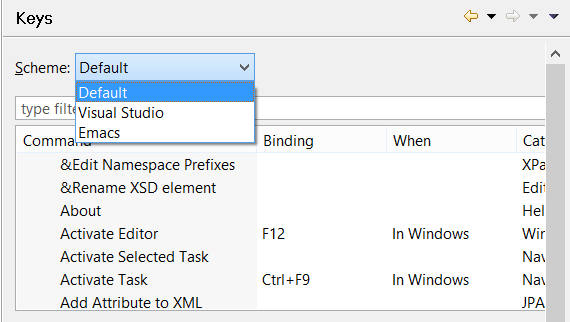

### Setting keyboard shortcuts

```cobol
Preferences: General -> Keys
```

The “Keys” panel allows you to see and change keyboard shortcuts. You can choose between three different presets and also customize them if you need to.


