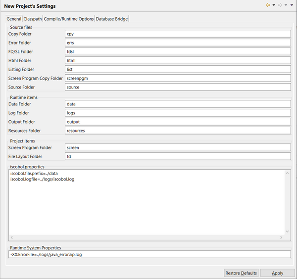
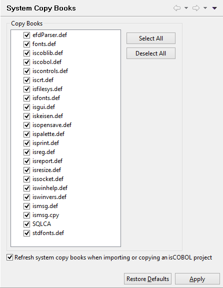

### Setting the Project initial settings

```cobol
Preferences: isCOBOL -> New Project’s settings
```

The “New Project’s settings” panel allows you to customize the name of the Project folders, a list of configuration properties that should always be used for Project programs, and a list of Java options that must be used at program launch.



You can also set a default Classpath for your projects. The jars and folder listed here will be added to the Classpath of your projects, extending the default Classpath that includes just the isCOBOL runtime libraries. See [Screen Designer](../isCOBOL%20IDE/Chapter1-isCOBOL_IDE.3.078.html#ww1316708 "Screen Designer") for further details.

In addition, compile and runtime options can be set. See [Compile and Runtime options](../isCOBOL%20IDE/Chapter1-isCOBOL_IDE.3.074.html#ww1270197 "Compile and Runtime options") for a complete description of these options. If you change the name of any of the directories in this panel, the corresponding compiler option is updated.

**Note** - if you remove options that specify a folder (i.e. -od, -ef, -lf...) from this panel, then the corresponding folder will not be created when you create a new project.

In this panel you can also configure DatabaseBridge subroutines generation. See [Generating DatabaseBridge subroutines](../isCOBOL%20IDE/Chapter1-isCOBOL_IDE.3.087.html#ww1096701 "Generating DatabaseBridge subroutines") for details about this feature.

These settings will be applied to the next project you create; you will be then allowed to edit them in each single project by clicking on *Project* menu and selecting *Properties*.

```cobol
Preferences: isCOBOL -> System Copy Books
```



This panel allows you to choose which system copy books must be included by default in the project cpy folder.

You can keep your copybooks updated by checking the "Refresh system copy books when importing or copying an isCOBOL project" box. Having this checked means that when you import or copy an isCOBOL project, existing copybooks are replaced with current versions. Unchecking this box will cause only the missing copybooks to be loaded.
