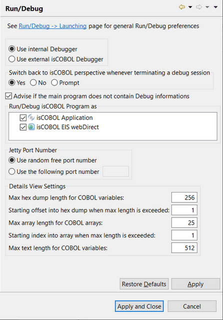

### Setting Run/Debug options

```cobol
Preferences: isCOBOL -> Run/Debug
```



The ”Run/Debug” panel allows you to configure options for the *Run As* and *Debug As* functions.

In this panel is also possible to configure the port used by Jetty, an internal servlet container that the IDE uses to run programs as ‘isCOBOL EIS WebDirect’ or ‘isCOBOL EIS Servlet.’ By default, a random port is used at each launch. If you want the IDE to use always the same port, here you can configure it.

Unchecking either *isCOBOL Application* or *isCOBOL EIS WebDirect* causes the other option to be used directly when the user run or debug a program.
