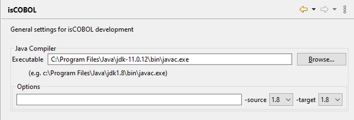

### Verifying Java availability

```cobol
Preferences: isCOBOL
```

Before starting to use the IDE for the development and maintenance of isCOBOL programs, it is recommended that you verify the association of an existing JDK to the IDE. This kind of setting is available as soon as *isCOBOL* is selected from the tree.

The *Executable* field should point to the JDK chosen during the installation process. If it’s empty or if you want to use a different JDK, provide a new path.

At this point you can also specify javac options that should be used at compile time, an alternate isCOBOL runtime library and the use of message boxes to inform the user about compiling result. By default, the *-source* option and the *-target* option are set to generate classes that are compatible with the minimum Java version supported by isCOBOL. These options are overridden by [\-jo=Option...](../SDK%20User's%20Guide/Chapter1-CompilerRuntime.05.07.html#ww1027608 "Compiler Options") that can be set in [Compile and Runtime options](../isCOBOL%20IDE/Chapter1-isCOBOL_IDE.3.074.html#ww1270197 "Compile and Runtime options") of each project.


