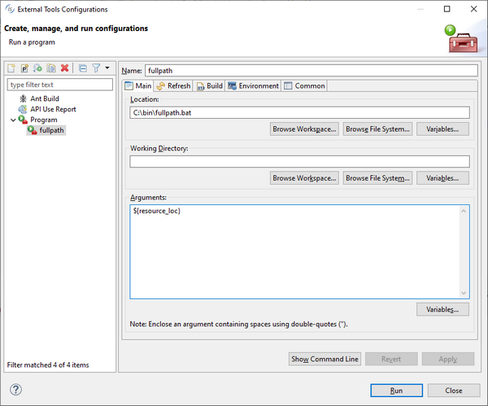

# External Tools

External tools allow you to configure and run programs, batch files, Ant buildfiles, and others. You can save these external tool configurations and run them at a later time. Output from external tools is displayed in the [Console](./The-isCOBOL-IDE-Perspective/Console) view.

Several variables are available when you configure an external tool. These variables are automatically expanded each time the external tool is run. By clicking on the Variables button in the external tool configuration you obtain a pop-up dialog that lists and describes the available variables. The dialog also allows you to create custom variables that will be added to the list.

These are the most common variables:

| Variable | Description |
| --- | --- |
| $\{workspace_loc} | The absolute path on the system's hard drive to IDE’s workspace directory |
| $\{project_loc} | The absolute path on the system's hard drive to the currently selected resource's project or to the project being built if the external tool is run as part of a build. |
| $\{resource_loc} | The absolute path on the system's hard drive to the currently selected resource. |
| $\{project_path} | The full path, relative to the workspace root, of the currently selected resource's project or of the project being built if the external tool is run as part of a build. |
| $\{resource_path} | The full path, relative to the workspace root, of the currently selected resource. |
| $\{project_name} | The name of the currently selected resource's project or of the project being built if the external tool is run as part of a build. |
| $\{resource_name} | The name of the currently selected resource. |

## Example

For testing purposes you can create a command that prints the full path of a resource. The below steps are applicable to the Windows platform:

1. create a batch file named fullpath.bat with the following code:

```cobol
@echo off
echo %1
```

2. follow these steps to configure an external tool that uses the above bat:

a. click on *Run* in the IDE’s menu bar

b. choose *External Tools* from the pop-up menu

c. choose *External Tools Configurations*...

d. select *Program* in the tree on the left and click the *New Configuration* button

e. fill the form as follows then click *Apply* and *Close*:



3. follow these steps to test your command:

a. select any item (folder or file) in your project, by clicking on it in the [isCOBOL Explorer](./The-isCOBOL-IDE-Perspective/isCOBOL-Explorer)

b. click on *Run* in the IDE’s menu bar

c. choose *External Tools* from the pop-up menu

d. choose 1 *fullpath*

The full path of the selected item appears in the [Console](./The-isCOBOL-IDE-Perspective/Console) view.
