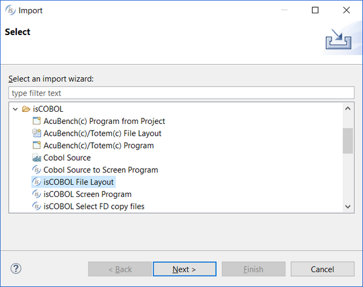

## Adding an Existing File Layout to the Current Project

isCOBOL IDE can also import an existing File Layout that is part of another project or workspace into the current project. To import an existing File Layout, right click on the project name in the [isCOBOL Explorer](../The-isCOBOL-IDE-Perspective/isCOBOL-Explorer) area and choose *Import* from the pop-up menu. Then select *isCOBOL / isCOBOL File Layout* from the tree.

A wizard procedure will guide you in finding existing idl files to be imported into the project.
