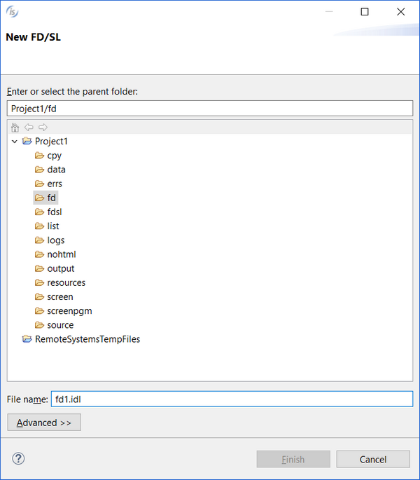
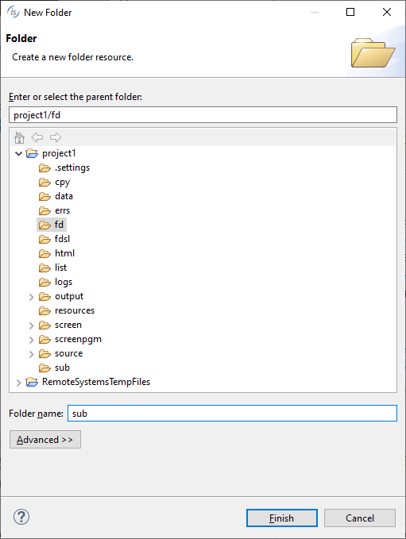
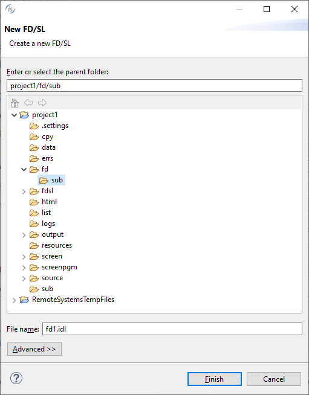

## Creating a new File Layout

To create a new File Layout, right click on the project name in the [isCOBOL Explorer](../The-isCOBOL-IDE-Perspective/isCOBOL-Explorer) area and choose *New / FD/SL* from the pop-up menu. The IDE will ask for fd name. Ensure that the name terminates with the .idl extension and that it’s placed in the *fd* folder of the project.

### Creating a new File Layout in a subfolder

The IDE allows you to create subfolders in the *fd* folder to isolate some File Layout from the others.

To create a subfolder, right click on the project name in the [isCOBOL Explorer](../The-isCOBOL-IDE-Perspective/isCOBOL-Explorer) area and choose *New / Folder* from the pop-up menu. The IDE will ask for folder name. Ensure that it’s placed in the *fd* folder of the project.

From now on, when you create a new File Layout, you can choose whether to place it in the *fd* folder or in the *sub* folder. You can create more than one subfolder, sibling to or nested in the previous ones.

