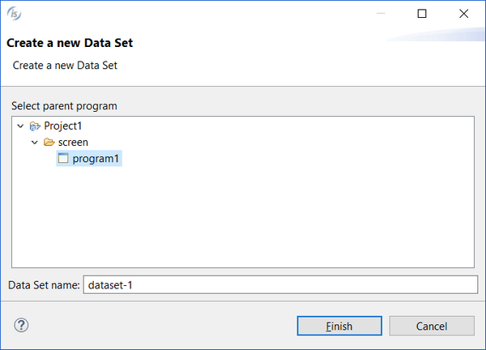
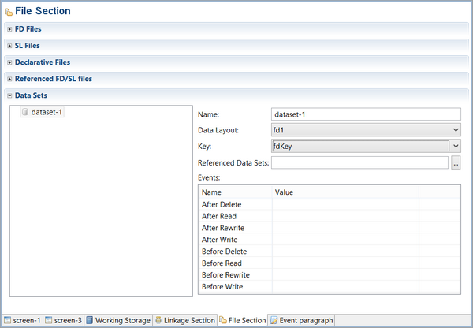

### Creating a new Dataset

To create a new Dataset for the program, right click on the program name in the [isCOBOL Explorer](../../The-isCOBOL-IDE-Perspective/isCOBOL-Explorer), select *New / Data Set* from the pop-up menu.

A panel will prompt you for the name of the Dataset and the program that will host it.

Once the Dataset has been added to the program, you can choose the following in the File Section or the Screen Program:

- Which fd is associated with the Dataset.
- Which key will be used by START and READ statements generated by the IDE.
- Which paragraphs must be executed before and after the standard I/O operations (optional).

#### FD Files

This editor has two pages: *Graphical* and *Cobol Editor*.

In the *Graphical* page you can import or link copybooks that include code for the program’s FILE SECTION.

Click on the “Import Copy File” button to import a copy file. The content of the copyfile will be generated in the program.

Click on the “Link Copy File” button to link a copy file. A COPY statement to that file will be generated in the program.

Click on the “Remove Copy File” button to remove a copy file previously imported or linked.

In the *Cobol Editor* page you can type COBOL code by hand. The code you type here will be generated at the bottom of the FILE SECTION in the program.

#### Sl Files

This editor has two pages: *Graphical* and *Cobol Editor*.

In the *Graphical* page you can import or link copybooks that include code for the program’s FILE-CONTROL paragraph.

Click on the “Import Copy File” button to import a copy file. The content of the copyfile will be generated in the program.

Click on the “Link Copy File” button to link a copy file. A COPY statement to that file will be generated in the program.

Click on the “Remove Copy File” button to remove a copy file previously imported or linked.

In the *Cobol Editor* page you can type COBOL code by hand. The code you type here will be generated at the bottom of the FILE-CONTROL paragraph in the program.

#### Declarative Files

This editor has two pages: *Graphical* and *Cobol Editor*.

In the *Graphical* page you can import or link copybooks that include code for the DECLARATIVES section.

Click on the “Import Copy File” button to import a copy file. The content of the copyfile will be generated in the program.

Click on the “Link Copy File” button to link a copy file. A COPY statement to that file will be generated in the program.

Click on the “Remove Copy File” button to remove a copy file previously imported or linked.

In the *Cobol Editor* page you can type COBOL code by hand. The code you type here will be generated at the bottom of the DECLARATIVES section in the program.

#### Referenced FD/SL files

This section includes the files included in referenced datasets.

#### Data Sets

In this section you can associate a specific file layout to your dataset as well as referencing other datasets in the Screen Program.
