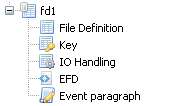

## File Layout Structure

File Definition: contains the description of the file and the record.

Key: contains the description of the keys.

I/O Handling: configures which paragraphs must be generated for the I/O.

EFD: sets EFD directives for record fields.

Event Paragraph: contains user defined paragraphs for I/O handling.

To generate FD/SL copybooks right click on the File Layout name and select “Generate FD/SL” from the pop-up menu.

To view the generated copybooks right click on the File Layout and select “View *fdname*.fd”, “View *fdname*.sl” or “View *fdname*.prc” from the pop-up menu.
