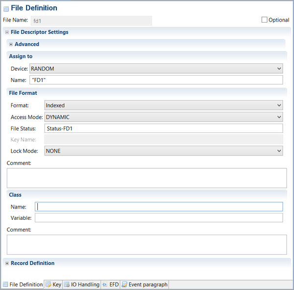

## File and Record Definition

File Name: Logical name of the file. This cannot be changed once the File Layout has been created.

Optional: Specifies whether the OPTIONAL clause should be generated in the SELECT statement for the file.

Advanced: Optional advanced file settings.

Device: Device of the file, choose between INPUT, OUPTUT, I/O, RANDOM, DISC, CONSOLE.

Name: Physical name of the file. If included between quotes is treated as constant string, otherwise its treated as a variable.

Format: Organization of the file. Choose between SEQUENTIAL, INDEXED or RELATIVE.

Access mode: Defines the access mode of the file. Choose between SEQUENTIAL, DYNAMIC or RANDOM .

File Status: Name of the file status variable. If omitted, no file status will be associated with the file.
