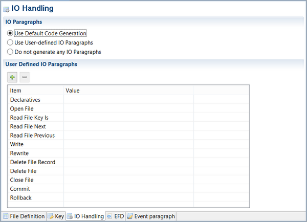

### I/O Handling

Three options are available in the I/O Handling tab:

- Use Default Code Generation: The IDE will automatically generate paragraphs for I/O handling (default behavior)
- Use User-Defined I/O Paragraphs: The IDE will generate paragraphs written by the user in the Event paragraph section of the File Layout.
- Do not generate any I/O Paragraphs: no Procedure Division code will be generated for the file
