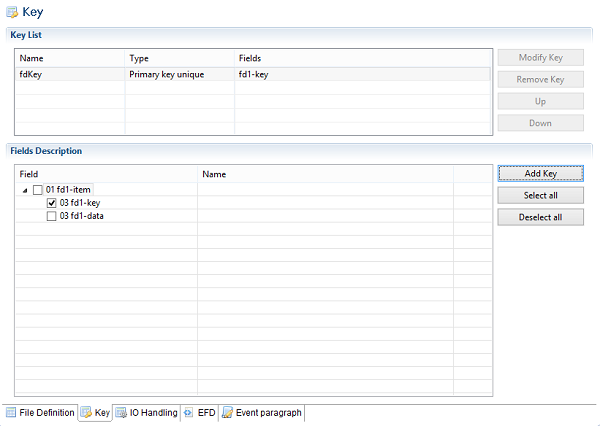

### Key Definition

To add a new key to the file:

1. select the fields that will be part of the key from the Fields Description. Double click in the Name column in order to display possible field name extensions.
2. click on the “Add Key” button
3. Edit the columns of the Key List to set key name and type
4. When more than one key has been defined, use “Up” and “Down” buttons to change the keys definition order
