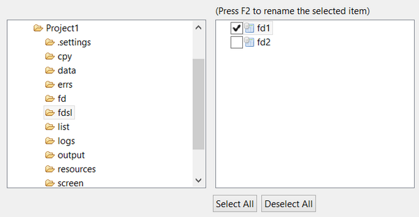

## Generating File Layouts from Existing Copybooks

isCOBOL IDE is able to generate a File Layout by importing existing fd and sl copybooks.

1. Right click on the project name in the [isCOBOL Explorer](../The-isCOBOL-IDE-Perspective/isCOBOL-Explorer) area.
2. Choose *Import* from the pop-up menu.
3. Choose *isCOBOL / isCOBOL Select FD copy files* from the tree.
4. Browse to find the folder containing the copybooks, check the ones that you wish to import and click *Finish*.
5. The files will appear between your FDs.
