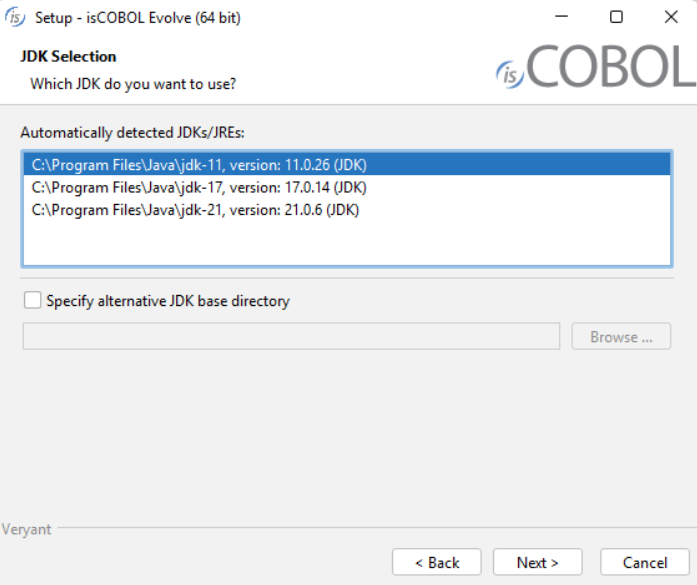
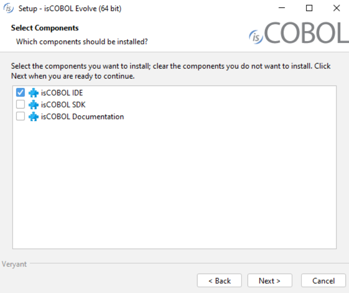
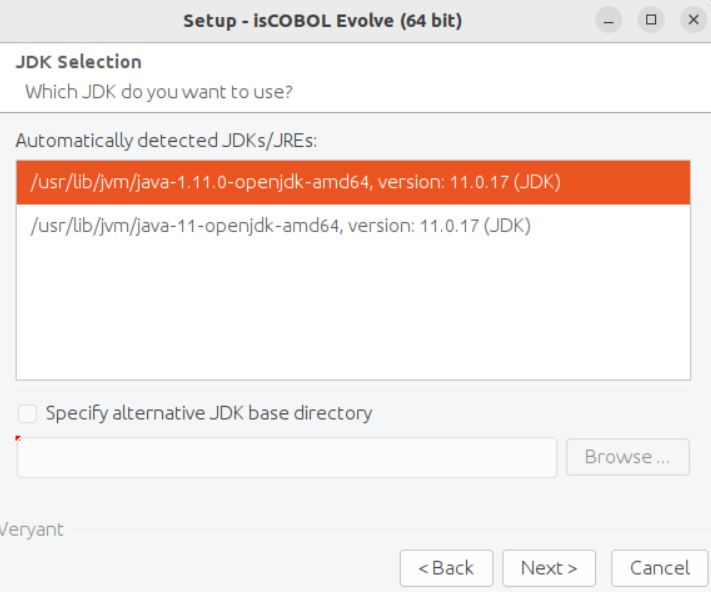
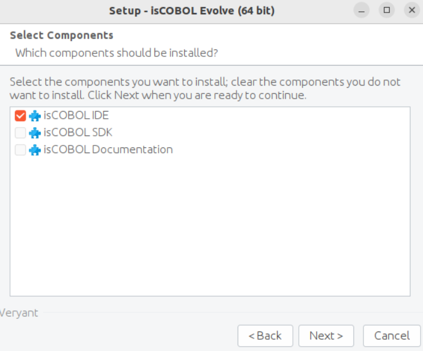
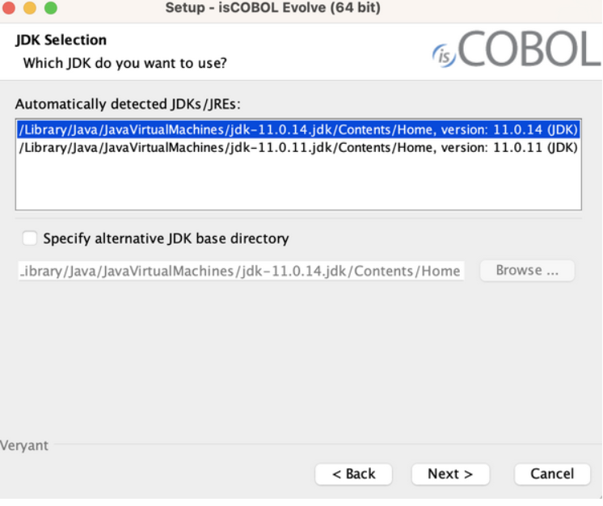
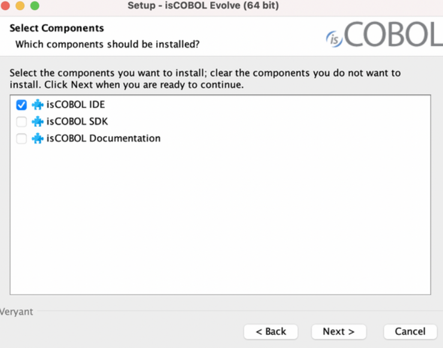
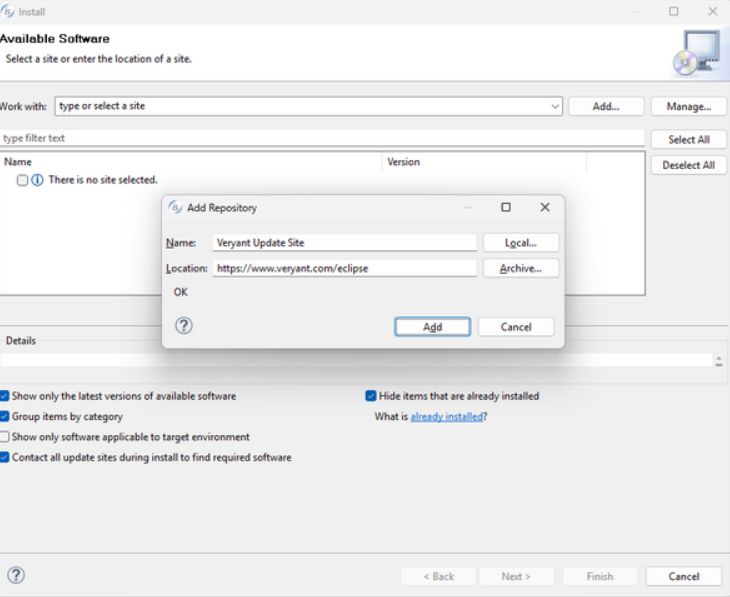
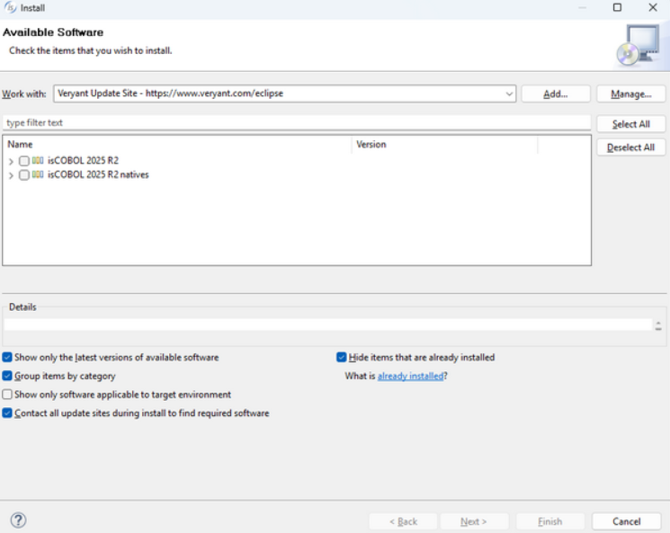

## Download and install isCOBOL Evolve

### Windows

1. If you haven't already done so, [Download and install the Java Development Kit (JDK)](/pages/is-cobol-IDE/Getting-Started/download-JDK).
2. Go to [https://support.veryant.com](https://support.veryant.com).
3. Sign in with your User ID and Password.
4. Click on the "Download Software" link.
5. Scroll down to the list of files for Windows x64 64-bit. Select isCOBOL_Evolve2025_2_n_Windows_64.msi, where n is the build number.
6. Run the downloaded installer to install the files.
7. Select your JDK when prompted

8. Choose if you wish to install only the IDE or also the isCOBOL SDK. Installing the isCOBOL SDK will allow you to compile, run and debug from a command prompt, outside of the IDE.

9. Follow the wizard procedure to the end. In the process you will be asked to provide the installation path ("C:\Veryant" by default) and license keys. You can skip license activation and perform it later, as explained in [Activate the License](/pages/is-cobol-IDE/Getting-Started/activate).

#### Quiet mode

The isCOBOL Evolve setup supports the msi quiet mode. Settings can be driven with a response file.

A response file is a text file with name-value pairs that represent installer variables.

A response file is generated automatically after an installation is finished. The generated response file is found in the *.install4j* directory of the isCOBOL Evolve and is named *response.varfile*.

When an installer is executed, it checks whether a file with the same name and the *.varfile* extension can be found in the same directory and loads that file as the response file. For example, if an installer is named *foo_setup.msi* on Windows, the response file next to it has to be named *foo_setup.varfile*.

For more information about msi setups and their command line options, see [Microsoft Standard Installer Command-Line Options]().

### Linux

1. If you haven't already done so, [Download and install the Java Development Kit (JDK)](/pages/is-cobol-IDE/Getting-Started/download-JDK).
2. Go to [https://support.veryant.com](https://support.veryant.com).
3. Sign in with your User ID and Password.
4. Click on the "Download Software" link.
5. Scroll down to the list of files for Linux x64 64-bit. Select isCOBOL_Evolve2025_2_n_Linux_64.sh, where n is the build number.
6. Run the downloaded installer to install the files, e.g.

```cobol
sh isCOBOL_Evolve2025_2_*_Linux_64.sh
```

7. Select your JDK when prompted

8. Choose if you wish to install only the IDE or also the isCOBOL SDK. Installing the isCOBOL SDK will allow you to compile, run and debug from a command prompt, outside of the IDE.

9. Follow the wizard procedure to the end. In the process you will be asked to provide the installation path ("$HOME/veryant" by default) and license keys. You can skip license activation and perform it later, as explained in Activate the License.

### MacOSX

1. If you haven't already done so, [Download and install the Java Development Kit (JDK)](/pages/is-cobol-IDE/Getting-Started/download-JDK).
2. Go to [https://support.veryant.com](https://support.veryant.com).
3. Sign in with your User ID and Password.
4. Click on the "Download Software" link.
5. Scroll down to the list of files for Mac OS 64-bit. Select isCOBOL_Evolve2025_2_n_MacOsx_64.dmg, where n is the build number.
6. Run the downloaded installer to install the files.
7. Select your JDK when prompted

8. Choose if you wish to install only the IDE or also the isCOBOL SDK. Installing the isCOBOL SDK will allow you to compile, run and debug from a command prompt, outside of the IDE.

9. Follow the wizard procedure to the end. In the process you will be asked to provide the installation path ("/Applications" by default) and license keys. You can skip license activation and perform it later, as explained in [Activate the License](/pages/is-cobol-IDE/Getting-Started/activate).

### Other

For other platforms or for existing Eclipse environments, it is possible to install the isCOBOL IDE plugins using the Eclipse “Install New Software” feature.

It’s good practice to use an Eclipse environment of the same version as the one which isCOBOL IDE is based on. The current isCOBOL IDE is based on Eclipse 2023-09 (4.29).

To install the isCOBOL IDE plugins in an existing Eclipse environment:

1. Click on *Help* menu and choose *Install New Software…*
2. Click on the *Add…* button
3. Fill in the fields as follows:

4. proceed in the wizard procedure and choose isCOBOL from the list of available products:


### How to install a previous release

By filling the Location field with ["https://www.veryant.com/eclipse"](https://www.veryant.com/eclipse) you obtain the latest IDE release. In order to download previous releases, use this kind of url instead: ["https://www.veryant.com/eclipse/older/v"](https://www.veryant.com/eclipse/older/v). For example, in order to download isCOBOL IDE 2024 R2, use ["https://www.veryant.com/eclipse/older/v2024R2"](https://www.veryant.com/eclipse/older/v2024R2).
