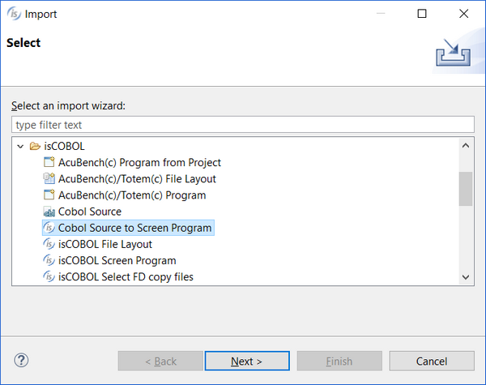
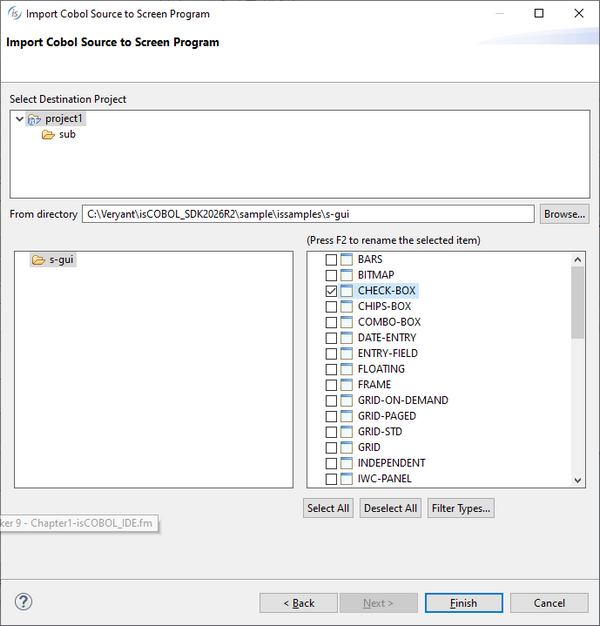

# Importing a Program with Screen Section

isCOBOL IDE allows you to import programs with Screen Section in order to maintain their screen through the Screen Designer. Programs source files are read from disk and transformed into isCOBOL Screen Programs.

Before performing this kind of import, the following steps have to be followed:

1. Ensure that the IDE is set to generate code in the same format of the program you’re going to import. This setting is available by choosing *Window* in the menu bar, then *Preferences* and eventually selecting *isCOBOL > Code Generator* from the tree. The "Source Format" setting must be "ANSI" or "Terminal" according to the format of the source file(s) you’re going to import.
2. In the *Properties* of the project that will host your program, change compiler options by activating all the flags that are necessary for the compilation of the program you’re going to import. For example, if the source code contains the syntax RECORDING MODE IS V, activate the -cv option. Also ensure that the -sp option contains all the necessary paths to find the copybooks declared in the program; these paths must be physical paths selected from the file system, Eclipse aliases are currently not considered by the import logic.
3. If the program you’re going to import uses files, ensure that these files are described in separate copybooks (sl and fd copybooks) and import these copybooks as described in [Generating File Layouts from Existing Copybooks](./File-Layouts/Generating-File-Layouts-from-Existing-Copybooks).

At this point you can proceed with the import of the program with Screen Section.

1. Right click on the project name in the [isCOBOL Explorer](./The-isCOBOL-IDE-Perspective/isCOBOL-Explorer) area.
2. Choose *Import* from the pop-up menu.
3. Choose *Cobol Source* to *Screen Program* from the tree
4. Select the destination project or one of its subfolders, then browse to find the source files, check the ones that you wish to import and click *Finish*

By default, only files with “.cbl” extension are considered. If your source files have different extensions, click on the *Filter Types*... button to configure it.

5. The program will appear in the Structural View.

This kind of Import is subjected to the following limitations:

1. The IDE doesn’t know window dimensions, so in the Screen Designer, the properties Lines and Size might not be set correctly. If so, you can edit them to correct window dimensions.
2. Coordinates and size properties that are set with variables in the imported program are set to their default in the Screen Designer. In this case the layout of Screen in the Designer might not match the layout you see at runtime.
3. Bitmaps and fonts referenced in the imported program are not shown in the Screen Designer, despite they appear correctly when you run the program.
4. Constant data items (level 78) are replaced by their values in controls properties.
