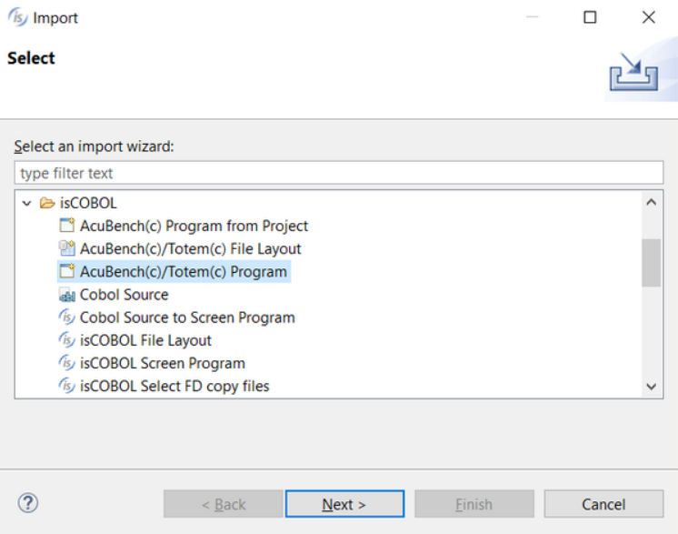
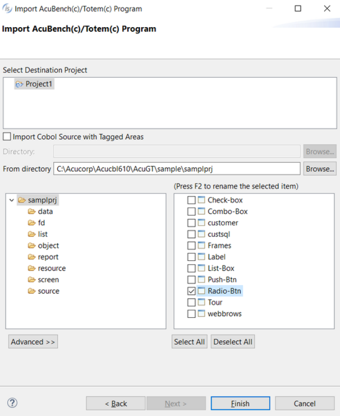
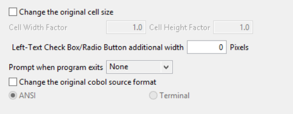
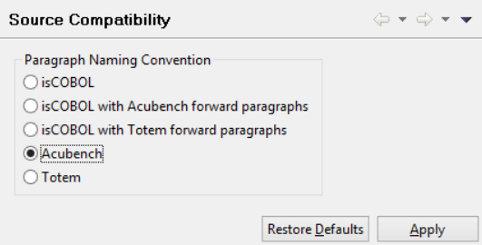

# Importing programs from AcuBench

AcuBench(TM) is the integrated development environment member of the extend(TM) family of Acucorp solutions.

The following files can be imported:

- psf: All items described in AcuBench program files are imported.
- dlt: Data layouts can be imported as well.

The following files cannot be imported:

- stf: The screen is imported along with the program (psf). It cannot be imported separately.
- pjt: AcuBench project files are not recognized.
- wtf: The report is imported along with the program (psf). It cannot be imported separately.

**Note** - AcuBench generated paragraphs are maintained in the source code, but their content is moved to the corresponding IDE generated paragraph and they just jump to it.

The best practice for importing AcuBench programs and their items consists of the following steps:

1. link custom copy books, if any
2. import file layouts
3. import programs

To import an AcuBench file layout, refer to [Importing a Data Layout from AcuBench](), discussed below.

To import an AcuBench program:

1. Right click on the project name in the [isCOBOL Explorer]() area.
2. Choose *Import* from the pop-up menu.
3. Choose *isCOBOL / AcuBench(c)/Totem(c) Program* from the tree.

*Note* - the *AcuBench(c)/Totem(c) Program* option reads psf files from disk. This is useful for standard AcuBench projects that use default settings. If your AcuBench project include some customization made at project level (e.g. different file extensions for the generated source files), then you might prefer the option *AcuBench(c)* Program from Project, that retrieves the list of psf files and their settings by reading the pjt file.
4. Browse to find the psf files, check the ones that you wish to import.

If the programs included custom code written outside of the tagged areas, check the option Import Cobol Source with Tagget Areas and provide the directory where the cbl files are stored.
5. Before clicking on the *Finish* button you can optionally set one of the advanced options, such as changing the source format, setting the action to be performed at program exit or altering the original cell size. Click on the *Advanced* >> button to show this panel:

6. After clicking on *Finish*, the program will appear in the Structural View.

## Version compatibility

Only items from AcuBench version 5.0 or greater are supported.

Importing items from previous AcuBench versions may lead to unpredictable results.

## Changing the paragraph naming convention

Internal paragraphs such as “Acu-Initial-Routine” are maintained as they are. If you prefer to have isCOBOL names such as “is-initial-routine” for them, or if you prefer to have both names with Acu’s paragraphs redirecting to isCOBOL’s paragraphs (as done in previous versions of the isCOBOL IDE)

1. right click on the program name in the Structural View
2. choose *Properties*
3. choose *Screen Program* / *Code Generation* / *Source Compatibility*
4. select the paragraph naming convention that you prefer
5. 

## AcuBenchPrint

While the AcuBench reports are executed as HTML files to be printed via IE ActiveX using the AcuBenchPrint.dll wrapper, the isCOBOL support for AcuBench reports includes an HTML rendering tool that is able to print and preview generated HTML without any IE ActiveX dependences. In practice, there’s no more need of AcuBenchPrint.dll in order to print or preview reports imported from AcuBench under isCOBOL.
