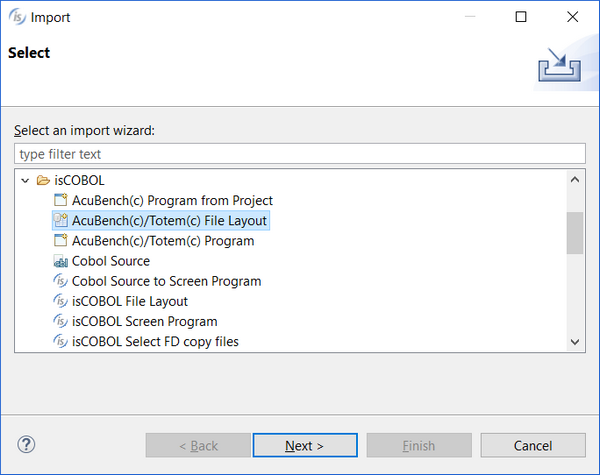
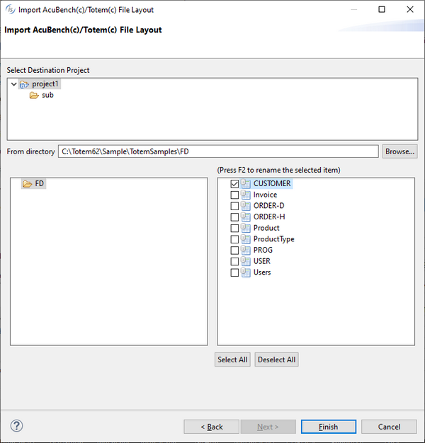

## Importing a Data Layout from Totem

To import a Totem Data Layout:

1. Right click on the project name in the [isCOBOL Explorer](../The-isCOBOL-IDE-Perspective/isCOBOL-Explorer) area.
2. Choose *Import* from the pop-up menu.
3. Choose *isCOBOL / AcuBench(c)/Totem(c) File Layout* from the tree.
4. Select the destination project or one of its subfolders, then browse to find the clf files, check the ones that you wish to import and click *Finish*.
5. The CLFs will be added on the Data tab, and datasets will appear in the program's File Section on the Structural tab."
