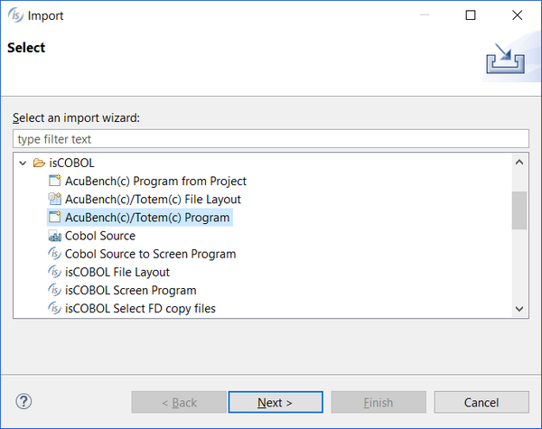
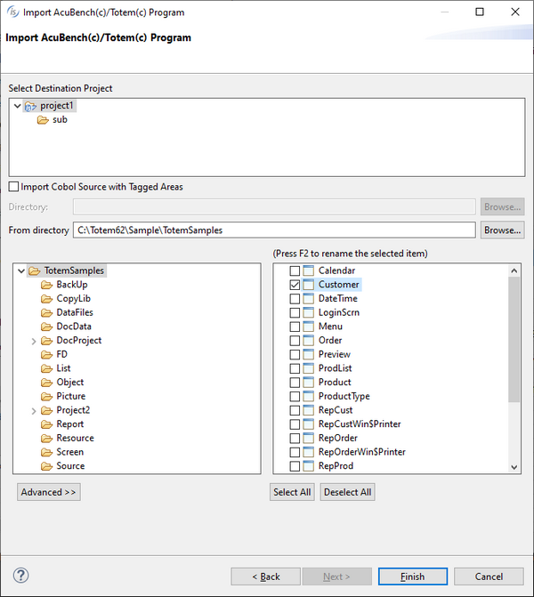
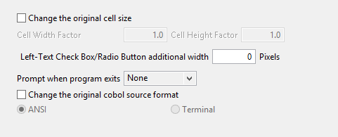
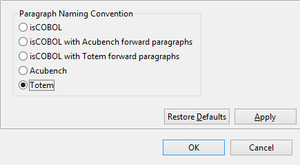

# Importing programs from Totem

Totem(TM) is the integrated development environment supplied by CASEMaker.

The following files can be imported:

- cpf: all items described in Totem program files are imported except for reports. (Reports are currently not supported)
- clf: Data layouts can be imported as well.

The following files cannot be imported:

- stf: The screen is imported along with the program (cpf). It cannot be imported separately.
- cwf: Totem project files are not recognized.
- wtf: The report is imported along with the program (cpf). It cannot be imported separately.
- dmd: Data modeling diagrams are not recognized.
- skl: Skeleton files for code generation are not recognized by isCOBOL IDE. isCOBOL IDE has its own generation rules.

During the import process:

- Totem Data Controls are translated into standard GUI controls, since Data Controls are not supported by isCOBOL IDE.
- The above behavior also applies to Custom Controls, which will not be maintainable in the IDE Screen Designer.

**Note** - Totem generated paragraphs are maintained in the source code, but their content is moved to the corresponding IDE generated paragraph and they just jump to it.

The best practice for importing Totem programs and their items consists of the following steps:

1. link custom copy books, if any
2. import file layouts
3. import programs

To import a Totem file layout, refer to [Importing a Data Layout from Totem](./Importing-a-Data-Layout-from-Totem), discussed below.

To import a Totem program:

1. Right click on the project name in the [isCOBOL Explorer](../The-isCOBOL-IDE-Perspective/isCOBOL-Explorer) area.
2. Choose *Import* from the pop-up menu.
3. Choose *isCOBOL / AcuBench(c)/Totem(c) Program* from the tree.
4. Select the destination project or one of its subfolders, then browse to find the cpf files, check the ones that you wish to import

If the programs included custom code written outside of the tagged areas, check the option *Import Cobol* Source with *Tagget Areas* and provide the directory where the cbl files are stored.

5. Before clicking on the *Finish* button you can optionally set one of the advanced options, such as changing the source format, setting the action to be performed at program exit or altering the original cell size. Click on the *Advanced >>* button to show this panel:
6. The program will appear in the Structural View.

## Version compatibility

Only items from Totem version 6.0 or greater are supported.

Importing items from previous Totem versions may lead to unpredictable results.

## Changing the paragraph naming convention

Internal paragraphs such as “Initialize-Routine” are maintained as they are. If you prefer to have isCOBOL names such as “is-initial-routine” for them, or if you prefer to have both names with Acu’s paragraphs redirecting to isCOBOL’s paragraphs (as done in previous versions of the isCOBOL IDE)

1. right click on the program name in the Structural View
2. choose *Properties*
3. choose *Screen Program / Code Generation / Source Compatibility*
4. select the paragraph naming convention that you prefer
