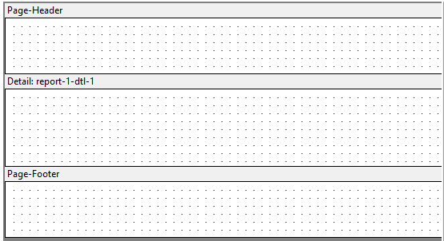
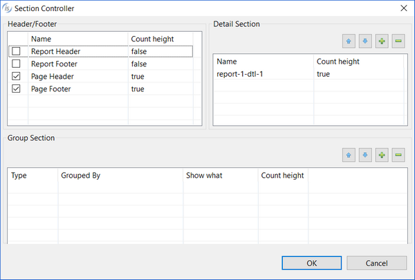

## Creating a new Report

To create a new Report, right click on the program name in the [isCOBOL Explorer](../../The-isCOBOL-IDE-Perspective/isCOBOL-Explorer) area and choose *New / Report* from the pop-up menu. Choose the name of your report and click *Finish*.

The new empty Report looks like this:

### Report Sections

By default, a new Report has three sections: a page header, a detail section, and a page footer. With the Section Controller interface, you can add report headers and footers, multiple detail sections, and group sections that define breakpoints for the information in the Report.

The report header is printed once at the beginning of a Report, and the report footer is printed once at the end of a Report. You define the components and appearance of your report header or footer in the corresponding Property window. Add a report header or footer to the Report via the [Section Controller](./Creating-a-new-Report.md#section-controller) dialog.

A group header prints at the beginning of a marked breakpoint, and a group footer prints at the end of a marked breakpoint. You may have multiple group headers or group footers in a Report, representing multiple breakpoints. Where multiple breakpoints are named, the first named is the primary breakpoint, and subsequent breakpoints are always secondary to the breakpoint preceding them. When multiple group footers appear in a Report, they appear in reverse order in the Report Designer, with the secondary group footers appearing above the primary group footer. You add a group header or group footer to the Report via the [Section Controller](./Creating-a-new-Report.md#section-controller) dialog.

The detail section prints repeatedly, providing the basic reporting function. This section constitutes the main body of the Report. Code for the detail section is generated into an ".rpt" COPY file. By default, one detail section appears in the Report Composer window when you create a new Report. You may have multiple detail sections in a Report, for example, if you wish to present your basic detail information in two parts and you choose a different font or background color for each part. You add detail sections via the [Section Controller](./Creating-a-new-Report.md#section-controller) dialog.

### Section Controller

Right-click in the Report Designer and choose *Section Controller* from the pop-up menu. Use this dialog to define what headers and footers should be printed.

