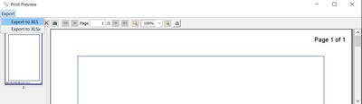

## How to print Reports

### Retrieving data for the Report

Which method you use to retrieve data for your Report depends on whether you use tagged areas or not.

For programs that don’t use Tagged Areas (default), follow these steps:

- Write COBOL statements to retrieve the first data record in the BeforeDoPrint procedure of your Report.

Code example:

```cobol
       report-1-bef-do-print.
           move low-value to prd-key
           start product key not < prd-key
              invalid
                 move 0 to report-1-doprintrtn-loop
              not invalid
                 move 1 to report-1-doprintrtn-loop
                 read product next no lock
                    at end
                       move 0 to report-1-doprintrtn-loop
                 end-read
           end-start
           .
```

<ReportName\>-doprintrtn-loop is a variable declared automatically by the IDE. When you set this variable to 0 the print loop is interrupted, when you set it to 1 the print loop continues.

- Write COBOL statements to retrieve the next record in the AfterDoPrint procedure of your Report.

Code example:

```cobol
       report-1-aft-do-print.
           move 1 to report-1-doprintrtn-loop
           read product next no lock
                at end
                   move 0 to report-1-doprintrtn-loop
           end-read
           .
```

For programs that use Tagged Areas, follow these steps:

- Write COBOL statements to retrieve data for the Report in the paragraph "is-<reportname\>-master-print-loop". This paragraph is automatically generated with your report project.

Code example:

```cobol
           move low-value to prd-key
           start product key not < prd-key
             invalid
               continue
              not invalid
               perform until 1 = 2
                 read product next
                   at end
                     exit perform
                 end-read
                 perform IS-REPORT-1-DO-PRINT-RTN
              end-perform
           end-start.
```

Note that for each record read in the above loop, the paragraph IS-<ReportName\>-DO-PRINT-RTN  is performed. This paragraph is responsible for printing the data.

### Printing the Report

The following paragraphs are always generated for programs with reports. You can perform them in your program logic. Choose the proper one according to the desired printer output:

| Paragraph Name | Action |
| --- | --- |
| is-*report-name*-preview | Opens the Report in a Print Preview <br><br>The preview dialog is very similar to the one shown by the [SpoolPrinter Class (com.iscobol.rts.print.SpoolPrinter) and the Print Preview](\), but the preview dialog generated by the IDE also allows you to export the report to xls and xlsx files.<br><br>See [Exporting to Excel file](./How-to-print-Reports#exporting-to-excel-file) below for details. <br><br>If you wish to customize the preview dialog, you can invoke The [com.iscobol.rts.print.SpoolPrinter class](\) before jumping to this paragraph. |
| is-*report-name*-print | Prints the Report on the active printer |
| is-*report-name*-print-pdf | Prints the Report to a PDF file. The name and location of the PDF file are calculated according to the [output file name](./Report-Designer-Reference/REPORT) property. This property should specify a file name with ".html" extension. The IDE will take care of generating a file with the same name and ".pdf" extension. |
| is-**report-name**-print-xls | Prints the Report to an Excel 97-2003 workbook. The name and location of the XLS file are calculated according to the [output file name](./Report-Designer-Reference/REPORT) property. This property should specify a file name with ".html" extension. The IDE will take care of generating a file with the same name and ".xls" extension. |
| is-*report-name*-print-xlsx | Prints the Report to an Excel workbook. The name and location of the XLSX file are calculated according to the [output file name](./Report-Designer-Reference/REPORT) property. This property should specify a file name with ".html" extension. The IDE will take care of generating a file with the same name and ".xlsx" extension. |
| is-*report-name*-print-tofile | Prints the Report to an HTML file. The name and location of the HTML file are controlled by the [output file name](./Report-Designer-Reference/REPORT) property. |
| is-*report-name*-setup-print | Shows the Choose Printer dialog, then prints the Report on the chosen printer |

### Exporting to Excel file

The *Export* menu in the print preview dialog allows you to export the current report to either a XLS or XLSX file.

The export process can be configured through specific properties. See [Export to Excel feature](../../is-cobol-evolve/SDK-Users-Guide/Compiler-and-Runtime/Configuration/Configuration-Properties#export-to-excel-feature) for details.

There are a few limitations if compared with the HTML report:

- Header and footer information like the page number are skipped and don’t appear in the Excel file.
- If the report includes more lines than the maximum number of lines allowed by the XLS format, then the report is automatically split into multiple spreadsheets.
- If the report includes more columns than the maximum number of columns allowed by the XLS format, then the export fails, but no error is shown.
