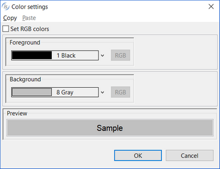
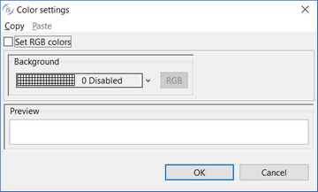

### DETAIL

| Properties | |
| --- | --- |
| (name) | Specifies the control name. This property is set automatically when the control is drawn. |
| color | Opens a dialog that allows the user to choose the color.   |
| font | Opens a dialog that allows the user to choose the font.   |
| lines | Specifies the width of the report item. |
| lock | TRUE...Locks the control on the Report Designer so that you cannot move it anymore by dragging it with the mouse. FALSE...You can move the control on the Report Designer by dragging it with the mouse. |
| print condition | Specifies a condition (e.g. WRK-USER=”Admin”) that avoids the Report item to be printed when false. |
| size | Specifies the width of the report item. |
| skip after print | TRUE...Prints a blank page after this report section FALSE...Doesn’t print a blank page after this report section |
| visible | TRUE... The report item is visible FALSE... The report item is hidden |
| zebra | Opens a dialog that allows you to choose an additional color in order to produce a zebra effect.   |

| Events | |
| --- | --- |
| No Events available. | |

| Exceptions | |
| --- | --- |
| No Exceptions available. | |

| Procedures | |
| --- | --- |
| AfterPrint | Allows the user to create a paragraph that is performed after the report item has been printed. |
| BeforePrint | Allows the user to create a paragraph that is performed before printing the report item. |

| Variables | |
| --- | --- |
| color variable | Numeric variable that hosts the color value. |
| visible variable | Numeric variable that hosts the visible state. |
