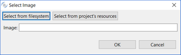
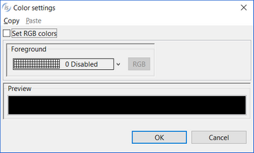
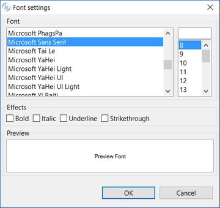

### IMAGE

| Properties | |
| --- | --- |
| (name) | Specifies the control name. This property is set automatically when the control is drawn. |
| bitmap | Opens a dialog that allows you to choose the bitmap.   |
| bitmap path | FULL PATH...The browser uses the full path of the bitmap to locate the bitmap file. DYNAMIC FULL PATH...A call to the C$FULLNAME library routine is used to derive the full path of the bitmap file. The bitmap can be stored in any of the FILE-PREFIX directories named. The browser uses the full path of the bitmap to locate the bitmap file. USER DEFINED...The browser searches for the bitmap in the same directory as the HTML file. |
| bitmap position | Specifies the position of the bitmap within the control area: -Center -Left Top -Left Bottom -Right Top -Right Bottom |
| bitmap style | RATIO...The bitmap's height-to-width ratio is preserved inside the space allocated for the bitmap. STRETCH...The bitmap height-to-width ratio is altered if necessary to fit the bitmap into the space allocated for it. |
| border color | Opens a dialog that allows the user to choose the border color.   |
| border style | BOXED...The border is shown NO-BOX...The border is not shown |
| border width | Specifies the width of the border. |
| color | Opens a dialog that allows the user to choose the color.   |
| column | Specifies the X coordinate of the report item. |
| font | Opens a dialog that allows the user to choose the font.   |
| hyperlink | Specifies a URL to navigate if the control is clicked when displayed in a web browser. |
| line | Specifies the Y coordinate of the report item. |
| lines | Specifies the width of the report item. |
| lock | TRUE...Locks the control on the Report Designer so that you cannot move it anymore by dragging it with the mouse. FALSE...You can move the control on the Report Designer by dragging it with the mouse. |
| print condition | Specifies a condition (e.g. WRK-USER=”Admin”) that avoids the Report item to be printed when false. |
| print if repeat | TRUE...When consecutive records contain the same data values, both data values print. FALSE...When consecutive records contain the same data values, the second (and subsequent) same data values do not print. |
| size | Specifies the width of the report item. |
| value | Specifies the control value |
| visible | TRUE... The report item is visible FALSE... The report item is hidden |

| Events | |
| --- | --- |
| No Events available. | |

| Exceptions | |
| --- | --- |
| No Exceptions available. | |

| Procedures | |
| --- | --- |
| AfterPrint | Allows the user to create a paragraph that is performed after the report item has been printed. |
| BeforePrint | Allows the user to create a paragraph that is performed before printing the report item. |

| Variables | |
| --- | --- |
| color variable | Numeric variable that hosts the color value. |
| hyperlink variable | Alphanumeric variable that hosts the hyperlink. |
| value variable | Numeric variable that hosts the value. |
| visible variable | Numeric variable that hosts the visible state. |
