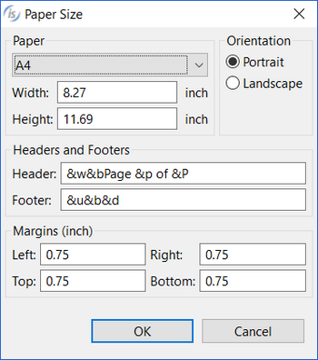

### REPORT

| Properties | |
| --- | --- |
| (name) | Specifies the report name. This property is set automatically when the report is created. |
| output file name | Specifies the name and path of the HTML file generated on disk for this report. Since the content of this file is HTML code, you should give this file a ".html" extension.If this property is not set, then "<ReportName\>.html" is assumed.If the report file name doesn’t include an absolute path, the report is generated in the first path of the FILE-PREFIX.   When the [is-report-name-print-pdf](../How-to-print-Reports) paragraph is performed, the IDE generates an additional file with the same name and ".pdf" extension. When the [is-report-name-print-xls](../How-to-print-Reports) paragraph is performed, the IDE generates an additional file with the same name and ".xls" extension. When the [is-report-name-print-xlsx](../How-to-print-Reports) paragraph is performed, the IDE generates an additional file with the same name and ".xlsx" extension. Use the "@[display]:" prefix followed by a client side path (e.g. "@[display]:C:\Temp\myReport.html" ) to generate the report on the client machine when the program runs in a thin client environment. The "@[display]:" prefix is automatically ignored when running out of a thin client environment. |
| paper size | Opens a dialog that allows you to set paper size and orientation.    The following escape sequences are supported in the Header and Footer fields in order to add useful information: &p = page number; &P = total number of pages; &b = the following information will be printed on the right side of the sheet; &d = current date in short format according to the locale, e.g. 4/16/14; &D = current date in long format according to the locale, e.g. April 16, 2014; &T = timestamp in the format HH:NN:SS &u = name of the report; &w = not handled, ignored; && = the character '&'   Any other sequence of two characters starting with '&' will print a question mark (?). |
| print setup | Opens a dialog that allows you to set up the printer.  |
| title | Specifies the title of the HTML report. This title is shown in the browser title bar when the report is opened by a web browser. |
| watermark | Browse for a image file to be printed in the background of each page of the report. |
| watermark style | **None...** the watermark image is not printed **Center...** the watermark image is printed at the center of the page **Tile...** the watermark image is repeated in order to cover the whole page |

| Events |  |
| --- | --- |
| No Events available. | |

| Exceptions |  |
| --- | --- |
| No Exceptions available. | |

| Procedures |  |
| --- | --- |
| AfterDoPrint | This is a special paragraph that is executed automatically after the print of each detail. See [How to print Reports](../How-to-print-Reports) for more details. |
| AfterPrint | Allows the user to create a paragraph that is performed after the report has been printed. |
| BeforeDoPrint | This is a special paragraph that is executed automatically when the print of the report is requested. See [How to print Reports](../How-to-print-Reports) for more details. |
| BeforePrint | Allows the user to create a paragraph that is performed before printing the report. |
| Variables |
| output file name | Specifies the name of the html file generated for this report. |
