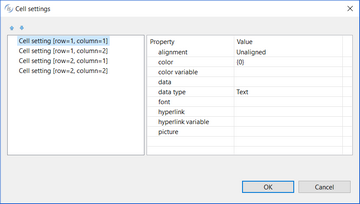
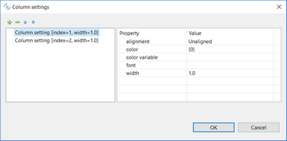
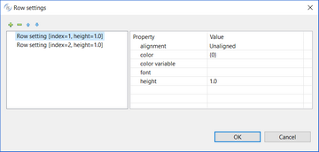

### TABLE

| Properties | |
| --- | --- |
| (name) | Specifies the control name. This property is set automatically when the control is drawn. |
| bitmap path | FULL PATH...The browser uses the full path of the bitmap to locate the bitmap file. DYNAMIC FULL PATH...A call to the C$FULLNAME library routine is used to derive the full path of the bitmap file. The bitmap can be stored in any of the FILE-PREFIX directories named. The browser uses the full path of the bitmap to locate the bitmap file. USER DEFINED...The browser searches for the bitmap in the same directory as the HTML file.   It applies to all the images shown in the table. |
| border color | Opens a dialog that allows the user to choose the border color.   |
| border style | BOXED...The border is shown NO-BOX...The border is not shown |
| border width | Specifies the width of the border. |
| cell padding | Specifies the amount of blank space in pixel between the text in a cell and the horizontal grid lines above and below that text. |
| cell settings | Opens a dialog that allows you to configure cell settings.   |
| cell spacing | Specifies the amount of blank space in pixels between the vertical grid lines and horizontal grid lines in a table cell. |
| color | Opens a dialog that allows the user to choose the color.   |
| column | Specifies the X coordinate of the report item. |
| column settings | Opens a dialog that allows you to configure column settings.   |
| font | Opens a dialog that allows the user to choose the font.   |
| group | This property has not effect, it’s included for user documentation purposes. |
| line | Specifies the Y coordinate of the report item. |
| lines | Specifies the width of the report item. |
| lock | TRUE...Locks the control on the Report Designer so that you cannot move it anymore by dragging it with the mouse. FALSE...You can move the control on the Report Designer by dragging it with the mouse. |
| print condition | Specifies a condition (e.g. WRK-USER=”Admin”) that avoids the Report item to be printed when false. |
| row settings | Opens a dialog that allows you to configure row settings.   |
| show grid line | TRUE...Cells dividers are shown FALSE...Cells dividers are not shown |
| size | Specifies the width of the report item. |
| visible | TRUE... The report item is visible FALSE... The report item is hidden |

| Events | |
| --- | --- |
| No Events available. | |

| Exceptions |  |
| --- | --- |
| No Exceptions available. | |

| Procedures |  |
| --- | --- |
| AfterPrint | Allows the user to create a paragraph that is performed after the report item has been printed. |
| BeforePrint | Allows the user to create a paragraph that is performed before printing the report item. |

| Variables | |
| --- | --- |
| color variable | Numeric variable that hosts the color value. |
| visible variable | Numeric variable that hosts the visible state. |
