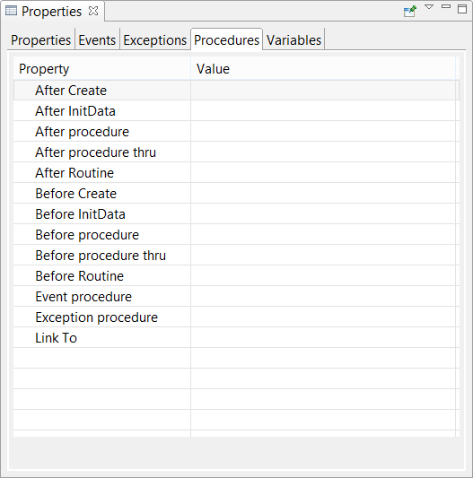

### Screen Entry Points

In the Screen properties the following entry points are available:

They allow you to insert code that will be executed at the program startup (Before Program) and before the program exit (After Program).
