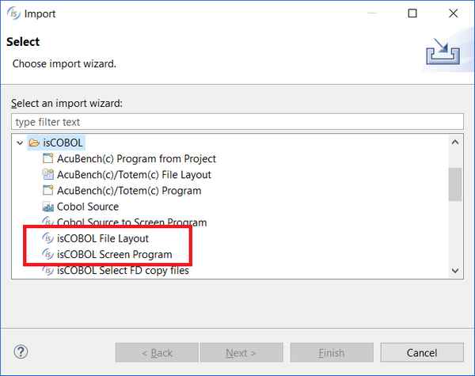
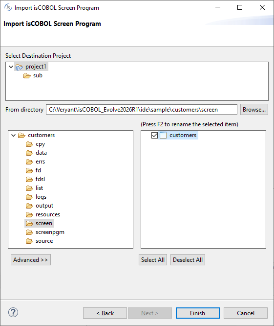

## Adding existing Screen Programs to the current Project

isCOBOL IDE can also import an existing Screen Program that is part of another project or workspace into the current project.

In order to add existing Screen Programs to the current Project, right click on the project name in the [isCOBOL Explorer](../The-isCOBOL-IDE-Perspective/isCOBOL-Explorer) and choose Import from the pop-up menu. Then select *isCOBOL / isCOBOL Screen Program* from the tree.

Screen Programs may contain a Dataset with some file definitions. In this case, repeat the above steps, selecting *isCOBOL File Layout* from the tree, in order to import the necessary file definitions.

Select the destination project or one of its subfolders, then use the *Browse* button to find the folder with the program or file layout that you wish to import. Select the desired item from the list on the right. Click on the *Advanced* button for advanced options.

Advanced options for Screen Program are:

| | |
| --- | --- |
| IDE 2013 R1 compatibility | Screen programs (*.isp) created by isCOBOL IDE 2013R1 or previous are different (and thus not compatible) than the ones created by IDE 2013R2 and later. Check this option if you need to import a isp generated by isCOBOL IDE 2013 R1 or previous. The IDE will perform the necessary conversion. |
| IDE 2016 R2 compatibility | Screen programs (*.isp) created by isCOBOL IDE 2016R2 or previous are different (and thus not compatible) than the ones created by IDE 2017R1 and later. Check this option if you need to import a isp generated by isCOBOL IDE 2016 R2 or previous. The IDE will perform the necessary conversion. |
| Create links in workspace | By default the imported resource is copied in the project folder and modifications are done on the copied resource, leaving the original resource unchanged. If you check this option instead, the resource is linked and modifications are done on the original resource. |
| | |

Advanced options for File Layout are:

| | |
| --- | --- |
| Create links in workspace | By default the imported resource is copied in the project folder and modifications are done on the copied resource, leaving the original resource unchanged. If you check this option instead, the resource is linked and modifications are done on the original resource. |
| | |
