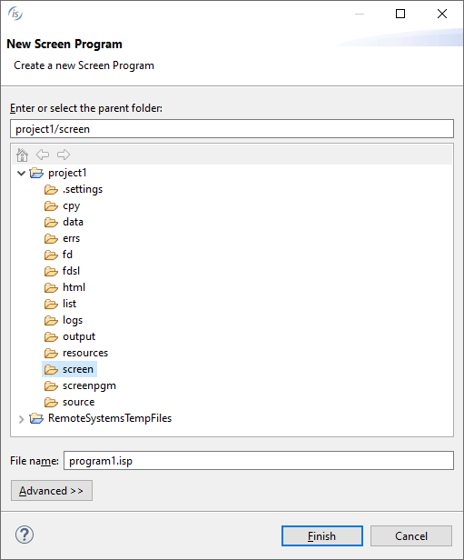
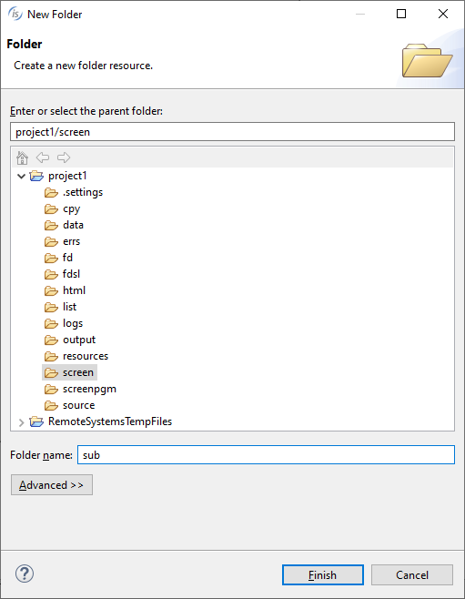
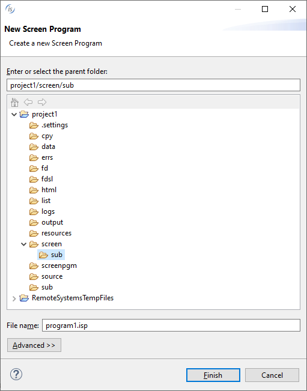

## Creating a new Screen Program

To create a new Screen Program, right click on the project name in the [isCOBOL Explorer](../The-isCOBOL-IDE-Perspective/isCOBOL-Explorer) area and choose *New / Screen Program* from the pop-up menu. The IDE will ask for program name. Ensure that the name terminates with the .isp extension and that it’s placed in the *screen* folder of the project.

### Creating a new Screen Program in a subfolder

The IDE allows you to create subfolders in the *screen* folder to isolate some Screen Programs from the others.

To create a subfolder, right click on the project name in the [isCOBOL Explorer](../The-isCOBOL-IDE-Perspective/isCOBOL-Explorer) area and choose *New / Folder* from the pop-up menu. The IDE will ask for folder name. Ensure that it’s placed in the *screen* folder of the project.

From now on, when you create a new Screen Program, you can choose whether to place it in the *screen* folder or in the *sub* folder. You can create more than one subfolder, sibling to or nested in the previous ones.

