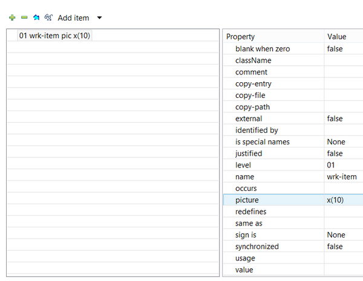
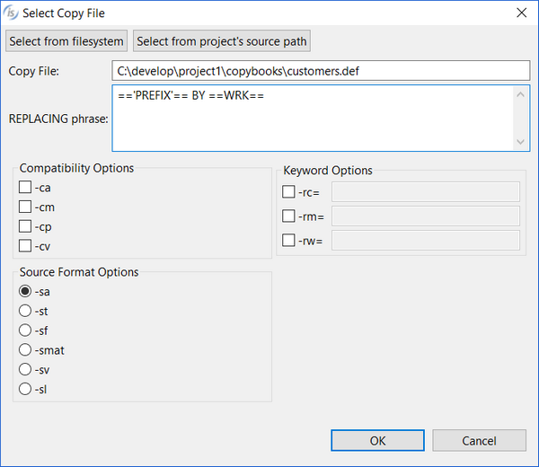

## Data Division management

The Editor for Working-Storage, Local-Storage, Thread-Local-Storage and Linkage sections has the following layout.

- To create a new group variable, click on the *Add item* button or choose *01-49 Level* from the *Add Item* menu.
- To create a sub-item into a group variable, click on the *Insert a sub-item* button.
- To create a stand-alone variable, choose *77 Level* from the *Add item* menu.
- To create a constant, choose *78 Level* from the *Add item* menu.
- To create a boolean constant, choose *88 Level* from the *Add item* menu.
- To create a renames, choose *66 Level* from the *Add item* menu.
- To link a copybook, choose *Link Copy File* from the *Add item* menu. Linked copy files cannot be edited from inside the IDE, they’re just referenced.
- To import all the variables of a copybook, choose *Import Copy File* from the *Add item* menu. Once imported, the variables can be maintained from inside the IDE as if as they were created through it.

In the dialog shown by *Link Copy File* and *Import Copy File* it’s possible to specify a REPLACING phrase as well as compatibility flags that the IDE should apply in order to parse the copybook content correctly.

*Select from filesystem* allows you to browse for a copybook in the whole file system; the full path of the copy book is used in this case. *Select from project’s source path* allows you to browse for a copybook in the project folders; only the copybook name is used in this case.

- You can edit item characteristics from the table on the right. The level number can be changed only for items whose level is 01 to 49.
