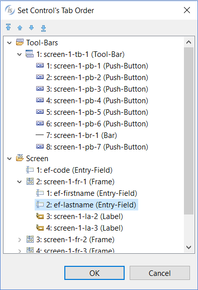
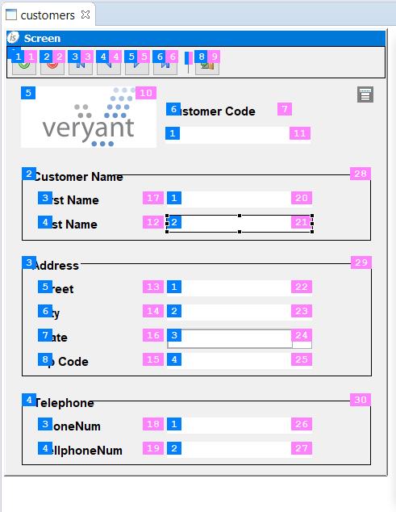

### Tab Order and ID Order

The tab order is the order in which controls are described in the program’s Screen Section that matches with the order in which they get the focus when the user press the Tab button on the keyboard. This ordinal number allows you to identify the control via the CONTROL-VALUE data item. Every control has a ID property. The ID is a unique number that allows you to identify the control via the CONTROL-ID data item. See [SCREEN CONTROL](../../../is-cobol-evolve/Language-Reference/Environment-Division/Configuration-Section/Special-names#screen-control) for more details about CONTROL-VALUE and CONTROL-ID data items.

To change the tab order of controls

1. right click in the screen area
2. choose *Tab Order* from the pop-up menu

Use the buttons on top of the list or drag the items in the tree-view in order to change the tab order of the controls.

To change the ID of controls

1. select the control with a single click of the left mouse button
2. search for "id" in the [Properties](../../The-isCOBOL-IDE-Perspective/Properties) view and change its value

To have an overview of the current tab order and IDs:

1. right click in the screen area
2. select *Show Control Numbering* in the pop-up menu
3. activate the two items in this sub menu

The tab order of controls is displayed on the left side, while control ID is displayed on the right side of the control.
