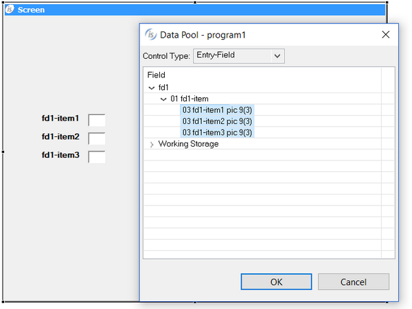

### The Data Pool feature

The quickest way to draw a control in the Screen Designer is by taking advantage of the Data Pool feature. The Data Pool allows you to draw a control starting from a data-item defined in the program.

Right click on the screen and select “DataPool” from the pop-up menu. The following dialog pops up.

Select the data-items that you wish to handle through graphical controls. Select the control type from the list on the top. Drag the data items on the screen with the mouse. When you release the left mouse button the desired controls appears on the screen.
