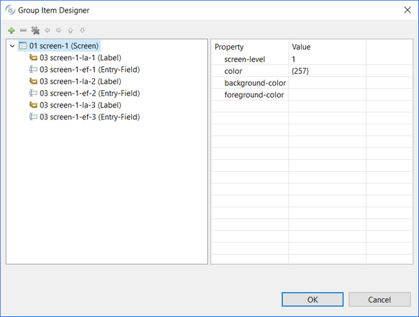

### The Group Item Designer

The Group Item Designer allows you to create groups of controls. By default, the IDE generates every control as a sub-item of the screen in the Screen Section of the source. The generated code looks like:

```cobol
01 screen-1.
   03 control-1.
   03 control-2.
   03 control-3.
   03 control-4.
   03 control-5.
   03 control-6.
```

The Group Item Designer allows you to separate these controls into different groups. The new code may look like:

```cobol
01 screen-1.
   03 group-1.
      05 control-1.
      05 control-2.
   03 group-2.
      05 control-3.
      05 control-4.
      05 control-5.
   03 control-6.
```

The advantage is that you can set some common properties (like visibility) or common embedded procedures for the group instead of setting them for each single control.

To take advantage of this feature, right click on the window in the Screen Designer and select "Group Item Designer" from the pop-up menu. The following dialog appears:



By default, the current Screen Section representation is shown.

- To create a new group, click on the "Add" button.
- To remove an item or a group, click on the Remove button. The item will not be generated in the program Screen Section.
- To change the level number of a control or a group, click on the "Move Left" and "Move Right" buttons.
- To change the tab order of a control or a group, click on the "Move Up" and "Move Down" buttons.
