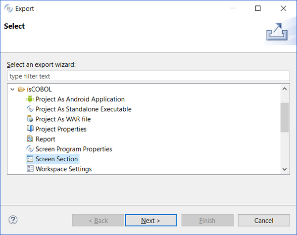
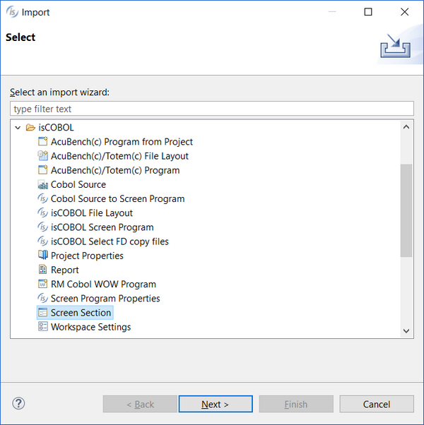

## Import / Export of Screens

Screens can be exported to external files and imported in other projects.

To export one or more screens:

1. right click on the program name in the [isCOBOL Explorer](../The-isCOBOL-IDE-Perspective/isCOBOL-Explorer)
2. choose *Export*
3. expand *isCOBOL*
4. select *Screen Section*

5. click *Next*
6. select the screens you want to export
7. click *Next*
8. choose the destination file (the file must have .isl extension)
9. click *Finish*

To import a isl file and have its screens added to your program:

1. right click on the program name in the [isCOBOL Explorer](../The-isCOBOL-IDE-Perspective/isCOBOL-Explorer)
2. choose *Import*
3. expand *isCOBOL*
4. select *Screen Section*

5. click *Next*
6. browse for the directory where .isl files are
7. select the screens you wish to import
8. click *Finish*

The isl file can also be used as a template for new screens. See [Loading Screen Templates](../Configuration/Customization/Setting-Screen-Designer-Preferences/Loading-Screen-Templates) for more information.
