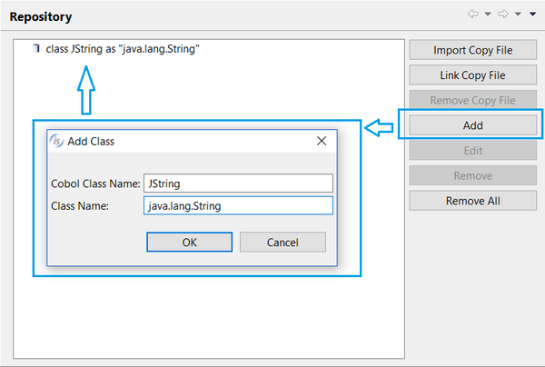

## Repository

If you plan to interact with Java objects in your program, you need to declare these objects. This can be done in the repository. To access the repository

- Right click on the program name in the [isCOBOL Explorer](../The-isCOBOL-IDE-Perspective/isCOBOL-Explorer).
- Select *Repository* from the list.

To add classes, click on the Add button and provide both a logical name and full class name. The class will be searched for in the project Class Path (see [Screen Designer](../Working-With-Projects/Setting-Project-properties/Screen-Designer) for more information). If not found, the IDE shows a red ‘class not found’ message above the fields.

It’s also possible to link or import copybooks where classes are defined.

The content of this dialog is generated by the IDE in the REPOSITORY paragraph of the program allowing you to instance class methods in the COBOL code.
