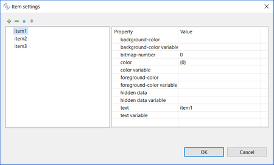

### CHIPS BOX

Refer to [CHIPS-BOX](../../../is-cobol-evolve/User-Interface/Controls-Reference/CHIPS-BOX/CHIPS-BOX) for details about properties, styles and events of this control.

| Properties | |
| --- | --- |
| (name) | Specifies the control name. This property is set automatically when the control is drawn |
| additional properties | Allows the user to specify additional properties and styles. The text you write here is generated as is and may generate compile errors if not correct. |
| background-color | Opens a dialog that allows the user to choose the control background color.   |
| border | Allows the user to set one of the following three styles: 3-D BOXED NO-BOX |
| border-color | Opens a dialog that allows the user to choose the control border color.   |
| chips-border-width | Specifies the value for the *Chips-Border-Width* property |
| chips-radius | Specifies the value for the *Chips-Radius* property |
| chips-rollover-border-width | Specifies the value for the *Chips-Rollover-Border-Width* property |
| chips-type | Allows the user to set one of the following two types: BASIC REMOVABLE |
| color | Opens a dialog that allows the user to choose the control color.   |
| column | Specifies the X coordinate of the control as expressed in cells. This property is set automatically when the control is drawn. |
| column pixels | Specifies the X coordinate of the control as expressed in pixels. This property is set automatically when the control is drawn. |
| css-base-style-name css-style-name | Specify the CSS style associated with the control. It works only in a WebDirect environment. See [Customize the WebDirect Layout using CSS](../../../is-cobol-EIS/WebDirect-option/Customize-the-WebDirect-Layout-using-CSS) for more information. |
| custom-data | Specifies the value for the *Custom-Data* property. |
| destroy type | AUTOMATIC...neither the *Temporary* nor Permanent styles are generated TEMPORARY...*Temporary* style is generated PERMANENT...*Permanent* style is generated |
| drag mode | Reserved for future use. |
| enabled | NONE...*Enabled* property is not generated TRUE... *Enabled=1* is generated FALSE...*Enabled=0* is generated |
| event list | Opens a dialog that allows you to choose which events must be added to the event list of this control.   |
| exclude event list | NONE... The *Exclude-Event-List* property is not generated. 0... *Exclude-Event-List=0* is generated. 1... *Exclude-Event-List=1* is generated. |
| font | Opens a dialog that allows the user to choose the control font.       The dialog lists the fonts installed in the system and allows you to load new fonts from disc files. Fonts loaded from disc are added to the list with an asterisk before their name. When one of these fonts is selected the *Copy Resource* option is enabled and can be activated. Activate the option to include the font disc file in the compiled class or be sure to distribute this file along with your application. |
| foreground-color | Opens a dialog that allows the user to choose the control foreground color.   |
| height-in-cells | TRUE...The *Height-In-Cells* style is generated FALSE... The *Height-In-Cells* style is not generated |
| help-id | Specifies the control *Help-id*. |
| hint | Specifies the value for the *Hint* property |
| id | Specifies the control id. This property is set automatically when the control is drawn. |
| item rollover background color | Opens a dialog that allows the user to choose the rollover background color.   |
| item rollover color | Opens a dialog that allows the user to choose the rollover color.   |
| item rollover foreground color | Opens a dialog that allows the user to choose the rollover foreground color.   |
| item-to-add | Opens a dialog that allows the user to configure the chips in the box.   |
| key | Specifies the value for the *Key* property. |
| layout-data | Opens a dialog that allows the user to choose the control resize rules.    If the option "Follows Layout-Manager defaults" is checked, the *Layout-Data* property is not generated. |
| line | Specifies the Y coordinate of the control as expressed in cells. This property is set automatically when the control is drawn |
| line pixels | Specifies the Y coordinate of the control as expressed in pixels. This property is set automatically when the control is drawn |
| lines | Specifies the control height as expressed in cells. This property is set automatically when the control is drawn |
| lines pixels | Specifies the control height as expressed in pixels. This property is set automatically when the control is drawn |
| lines unit | DEFAULT... Either *CELLS* or nothing is generated after the *Lines* value depending on the window’s “cell” property setting None... Neither *CELLS* nor *PIXELS* are generated after the *Lines* value CELLS... *CELLS* is generated after the *Lines* value PIXELS... *PIXELS* is generated after the *Lines* value |
| lock | TRUE...Locks the control on the Screen Designer so that you cannot move it anymore by dragging it with the mouse. FALSE...You can move the control on the Screen Designer by dragging it with the mouse |
| mass-update | TRUE... *Mass-Update=1* is generated FALSE... *Mass-Update* property is not generated |
| max-height | Specifies the control maximum height as expressed in cells |
| max-width | Specifies the control maximum width as expressed in cells |
| min-height | Specifies the control minimum height as expressed in cells |
| min-width | Specifies the control minimum width as expressed in cells |
| notify-mouse | TRUE...The *Notify-Mouse* style is generated FALSE...The *Notify-Mouse* style is not generated |
| notify selchange | TRUE...The *Notify-Selchange* style is generated FALSE...The *Notify-Selchange* style is not generated |
| pop up menu | Associates a pop-up menu with the control. The menu must have been drawn on the same screen. |
| size | Specifies the control width as expressed in cells. This property is set automatically when the control is drawn |
| size pixels | Specifies the control width as expressed in pixels. This property is set automatically when the control is drawn |
| size unit | DEFAULT... Either *CELLS* or nothing is generated after the *Size* value depending on the window’s “cell” property setting None... Neither *CELLS* nor *PIXELS* are generated after the *Size* value CELLS... *CELLS* is generated after the *Size* value PIXELS... *PIXELS* is generated after the *Size* value |
| tab order | Sets the ordinal position of the control in the Screen Section. This property is set automatically when the control is drawn |
| unsorted | TRUE... The *Unsorted* style is generated FALSE... The *Unsorted* style is not generated |
| visible | NONE...*Visible* property is not generatedTRUE... *Visible=1* is generated FALSE...*Visible=0* is generated |
| width-in-cells | TRUE...The *Width-In-Cells* style is generated FALSE... The *Width-In-Cells* style is not generated |

| Events | |
| --- | --- |
| cmd-clicked event | Allows the user to create a paragraph to handle the CMD-CLICKED event in the Procedure Division |
| cmd-goto event | Allows the user to create a paragraph to handle the CMD-GOTO event in the Procedure Division |
| cmd-help event | Allows the user to create a paragraph to handle the CMD-HELP event in the Procedure Division |
| msg-close | Allows the user to create a paragraph to handle the MSG-CLOSE event in the Procedure Division |
| msg-drag event | Reserved for future use |
| msg-drop event | Reserved for future use |
| msg-end-menu event | Allows the user to create a paragraph to handle the MSG-END-MENU event in the Procedure Division |
| msg-init-menu event | Allows the user to create a paragraph to handle the MSG-INIT-MENU event in the Procedure Division |
| msg-menu-input event | Allows the user to create a paragraph to handle the MSG-MENU-INPUT event in the Procedure Division |
| msg-mouse-enter event | Allows the user to create a paragraph to handle the MSG-MOUSE-ENTER event in the Procedure Division |
| msg-mouse-exit event | Allows the user to create a paragraph to handle the MSG-MOUSE-EXIT event in the Procedure Division |
| other event | Allows the user to create a custom paragraph |

| Exceptions | |
| --- | --- |
| cmd-clicked exception | Allows the user to create a paragraph to handle the CMD-CLICKED event when the Accept terminates with crt status = 96. This is an alternative to the event procedures described above |
| cmd-goto exception | Allows the user to create a paragraph to handle the CMD-GOTO event when the Accept terminates with crt status = 96. This is an alternative to the event procedures described above |
| cmd-help exception | Allows the user to create a paragraph to handle the CMD-HELP event when the Accept terminates with crt status = 96. This is an alternative to the event procedures described above |
| other exception | Allows the user to create a custom paragraph |

| Procedures | |
| --- | --- |
| After procedure | Allows the user to create a paragraph to handle the control AFTER PROCEDURE |
| After procedure thru | Allows the user to optionally specify a THRU paragraph for the AFTER PROCEDURE. |
| Before procedure | Allows the user to create a paragraph to handle the control BEFORE PROCEDURE |
| Before procedure thru | Allows the user to optionally specify a THRU paragraph for the BEFORE PROCEDURE. |
| Event procedure | Allows the user to create a paragraph to handle the control EVENT PROCEDURE |
| Exception procedure | Allows the user to create a paragraph to handle the control EXCETPION PROCEDURE |
| Link To | Associates a paragraph with the control that will be executed when the control is double clicked |

| Variables | |
| --- | --- |
| background-color variable | Numeric variable that hosts the value for the *Background-Color* property |
| border-color variable | Numeric variable that hosts the value for the *Border-Color* property |
| chips-border-width variable | Numeric variable that hosts the value for the *Chips-Border-Width* property |
| chips-radius variable | Numeric variable that hosts the value for the *Chips-Radius* property |
| chips-rollover-border-width variable | Numeric variable that hosts the value for the *Chips-Rollover-Border-Width* property |
| color variable | Numeric variable that hosts the color value |
| column variable | Numeric variable that hosts the column value |
| css-style-name variable | Alphanumeric variable that hosts the css style associated with the control. It works only in a WebDirect environment. |
| drag-mode variable | Reserved for future use |
| enabled variable | Numeric variable that hosts the enabled state |
| foreground-color variable | Numeric variable that hosts the value for the *Foreround-Color* property |
| help-id variable | Numeric variable that hosts the help id |
| hint variable | Alphanumeric variable that hosts the value for the *Hint* property |
| id variable | Numeric variable that hosts the control id |
| item rollover background color variable | Numeric variable that hosts the value for the I*tem-Rollover-Background-Color* property |
| item rollover color variable | Numeric variable that hosts the value for the *Item-Rollover-Color* property |
| item rollover foreground color variable | Numeric variable that hosts the value for the *Item-Rollover-Foreground-Color* property |
| key variable | Alphanumeric variable that hosts the value for the *Key* property |
| layout-data variable | Numeric variable that hosts the control resize rules |
| lines variable | Numeric variable that hosts the lines value |
| line variable | Numeric variable that hosts the line value |
| mass-update variable | Numeric variable that hosts the value for the *Mass-Update* property |
| max-height variable | Numeric variable that hosts the maximum height |
| max-width variable | Numeric variable that hosts the maximum width |
| min-height variable | Numeric variable that hosts the minimum height |
| min-width variable | Numeric variable that hosts the minimum width |
| size variable | Numeric variable that hosts the size value |
| visible variable | Numeric variable that hosts the visible state |
