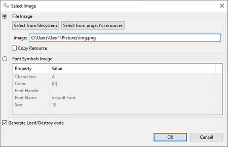
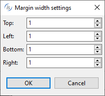
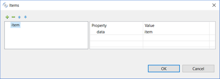

### ENTRY FIELD

Refer to [ENTRY-FIELD](../../../is-cobol-evolve/User-Interface/Controls-Reference/ENTRY-FIELD/ENTRY-FIELD) for details about properties, styles and events of this control.

| Properties | |
| --- | --- |
| (name) | Specifies the control name. This property is set automatically when the control is drawn |
| action | Specifies the value for the Action property. You can choose between: None CUT COPY PASTE DELETE UNDO REDO SELECT ALL |
| additional properties | Allows the user to specify additional properties and styles. The text you write here is generated as is and may generate compile errors if not correct. |
| alignment | NONE... no alignment style is generated LEFT... *Left* style is generated RIGHT... *Right* style is generated CENTER...*Center* style is generated HTML...no alignment style is generated |
| auto | TRUE... The *Auto* style is generated FALSE... The *Auto* style is not generated |
| autodecimal | Specifies the value for the *Auto-Decimal* property |
| background-color | Opens a dialog that allows the user to choose the control background color.   |
| bitmap | Opens a dialog box that allows the user to select an image file to load into the control. It’s also possible to generate an image from a series of characters represented with a given font.   |
| bitmap-disabled | Specifies the value for the *Bitmap-Disabled* property |
| bitmap-hint | Specifies the value for the *Bitmap-Hint* property |
| bitmap-number | Specifies the value for the *Bitmap-Number* property |
| bitmap-rollover | Specifies the value for the *Bitmap-Rollover* property |
| bitmap-trailing-disabled | Specifies the value for the *Bitmap-Trailing-Disabled* property |
| bitmap-trailing-hint | Specifies the value for the *Bitmap-Trailing-Hint* property |
| bitmap-trailing-number | Specifies the value for the *Bitmap-Trailing-Number* property |
| bitmap-trailing-rollover | Specifies the value for the *Bitmap-Trailing-Rollover* property |
| border | Allows the user to set one of the following three styles: 3-D BOXED NO-BOX |
| border color | Opens a dialog that allows the user to choose the control border color.   |
| border width | Opens a dialog that allows the user to choose the control border width.   |
| case | NONE... Neither the *Upper* nor *Lower* styles are generated UPPER... *Upper* style is generated LOWER... *Lower* style is generated |
| color | Opens a dialog that allows the user to choose the control color.   |
| column | Specifies the X coordinate of the control as expressed in cells. This property is set automatically when the control is drawn. |
| column pixels | Specifies the X coordinate of the control as expressed in pixels. This property is set automatically when the control is drawn. |
| css-base-style-name css-style-name | Specify the CSS style associated with the control. It works only in a WebDirect environment. See [Customize the WebDirect Layout using CSS](../../../is-cobol-EIS/WebDirect-option/Customize-the-WebDirect-Layout-using-CSS) for more information. |
| cursor | Specifies the value for the *Cursor* property |
| cursor-col | Specifies the value for the *Cursor-Col* property |
| cursor-row | Specifies the value for the *Cursor-Row* property |
| custom-data | Specifies the value for the *Custom-Data* property. |
| destroy type | AUTOMATIC...neither the *Temporary* nor Permanent styles are generated TEMPORARY...*Temporary* style is generated PERMANENT...*Permanent* style is generated |
| drag mode | No drag events... *Drag-Mode* is not generated Only MSG-DRAG... *Drag-Mode=1* is generated Only MSG-DROP... *Drag-Mode=2* is generated Both events... *Drag-Mode=3* is generated |
| enabled | NONE...*Enabled* property is not generated TRUE... *Enabled=1* is generated FALSE...*Enabeld=0* is generated |
| event list | Opens a dialog that allows you to choose which events must be added to the event list of this control.   |
| exclude event list | NONE... The *Exclude-Event-List* property is not generated. 0... *Exclude-Event-List=0* is generated. 1... *Exclude-Event-List=1* is generated. |
| fill-char | Specifies the value for the *Fill-Char* property |
| font | Opens a dialog that allows the user to choose the control font.       The dialog lists the fonts installed in the system and allows you to load new fonts from disc files. Fonts loaded from disc are added to the list with an asterisk before their name. When one of these fonts is selected the *Copy Resource* option is enabled and can be activated. Activate the option to include the font disc file in the compiled class or be sure to distribute this file along with your application. |
| foreground-color | Opens a dialog that allows the user to choose the control foreground color.   |
| format-picture | Specifies the value for the *Pic* property |
| format-string | Specifies the value for the *Format-String* property |
| format-type | Specifies the value for the Format-Type property 0... MASK 1... NUMBER 2... DATE |
| height-in-cells | TRUE...The *Height-In-Cells* style is generated FALSE... The *Height-In-Cells* style is not generated |
| help-id | Specifies the control *Help-id*. |
| hint | Specifies the value for the *Hint* property. |
| id | Specifies the control id. This property is set automatically when the control is drawn. |
| input-filter | Specifies the value for the *Input-Filter* property. |
| key | Specifies the value for the *Key* property. |
| layout-data | Opens a dialog that allows the user to choose the control resize rules.    If the option "Follows Layout-Manager defaults" is checked, the *Layout-Data* property is not generated. |
| line | Specifies the Y coordinate of the control as expressed in cells. This property is set automatically when the control is drawn |
| line pixels | Specifies the Y coordinate of the control as expressed in pixels. This property is set automatically when the control is drawn |
| lines | Specifies the control height as expressed in cells. This property is set automatically when the control is drawn |
| lines pixels | Specifies the control height as expressed in pixels. This property is set automatically when the control is drawn |
| lines unit | DEFAULT... Either *CELLS* or nothing is generated after the *Lines* value depending on the window’s “cell” property setting None... Neither *CELLS* nor *PIXELS* are generated after the *Lines* value CELLS... *CELLS* is generated after the *Lines* value PIXELS... *PIXELS* is generated after the *Lines* value |
| lock | TRUE...Locks the control on the Screen Designer so that you cannot move it anymore by dragging it with the mouse. FALSE...You can move the control on the Screen Designer by dragging it with the mouse |
| margin width | Opens a dialog that allows you to input the margin width.   |
| material-design | Allows the user to choose between:None (default) 1: Boxed 2: Underlined |
| max-height | Specifies the control maximum height as expressed in cells |
| max-lines | Specifies the value for the *Max-Lines* property |
| max-text | Specifies the value for the *Max-Text* property |
| max-val | Specifies the value for the *Max-Val* property |
| max-width | Specifies the control maximum width as expressed in cells |
| md-label | Specifies the text of the floating label for material-design fields |
| md-radius | Specifies the border rounding radius for boxed material-design fields |
| md-supporting-text | Specifies the supporting text for material-design fields |
| min-height | Specifies the control minimum height as expressed in cells |
| min-val | Specifies the value for the *Min-Val* property |
| min-width | Specifies the control minimum width as expressed in cells |
| no -autosel | TRUE... The *No-Autosel* style is generated FALSE... The *No-Autosel* style is not generated |
| no-tab | TRUE...The *No-Tab* style is generated FALSE...The *No-Tab* style is not generated |
| notify change | TRUE...The *Notify-Change* style is generated FALSE...The *Notify-Change* style is not generated |
| notify-change delay | Specifies the value for the *Notify-Change-Delay* property |
| notify-mouse | TRUE...The *Notify-Mouse* style is generated FALSE...The *Notify-Mouse* style is not generated |
| no-wrap | TRUE...The *No-Wrap* style is generated FALSE...The *No-Wrap* style is not generated |
| numeric | TRUE...The *Numeric* style is generated FALSE...The *Numeric* style is not generated |
| placeholder | Specifies the value for the *Placeholder* property |
| pop up menu | Associates a pop-up menu with the control. The menu must have been drawn on the same screen. |
| proposal | Opens a dialog that allows the user to declare proposal items.   |
| proposal delay | Specifies the value for the *Proposal-Delay* property |
| proposal-filter-type | NO-FILTER... *Proposal-Filter-Type=0* is generated CONTAINS...*Proposal-Filter-Type* is not generated STARTS-WITH...*Proposal-Filter-Type=2* is generated |
| proposal min text | Specifies the value for the *Proposal-Min-Text* property |
| proposals-unsorted | TRUE...The *Proposals-Unsorted* style is generated FALSE...The *Proposals-Unsorted* style is not generated |
| read-only | TRUE...The *Read-Only* style is generated FALSE...The *Read-Only* style is not generated |
| required | TRUE...The *Required* style is generated FALSE...The *Required* style is not generated |
| secure | TRUE...The *Secure* style is generated FALSE...The *Secure* style is not generated |
| selection-start | Specifies the value for the *Selection-Start* property |
| selection-start-col | Specifies the value for the *Selection-Start-Col* property |
| selection-start-row | Specifies the value for the *Selection-Start-Row* property |
| selection-text | Specifies the value for the *Selection-Text* property |
| size | Specifies the control width as expressed in cells. This property is set automatically when the control is drawn |
| size pixels | Specifies the control width as expressed in pixels. This property is set automatically when the control is drawn |
| size unit | DEFAULT... Either *CELLS* or nothing is generated after the *Size* value depending on the window’s “cell” property setting None... Neither *CELLS* nor *PIXELS* are generated after the *Size* value CELLS... *CELLS* is generated after the *Size* value PIXELS... *PIXELS* is generated after the *Size* value |
| style of control | Allows the user to choose the type of field between: SINGLELINE (default) MULTILINE VSCROLL VSCROLL-BAR SPINNER AUTO-SPIN |
| tab order | Sets the ordinal position of the control in the Screen Section. This property is set automatically when the control is drawn |
| spell checking | Sets the value for the *Spell-Checking* property.   Note that additional jar files must be added to the Project’s Classpath in order to activate this feature at run time. Refer to [Spell-Checking](../../../is-cobol-evolve/User-Interface/Controls-Reference/ENTRY-FIELD/Properties/Spell-Checking) for details about the required additional items. |
| text-orientation | 0: NONE... *Text-Orientation* is not generated 1: LEFT-TO-RIGHT...*Text-Orientation=1* is generated 2: RIGHT-TO-LEFT...*Text-Orientation=2* is generated |
| text-wrapping | AUTO-WRAP... *Text-Wrapping* is not generated WORD-WRAP...*Text-Wrapping=1* is generated CHAR-WRAP...*Text-Wrapping=2* is generated |
| use RETURN | TRUE... The *Use-Return* style is generated FALSE... The *Use-Return* style is not generated |
| use TAB | TRUE... The *Use-Tab* style is generated FALSE... The *Use-Tab* style is not generated |
| validation error message | Specifies the value for the *Validation-Errmsg* property |
| validation options | 0: None 1: Case Insensitive 2: Left Trimmed 3: Case Insensitive + Left Trimmed 4: Right Trimmed 5: Case Insensitive + Right Trimmed 6: Left Trimmed + Right Trimmed 7: Case Insensitive + Left Trimmed+ Right Trimmed |
| validation regexp | Specifies the value for the *Validation-Regexp* property |
| value | Specifies the value for the *Value* property |
| value multiple | TRUE... The *Multiple* keyword is generated along with Value FALSE... The *Multiple* keyword is not generated along with Value |
| value picture | Specifies the value for the *PIC* property |
| visible | NONE...*Visible* property is not generated TRUE... *Visible=1* is generated FALSE...*Visible=0* is generated |
| visible proposals count | Specifies the value for the *Visible-Proposals-Count* property |
| width-in-cells | TRUE...The *Width-In-Cells* style is generated FALSE... The *Width-In-Cells* style is not generated |

| Events | |
| --- | --- |
| cmd-goto event | Allows the user to create a paragraph to handle the CMD-GOTO event in the Procedure Division |
| cmd-help event | Allows the user to create a paragraph to handle the CMD-HELP event in the Procedure Division |
| msg-bitmap-clicked event | Allows the user to create a paragraph to handle the MSG-BITMAP-CLICKED event in the Procedure Division |
| msg-bitmap-dblclick event | Allows the user to create a paragraph to handle the MSG-BITMAP-DBLCLICK event in the Procedure Division |
| msg-drag event | Allows the user to create a paragraph to handle the MSG-DRAG event in the Procedure Division |
| msg-drop event | Allows the user to create a paragraph to handle the MSG-DROP event in the Procedure Division |
| msg-end-menu event | Allows the user to create a paragraph to handle the MSG-END-MENU event in the Procedure Division |
| msg-init-menu event | Allows the user to create a paragraph to handle the MSG-INIT-MENU event in the Procedure Division |
| msg-menu-input event | Allows the user to create a paragraph to handle the MSG-MENU-INPUT event in the Procedure Division |
| msg-mouse-enter event | Allows the user to create a paragraph to handle the MSG-MOUSE-ENTER event in the Procedure Division |
| msg-mouse-exit event | Allows the user to create a paragraph to handle the MSG-MOUSE-EXIT event in the Procedure Division |
| msg-validate event | Allows the user to create a paragraph to handle the MSG-VALIDATE event in the Procedure Division |
| ntf-changed event | Allows the user to create a paragraph to handle the NTF-CHANGED event in the Procedure Division |
| other event | Allows the user to create a custom paragraph |

| Exceptions | |
| --- | --- |
| cmd-goto exception | Allows the user to create a paragraph to handle the CMD-GOTO event when the Accept terminates with crt status = 96. This is an alternative to the event procedures described above |
| cmd-help exception | Allows the user to create a paragraph to handle the CMD-HELP event when the Accept terminates with crt status = 96. This is an alternative to the event procedures described above |
| ntf-changed exception | Allows the user to create a paragraph to handle the NTF-CHANGED event when the Accept terminates with crt status = 96. This is an alternative to the event procedures described above |
| other exception | Allows the user to create a custom paragraph |

| Procedures | |
| --- | --- |
| After procedure | Allows the user to create a paragraph to handle the control AFTER PROCEDURE |
| After procedure thru | Allows the user to optionally specify a THRU paragraph for the AFTER PROCEDURE. |
| Before procedure | Allows the user to create a paragraph to handle the control BEFORE PROCEDURE |
| Before procedure thru | Allows the user to optionally specify a THRU paragraph for the BEFORE PROCEDURE. |
| Event procedure | Allows the user to create a paragraph to handle the control EVENT PROCEDURE |
| Exception procedure | Allows the user to create a paragraph to handle the control EXCETPION PROCEDURE |

| Variables | |
| --- | --- |
| autodecimal variable | Numeric variable that hosts the value for the *Auto-Decimal* property |
| background-color variable | Numeric variable that hosts the value for the *Background-Color* property |
| bitmap-disabled variable | Numeric variable that hosts the value for the *Bitmap-Disabled* property |
| bitmap-hint variable | Alphanumeric variable that hosts the value for the *Bitmap-Hint* property |
| bitmap-number variable | Numeric variable that hosts the value for the *Bitmap-Number* property |
| bitmap-rollover variable | Numeric variable that hosts the value for the *Bitmap-Rollover* property |
| bitmap-trailing-disabled variable | Numeric variable that hosts the value for the *Bitmap-Trailing-Disabled* property |
| bitmap-trailing-hint variable | Alphanumeric variable that hosts the value for the *Bitmap-Trailing-Hint* property |
| bitmap-trailing-number variable | Numeric variable that hosts the value for the *Bitmap-Trailing-Number* property |
| bitmap-trailing-rollover variable | Numeric variable that hosts the value for the *Bitmap-Trailing-Rollover* property |
| bitmap-width variable | Numeric variable that hosts the value for the *Bitmap-Width* property |
| border color variable | Numeric variable that hosts the value for the *Border-Color* property |
| border width variable | Alphanumeric variable that hosts the value for the *Border-Width* property |
| color variable | Numeric variable that hosts the color value |
| column variable | Numeric variable that hosts the column value |
| css-style-name variable | Alphanumeric variable that hosts the css style associated with the control. It works only in a WebDirect environment. |
| cursor-col variable | Numeric variable that hosts the cursor column value |
| cursor-row variable | Numeric variable that hosts the cursor row value |
| cursor variable | Numeric variable that hosts the cursor value |
| custom-data variable | Alphanumeric variable that hosts the value for the *Custom-Data* property |
| enabled variable | Numeric variable that hosts the enabled state |
| foreground-color variable | Numeric variable that hosts the value for the *Foreground-Color* property |
| help-id variable | Numeric variable that hosts the help id |
| hint variable | Alphanumeric variable that hosts the hint value. |
| id variable | Numeric variable that hosts the control id |
| input-filter variable | Alphanumeric variable that hosts the value for the *Input-Filter* property |
| key variable | Alphanumeric variable that hosts the value for the *Key* property |
| layout-data variable | Numeric variable that hosts the control resize rules |
| lines variable | Numeric variable that hosts the lines value |
| line variable | Numeric variable that hosts the line value |
| margin width variable | Numeric variable that hosts the value for the *Margin-Width* property |
| max-height variable | Numeric variable that hosts the maximum height |
| max-lines variable | Numeric variable that hosts the value for the *Max-Lines* property |
| max-text variable | Numeric variable that hosts the value for the *Max-Text* property |
| max-val variable | Numeric variable that hosts the value for the *Max-Val* property |
| max-width variable | Numeric variable that hosts the maximum width |
| md-label variable | Alphanumeric variable that hosts the value for the *Md-Label* property |
| md-radius variable | Numeric variable that hosts the value for the *Md-Radius* property |
| md-supporting-text variable | Alphanumeric variable that hosts the value for the *Md-Supporting-Text* property |
| min-height variable | Numeric variable that hosts the minimum height |
| min-val variable | Numeric variable that hosts the value for the *Min-Val* property |
| min-width variable | Numeric variable that hosts the minimum width |
| notify-change delay variable | Numeric variable that hosts the value for the *Notify-Change-Delay* property |
| placeholder variable | Alphanumeric variable that hosts the value of the *Placeholder* property |
| proposal delay variable | Numeric variable that hosts the value for the *Proposal-Delay* property |
| proposal filter type variable | Numeric variable that hosts the value for the *Proposal-Filter-Type* property |
| proposal min text variable | Numeric variable that hosts the value for the *Proposal-Min-Text* property |
| selection-start-col variable | Numeric variable that hosts the value for the *Selection-Start-Col* property |
| selection-start-row variable | Numeric variable that hosts the value for the *Selection-Start-Row* property |
| selection-start variable | Numeric variable that hosts the value for the *Selection-Start* property |
| size variable | Numeric variable that hosts the size value |
| spell-checking variable | Alphanumeric variable that hosts the value of the *Spell-Checking* property |
| style variable | Numeric variable that hosts the value of the *Style* property |
| text-wrapping variable | Numeric variable that hosts the value of the *Text-Wrapping* property |
| validation error message variable | Alphanumeric variable that hosts the value of the *Validation-Errmsg* property |
| validation options variable | Numeric variable that hosts the value of the *Validation-Opts* property |
| validation regexp variable | Alphanumeric variable that hosts the value of the *Validation-Regexp* property |
| value variable | Alphanumeric variable that hosts the value for the *Value* property |
| visible variable | Numeric variable that hosts the visible state |
