### GRID

Refer to [GRID](../../../is-cobol-evolve/User-Interface/Controls-Reference/GRID/GRID) for details about properties, styles and events of this control.

| Properties | |
| --- | --- |
| (name) | Specifies the control name. This property is set automatically when the control is drawn |
| action | Specifies the value for the Action property. You can choose between: None FIRST-PAGE LAST-PAGE CURRENT-PAGE |
| additional properties | Allows the user to specify additional properties and styles. The text you write here is generated as is and may generate compile errors if not correct. |
| adjustable columns | TRUE... The *Adjustable-Columns* style is generated FALSE... The *Adjustable-Columns* style is not generated |
| adjustable rows | TRUE... The *Adjustable-Rows* style is generated FALSE... The *Adjustable-Rows* style is not generated |
| background-color | Opens a dialog that allows the user to choose the control background color.  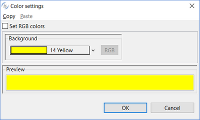 |
| border | Allows the user to set one of the following three styles: 3-D BOXED NO-BOX |
| border color | Opens a dialog that allows the user to choose the control border color.  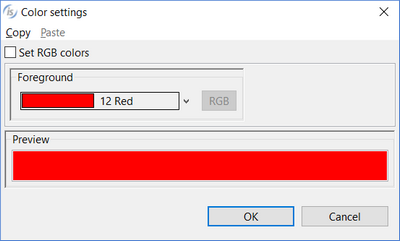 |
| border width | Opens a dialog that allows the user to choose the control border width.  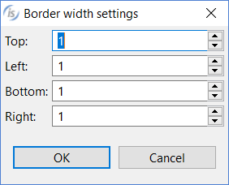 |
| cell entry background color | Opens a dialog that allows you to set the *Cell-Entry-Background-Color* property.   |
| cell entry color | Opens a dialog that allows you to set the *Cell-Entry-Color* property.  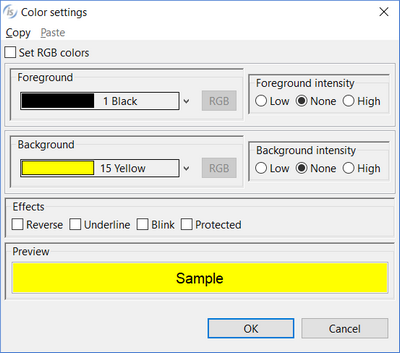 |
| cell entry foreground color | Opens a dialog that allows you to set the *Cell-Entry-Foreground-Color* property.   |
| cell selected background color | Opens a dialog that allows you to set the *Cell-Selected-Background-Color* property.   |
| cell selected color | Opens a dialog that allows you to set the *Cell-Selected-Color* property.   |
| cell selected foreground color | Opens a dialog that allows you to set the *Cell-Selected-Foreground-Color* property.   |
| cell settings | Opens a dialog that allows the user to set cells content  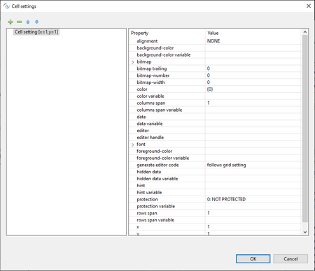 The “editor” property pops up a new dialog in which you can choose the graphical control that must appear in the cell during the editing.  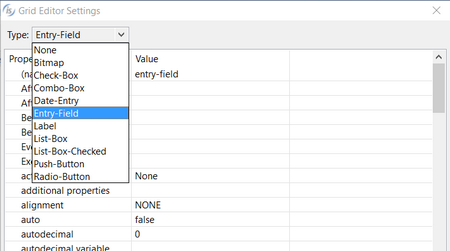 |
| centered headings | TRUE... The *Centered-Headings* style is generated FALSE... The *Centered-Headings* style is not generated |
| color | Opens a dialog that allows the user to choose the control color.   |
| column | Specifies the X coordinate of the control as expressed in cells. This property is set automatically when the control is drawn. |
| column headings | TRUE... The *Column-Headings* style is generated FALSE... The *Column-Headings* style is not generated |
| column headings height | Specifies the value for the *Column-Headings-Height* property. |
| column pixels | Specifies the X coordinate of the control as expressed in pixels. This property is set automatically when the control is drawn. |
| column selected background color | Opens a dialog that allows you to set the *Column-Selected-Background-Color* property.   |
| column selected color | Opens a dialog that allows you to set the *Column-Selected-Color* property.   |
| column selected foreground color | Opens a dialog that allows you to set the *Column-Selected-Foreground-Color* property.   |
| column settings | Opens a dialog that allows the user to define columns.  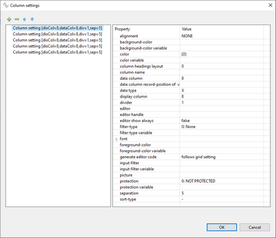 |
| css-base-style-name css-style-name | Specify the CSS style associated with the control. It works only in a WebDirect environment. See [Customize the WebDirect Layout using CSS](../../../is-cobol-EIS/WebDirect-option/Customize-the-WebDirect-Layout-using-CSS) for more information. |
| cursor color | Opens a dialog that allows the user to choose the cursor color.   |
| cursor frame color | Opens a dialog that allows the user to choose the cursor frame color.   |
| cursor frame width | Specifies the value for the *Cursor-Frame-Width* property |
| cursor X | Specifies the value for the *Cursor-X* property |
| cursor Y | Specifies the value for the *Cursor-Y* property |
| custom-data | Specifies the value for the *Custom-Data* property. |
| destroy type | AUTOMATIC...neither the *Temporary* nor Permanent styles are generated TEMPORARY...*Temporary* style is generated PERMANENT...*Permanent* style is generated |
| divider color | Opens a dialog to retrieve the value for the *Divider-Color* property.   |
| drag background color | Opens a dialog to retrieve the value for the *Drag-Backgrond-Color* property   |
| drag color | Opens a dialog to retrieve the value for the *Drag-Color* property   |
| drag foreground color | Opens a dialog to retrieve the value for the *Drag-Foreground-Color* property   |
| drag mode | No drag events... *Drag-Mode* is not generated Only MSG-DRAG... *Drag-Mode=1* is generated Only MSG-DROP... *Drag-Mode=2* is generated Both events... *Drag-Mode=3* is generated |
| enabled | NONE...The *Enabled* property is not generated TRUE... *Enabled=1* is generated FALSE...*Enabled=0* is generated |
| end color | Opens a dialog to retrieve the value for the End-Color property   |
| event list | Opens a dialog that allows you to choose which events must be added to the event list of this control.  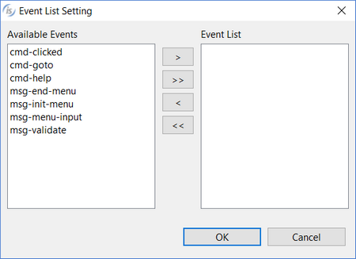 |
| exclude event list | NONE... The *Exclude-Event-List* property is not generated. 0... *Exclude-Event-List=0* is generated. 1... *Exclude-Event-List=1* is generated. |
| export file format | Specifies the value for the *Export-File-Format* property. |
| export file name | Specifies the value for the *Export-File-Name* property. |
| export file open | 0: Do not open exported file 1: Open exported file |
| filterable columns | TRUE...The *Filterable-Columns* style is generated FALSE... The *Filterable-Columns* style is not generated |
| font | Opens a dialog that allows the user to choose the control font.  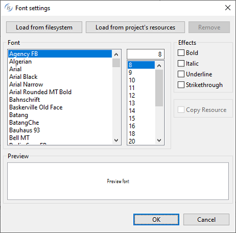    The dialog lists the fonts installed in the system and allows you to load new fonts from disc files. Fonts loaded from disc are added to the list with an asterisk before their name. When one of these fonts is selected the *Copy Resource* option is enabled and can be activated. Activate the option to include the font disc file in the compiled class or be sure to distribute this file along with your application. |
| foreground-color | Opens a dialog that allows the user to choose the control foreground color.   |
| generate editor code | on Msg-Begin-Entry...The cell editor control will be displayed only when the cell is edited on Display... The cell editor control will be displayed on each cell as the grid appears |
| heading background color | Opens a dialog to retrieve the value for the *Heading-Background-Color* property   |
| heading color | Opens a dialog to retrieve the value for the *Heading-Color* property   |
| heading cursor background color | Opens a dialog to retrieve the value for the *Heading-Cursor-Background-Color* property   |
| heading cursor color | Opens a dialog to retrieve the value for the *Heading-Cursor-Color* property   |
| heading cursor foreground color | Opens a dialog to retrieve the value for the *Heading-Cursor-Foreground-Color* property   |
| heading divider color | Opens a dialog to retrieve the value for the *Heading-Divider-Color* property   |
| heading font | Opens a dialog that allows the user to choose the heading font.     The dialog lists the fonts installed in the system and allows you to load new fonts from disc files. Fonts loaded from disc are added to the list with an asterisk before their name. When one of these fonts is selected the *Copy Resource* option is enabled and can be activated. Activate the option to include the font disc file in the compiled class or be sure to distribute this file along with your application. |
| heading foreground color | Opens a dialog to retrieve the value for the *Heading-Foreround-Color* property   |
| heading menu popup | Opens a dialog that allows you to configure the Grid heading menu.  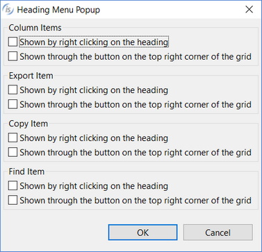 |
| heading rollover background color | Opens a dialog to retrieve the value for the *Heading-Rollover-Background-Color* property   |
| heading rollover color | Opens a dialog to retrieve the value for the *Heading-Rollover-Color* property   |
| heading rollover foreground color | Opens a dialog to retrieve the value for the *Heading-Rollover-Foreground-Color* property   |
| height-in-cells | TRUE...The *Height-In-Cells* style is generated FALSE... The *Height-In-Cells* style is not generated |
| help-id | Specifies the control *Help-id*. |
| hint | Specifies the value for the *Hint* property. |
| hscroll | TRUE... The *Hscroll* style is generated FALSE... The *Hscroll* style is not generated |
| id | Specifies the control id. This property is set automatically when the control is drawn. |
| key | Specifies the value for the *Key* property. |
| last-row | Specifies the value for the *Last-Row* property |
| layout-data | Opens a dialog that allows the user to choose the control resize rules.  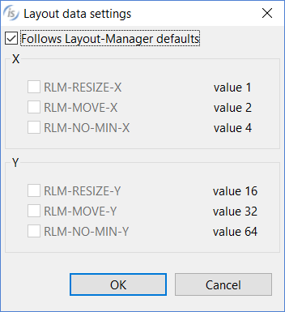  If the option "Follows Layout-Manager defaults" is checked, the *Layout-Data* property is not generated. |
| line | Specifies the Y coordinate of the control as expressed in cells. This property is set automatically when the control is drawn |
| line pixels | Specifies the Y coordinate of the control as expressed in pixels. This property is set automatically when the control is drawn |
| lines | Specifies the control height as expressed in cells. This property is set automatically when the control is drawn |
| lines pixels | Specifies the control height as expressed in pixels. This property is set automatically when the control is drawn |
| lines unit | DEFAULT... Either *CELLS* or nothing is generated after the *Lines* value depending on the window’s “cell” property setting None... Neither *CELLS* nor *PIXELS* are generated after the *Lines* value CELLS... *CELLS* is generated after the *Lines* value PIXELS... *PIXELS* is generated after the *Lines* value |
| lock | TRUE...Locks the control on the Screen Designer so that you cannot move it anymore by dragging it with the mouse. FALSE...You can move the control on the Screen Designer by dragging it with the mouse |
| lm-on-columns | NONE... *Lm-On-Columns* is not generated TRUE... *Lm-On-Columns=1* is generated FALSE... *Lm-On-Columns=0* is generated |
| lod-threshold | Specifies the value for the *Lod-Threshod* property |
| mass-update | TRUE... *Mass-Update=1* is generated FALSE... *Mass-Update* property is not generated |
| max-height | Specifies the control maximum height as expressed in cells |
| max-width | Specifies the control maximum width as expressed in cells |
| min-height | Specifies the control minimum height as expressed in cells |
| min-width | Specifies the control minimum width as expressed in cells |
| mouse-wheel-scroll | Specifies the value for the *Mouse-Wheel-Scroll* property |
| no-autosel | TRUE...The *No-Autosel* style is generated FALSE...The *No-Autosel* style is not generated |
| no-cell-drag | TRUE...The *No-Cell-Drag* style is generated FALSE...The *No-Cell-Drag* style is not generated |
| no-tab | TRUE...The *No-Tab* style is generated FALSE...The *No-Tab* style is not generated |
| notify-mouse | TRUE...The *Notify-Mouse* style is generated FALSE...The *Notify-Mouse* style is not generated |
| num col headings | Specifies the value for the *Num-Col-Headings* property |
| num row headings | Specifies the value for the *Num-Row-Headings* property |
| num columns | Specifies the number of columns in the grid. Use column settings to configure the single columns. |
| num rows | Specifies the value for the *Num-Rows* property |
| paged | TRUE...The *Paged* style is generated FALSE... The *Paged* style is not generated |
| pop up menu | Associates a pop-up menu with the control. The menu must have been drawn on the same screen. |
| protection | Specifies the value for the *Protection* property |
| record-to-add | Opens a dialog that allows the user to describe the record  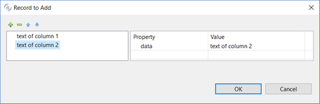   |
| region color | Opens a dialog to retrieve the value for the *Region-Color* property   |
| reordering columns | TRUE...The *Reordering-Columns* style is generated FALSE...The *Reordering-Columns* style is not generated |
| row color patterns | Opens a dialog that allows the user to define a row color pattern  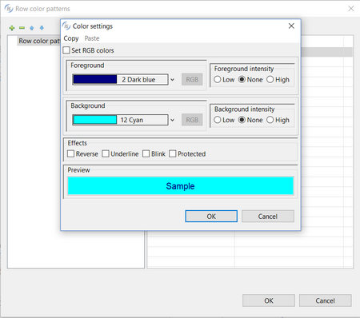 |
| row cursor background color | Opens a dialog that allows you to set the *Row-Cursor-Background-Color* property   |
| row cursor color | Opens a dialog that allows you to set the *Row-Cursor-Color* property   |
| row cursor foreground color | Opens a dialog that allows you to set the *Row-Cursor-Foreground-Color* property   |
| row dividers | Specifies the value for the *Row-Dividers* property |
| row headings | TRUE...The *Row-Headings* style is generated FALSE...The *Row-Headings* style is not generated |
| row rollover background color | Opens a dialog to retrieve the value for the *Row-Rollover-Background-Color* property   |
| row rollover color | Opens a dialog to retrieve the value for the *Row-Rollover-Color* property   |
| row rollover foreground color | Opens a dialog to retrieve the value for the *Row-Rollover-Foreground-Color* property   |
| row selected background color | Opens a dialog that allows you to set the *Row-Selected-Background-Color* property.   |
| row selected color | Opens a dialog that allows you to set the *Row-Selected-Color* property.   |
| row selected foreground color | Opens a dialog that allows you to set the *Row-Selected-Foreground-Color* property.   |
| row settings | Opens a dialog that allows the user to configure rows characteristics  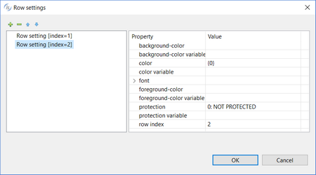 |
| rows-per-page | Specifies the value for the *Rows-Per-Page* property |
| search panel | Never visible... *Search-Panel=-1* is generated Visible on demand... *Search-Panel* is not generated Always visible... *Search-Panel=1* is generated |
| selection mode | Opens a dialog that allows you to set the Selection-Mode property.  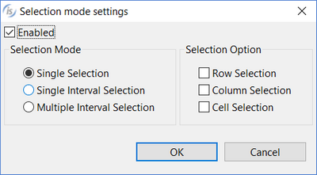 |
| size | Specifies the control width as expressed in cells. This property is set automatically when the control is drawn |
| size pixels | Specifies the control width as expressed in pixels. This property is set automatically when the control is drawn |
| size unit | DEFAULT... Either *CELLS* or nothing is generated after the Size value depending on the window’s “cell” property setting None... Neither *CELLS* nor *PIXELS* are generated after the Size value CELLS... *CELLS* is generated after the Size value PIXELS... *PIXELS* is generated after the Size value |
| sortable columns | TRUE...The *Sortable-Columns* style is generated FALSE...The *Sortable-Columns* style is not generated |
| tab order | Sets the ordinal position of the control in the Screen Section. This property is set automatically when the control is drawn |
| tiled heading | TRUE... The *Tiled-Headings* style is generated FALSE... The *Tiled-Headings* style is not generated |
| use TAB | TRUE... The *Use-Tab* style is generated FALSE.. The *Use-Tab* style is not generated |
| virtual width | Specifies the value for the *Virtual-Width* property |
| visible | NONE...*Visible* property is not generated TRUE... *Visible=1* is generated FALSE...*Visible=0* is generated |
| vpadding | Specifies the value for the *Vpadding* property |
| vscroll | TRUE...The *Vscroll* style is generated FALSE...The *Vscroll* style is not generated |
| width-in-cells | TRUE...The *Width-In-Cells* style is generated FALSE... The *Width-In-Cells* style is not generated |

| Events | |
| --- | --- |
| cmd-goto event | Allows the user to create a paragraph to handle the CMD-GOTO event in the Procedure Division |
| cmd-help event | Allows the user to create a paragraph to handle the CMD-HELP event in the Procedure Division |
| msg-begin-drag event | Allows the user to create a paragraph to handle the MSG-BEGIN-DRAG event in the Procedure Division |
| msg-begin-entry event | Allows the user to create a paragraph to handle the-MSG-BEGIN-ENTRY event in the Procedure Division |
| msg-begin-heading-drag event | Allows the user to create a paragraph to handle the MSG-BEGIN-HEADING-DRAG event in the Procedure Division |
| msg-begin-sort event | Allows the user to create a paragraph to handle the MSG-BEGIN-SORT event in the Procedure Division |
| msg-bitmap-clicked | Allows the user to create a paragraph to handle the MSG-BITMAP-CLICKED event in the Procedure Division |
| msg-bitmap-dblclick | Allows the user to create a paragraph to handle the MSG-BITMAP-DBLCLICK event in the Procedure Division |
| msg-cancel-entry | Allows the user to create a paragraph to handle the MSG-CANCEL-ENTRY event in the Procedure Division |
| msg-col-width-changed | Allows the user to create a paragraph to handle the MSG-COL-WIDTH-CHANGED event in the Procedure Division |
| msg-drag event | Allows the user to create a paragraph to handle the MSG-DRAG event in the Procedure Division |
| msg-drop event | Allows the user to create a paragraph to handle the MSG-DROP event in the Procedure Division |
| msg-end-drag event | Allows the user to create a paragraph to handle the MSG-END-DRAG event in the Procedure Division |
| msg-end-heading-drag event | Allows the user to create a paragraph to handle the MSG-END-HEADING-DRAG event in the Procedure Division |
| msg-end-menu event | Allows the user to create a paragraph to handle the MSG-END-MENU event in the Procedure Division |
| msg-finish-entry event | Allows the user to create a paragraph to handle the MSG-FINISH-ENTRY event in the Procedure Division |
| msg-finish-filter event | Allows the user to create a paragraph to handle the MSG-FINISH-FILTER event in the Procedure Division |
| msg-finish-sort event | Allows the user to create a paragraph to handle the MSG-FINISH-SORT event in the Procedure Division |
| msg-gd-dblclick event | Allows the user to create a paragraph to handle the MSG-GD-DBLCLICK event in the Procedure Division |
| msg-goto-cell-drag event | Allows the user to create a paragraph to handle the MSG-GOTO-CELL-DRAG event in the Procedure Division |
| msg-goto-cell event | Allows the user to create a paragraph to handle the MSG-GOTO-CELL event in the Procedure Division |
| msg-goto-cell-mouse event | Allows the user to create a paragraph to handle the MSG-GOTO-CELL-MOUSE event in the Procedure Division |
| msg-goto-cell-out-next event | Allows the user to create a paragraph to handle the MSG-GOTO-CELL-OUT-NEXT event in the Procedure Division |
| msg-goto-cell-out-prev event | Allows the user to create a paragraph to handle the MSG-GOTO-CELL-OUT-PREV event in the Procedure Division |
| msg-grid-rbutton-down event | Allows the user to create a paragraph to handle the MSG-GRID-RBUTTON-DOWN event in the Procedure Division |
| msg-grid-rbutton-up event | Allows the user to create a paragraph to handle the MSG-GRID-RBUTTON-UP event in the Procedure Division |
| msg-heading-clicked event | Allows the user to create a paragraph to handle the MSG-HEADING-CLICKED event in the Procedure Division |
| msg-heading-dblclick event | Allows the user to create a paragraph to handle the MSG-HEADING-DBLCLICK event in the Procedure Division |
| msg-heading-dragged event | Allows the user to create a paragraph to handle the MSG-HEADING-DRAGGED event in the Procedure Division |
| msg-init-menu event | Allows the user to create a paragraph to handle the MSG-INIT-MENU event in the Procedure Division |
| msg-load-on-demand event | Allows the user to create a paragraph to handle the MSG-LOAD-ON-DEMAND event in the Procedure Division |
| msg-menu-input event | Allows the user to create a paragraph to handle the MSG-MENU-INPUT event in the Procedure Division |
| msg-mouse-enter event | Allows the user to create a paragraph to handle the MSG-MOUSE-ENTER event in the Procedure Division |
| msg-mouse-exit event | Allows the user to create a paragraph to handle the MSG-MOUSE-EXIT event in the Procedure Division |
| msg-paged-first event | Allows the user to create a paragraph to handle the MSG-PAGED-FIRST event in the Procedure Division |
| msg-paged-last event | Allows the user to create a paragraph to handle the MSG-PAGED-LAST event in the Procedure Division |
| msg-paged-next event | Allows the user to create a paragraph to handle the MSG-PAGED-NEXT event in the Procedure Division |
| msg-paged-nextpage event | Allows the user to create a paragraph to handle the MSG-PAGED-NEXTPAGE event in the Procedure Division |
| msg-paged-prev event | Allows the user to create a paragraph to handle the MSG-PAGED-PREV event in the Procedure Division |
| msg-paged-prevpage event | Allows the user to create a paragraph to handle the MSG-PAGED-PREVPAGE event in the Procedure Division |
| msg-validate event | Allows the user to create a paragraph to handle the MSG-VALIDATE event in the Procedure Division |
| other event | Allows the user to create a custom paragraph |

| Exceptions | |
| --- | --- |
| cmd-goto exception | Allows the user to create a paragraph to handle the CMD-GOTO event when the Accept terminates with crt status = 96. This is an alternative to the event procedures described above |
| cmd-help exception | Allows the user to create a paragraph to handle the CMD-HELP event when the Accept terminates with crt status = 96. This is an alternative to the event procedures described above |
| other exception | Allows the user to create a custom paragraph |

| Procedures | |
| --- | --- |
| After procedure | Allows the user to create a paragraph to handle the control AFTER PROCEDURE |
| After procedure thru | Allows the user to optionally specify a THRU paragraph for the AFTER PROCEDURE. |
| Before procedure | Allows the user to create a paragraph to handle the control BEFORE PROCEDURE |
| Before procedure thru | Allows the user to optionally specify a THRU paragraph for the BEFORE PROCEDURE. |
| Event procedure | Allows the user to create a paragraph to handle the control EVENT PROCEDURE |
| Exception procedure | Allows the user to create a paragraph to handle the control EXCETPION PROCEDURE |

| Variables | |
| --- | --- |
| background-color variable | Numeric variable that hosts the value for the *Background-Color* property. |
| border color variable | Numeric variable that hosts the value for the *Border-Color* property. |
| border width variable | Alphanumeric variable that hosts the value for the *Border-Width* property. |
| cell-entry background color variable | Numeric variable that hosts the value for the *Cell-Entry-Background-Color* property. |
| cell-entry color variable | Numeric variable that hosts the value for the *Cell-Entry-Color* property. |
| cell-entry foreground color variable | Numeric variable that hosts the value for the *Cell-Entry-Foreground-Color* property. |
| cell selected background color variable | Numeric variable that hosts the value for the *Cell-Selected-Background-Color* property. |
| cell selected color variable | Numeric variable that hosts the value for the *Cell-Selected-Color* property. |
| cell selected foreground color variable | Numeric variable that hosts the value for the *Cell-Selected-Foreground-Color* property. |
| color variable | Numeric variable that hosts the color value |
| column headings height variable | Numeric variable that hosts the value for the *Column-Headings-Height* property. |
| column variable | Numeric variable that hosts the column value |
| css-style-name variable | Alphanumeric variable that hosts the css style associated with the control. It works only in a WebDirect environment. |
| cursor background color variable | Numeric variable that hosts the value for the *Cursor-BackgroundColor* property |
| cursor color variable | Numeric variable that hosts the value for the *Cursor-Color* property |
| cursor foreground color variable | Numeric variable that hosts the value for the *Cursor-Foreground-Color* property |
| cursor frame color variable | Numeric variable that hosts the value for the *Cursor-Frame-Color* property |
| cursor frame width variable | Numeric variable that hosts the value for the *Cursor-Frame-Width* property |
| cursor X variable | Numeric variable that hosts the value for the *Cursor-X* property |
| cursor Y variable | Numeric variable that hosts the value for the *Cursor-Y* property |
| custom-data property | Alphanumeric variable that hosts the value for the *Custom-Data* property |
| divider color variable | Numeric variable that hosts the value for the *Divider-Color* property |
| drag background color variable | Numeric variable that hosts the value for the *Drag-Background-Color* property |
| drag color variable | Numeric variable that hosts the value for the *Drag-Color* property |
| drag foreground color variable | Numeric variable that hosts the value for the *Drag-Foreground-Color* property |
| enabled variable | Numeric variable that hosts the enabled state |
| end color variable | Numeric variable that hosts the value for the *End-Color* property |
| export file format variable | Alphanumeric variable that hosts the value for the *Export-File-Format* property |
| export file name variable | Alphanumeric variable that hosts the value for the *Export-File-Name* property |
| export file open variable | Numeric variable that hosts the value for the *Export-File-Open* property |
| heading background color variable | Numeric variable that hosts the value for the *Heading-Background-Color* property |
| heading color variable | Numeric variable that hosts the value for the *Heading-Color* property |
| heading foreground color variable | Numeric variable that hosts the value for the *Heading-Foreground-Color* property |
| heading divider color variable | Numeric variable that hosts the value for the *Heading-Divider-Color* property |
| heading rollover background color variable | Numeric variable that hosts the value for the *Heading-Rollover-Background-Color* property |
| heading rollover color variable | Numeric variable that hosts the value for the *Heading-Rollover-Color* property |
| heading rollover foreground color variable | Numeric variable that hosts the value for the *Heading-Rollover-Foreground-Color* property |
| help-id variable | Numeric variable that hosts the help id |
| hint variable | Alphanumeric variable that hosts the hint value. |
| id variable | Numeric variable that hosts the control id |
| key variable | Alphanumeric variable that hosts the value for the *Key* property |
| last-row variable | Numeric variable that hosts the value for the *Last-Row* property |
| layout-data variable | Numeric variable that hosts the control resize rules |
| lines variable | Numeric variable that hosts the lines value |
| line variable | Numeric variable that hosts the line value |
| lod-threshold variable | Numeric variable that hosts the value for the *Lod-Threshold* property |
| mass-update variable | Numeric variable that hosts the value for the *Mass-Update* property |
| max-height variable | Numeric variable that hosts the maximum height |
| max-width variable | Numeric variable that hosts the maximum width |
| min-height variable | Numeric variable that hosts the minimum height |
| min-width variable | Numeric variable that hosts the minimum width |
| num col headings variable | Numeric variable that hosts the value for the *Num-Col-Headings* property |
| num rows variable | Numeric variable that hosts the value for the *Num-Rows* property |
| protection variable | Numeric variable that hosts the value for the *Protection* property |
| record data | Numeric variable that hosts the value for the *Record-Data* property |
| record-to-add variable | Numeric variable that hosts the value for the *Record-To-Add* property |
| region background color variable | Numeric variable that hosts the value for the *Region-Background-Color* property |
| region color variable | Numeric variable that hosts the value for the *Region-Color* property |
| region foreground color variable | Numeric variable that hosts the value for the *Region-Foreground-Color* property |
| row cursor background color variable | Numeric variable that hosts the value for the *Row-Cursor-Background-Color* property |
| row cursor color variable | Numeric variable that hosts the value for the *Row-Cursor-Color* property |
| row cursor foreground color variable | Numeric variable that hosts the value for the *Row-Cursor-Foreground-Color* property |
| row rollover background color variable | Numeric variable that hosts the value for the *Row-Rollover-Background-Color* property |
| row rollover color variable | Numeric variable that hosts the value for the *Row-Rollover-Color* property |
| row rollover foreground color variable | Numeric variable that hosts the value for the *Row-Rollover-Foreground-Color* property |
| row selected background color variable | Numeric variable that hosts the value for the *Row-Selected-Background-Color* property |
| row selected color variable | Numeric variable that hosts the value for the *Row-Selected-Color* property |
| row selected foreground color variable | Numeric variable that hosts the value for the *Row-Selected-Foreground-Color* property |
| rows-per-page variable | Numeric variable that hosts the value for the *Rows-Per-Page* property |
| search panel variable | Numeric variable that hosts the value for the *Search-Panel* property |
| selection-mode variable | Numeric variable that hosts the value for the *Selection-Mode* property |
| size variable | Numeric variable that hosts the size value |
| value container | occurs item that hosts control items |
| virtual width variable | Numeric variable that hosts the value for the *Virtual-Width* property |
| visible variable | Numeric variable that hosts the visible state |
| vpadding variable | Numeric variable that hosts the value for the *Vpadding* property |
