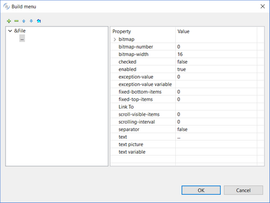

### MENU

| Properties | |
| --- | --- |
| (name) | Specifies the control name. This property is set automatically when the control is drawn |
| bitmap | Opens a dialog box that allows the user to select an image file to be used as tray icon. It’s considered only when style=SYSTEM-TRAY. It’s also possible to generate an image from a series of characters represented with a given font   |
| bitmap-number | Specifies which bitmap of a bitmap strip must be used as tray icon. It’s considered only when style=SYSTEM-TRAY |
| bitmap-width | Specifies the width in pixels of the tray icon. It’s considered only when style=SYSTEM-TRAY |
| column pixels | Specifies the X coordinate of the control as expressed in pixels. This property is set automatically when the control is drawn |
| exception-value | Specifies the exception-value returned when clicking on the tray icon. It’s considered only when style=SYSTEM-TRAY |
| exception-value-2 | Specifies the exception-value returned when double-clicking on the tray icon. It’s considered only when style=SYSTEM-TRAY |
| item settings | Opens a dialog that allows the user to define menu items   |
| line pixels | Specifies the Y coordinate of the control as expressed in pixels. This property is set automatically when the control is drawn |
| style | Allows the user to choose the type of menu MENU-BAR POP-UP SYSTEM-TRAY HAMBURGER |
| tooltip-text | Specifies the tray icon tool tip text. It’s considered only when style=SYSTEM-TRAY |
| tooltip-text picture | Specifies the picture for the tooltip-text variable |

| Events | |
| --- | --- |
| No Events available. | |

| Exceptions |  |
| --- | --- |
| No Exceptions available. | |

| Procedures |  |
| --- | --- |
| No Procedures available. | |

| Variables | |
| --- | --- |
| exception-value | Numeric variable that hosts the exception-value generated when clicking on the tray icon |
| exception-value-2 | Numeric variable that hosts the exception-value generated when double-clicking on the tray icon |
| menu-handle | Numeric variable that hosts the control handle |
| tooltip-text variable | Alphanumeric variable that hosts the tool-tip for the tray icon |
