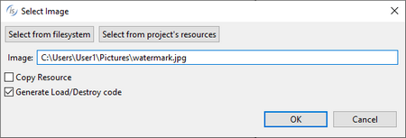

### SCROLL PANE

Refer to [SCROLL-PANE](../../../is-cobol-evolve/User-Interface/Controls-Reference/SCROLL-PANE/SCROLL-PANE) for details about properties, styles and events of this control.

| Properties | |
| --- | --- |
| (name) | Specifies the control name. This property is set automatically when the control is drawn |
| (page name) | Specifies the logical name of the group of controls included in the Scroll Pane. This property is set automatically when the control is drawn |
| additional properties | Allows the user to specify additional properties and styles. The text you write here is generated as is and may generate compile errors if not correct. |
| background-bitmap | Opens a dialog box that allows the user to select an image file to load into the control.   |
| background-bitmap-scale | Allows the user to choose if the background-bitmap must be scaled to fit the control area. The Background-Bitmap-Scale property is generated according to this choice. |
| background-color | Opens a dialog that allows the user to choose the control background color.   |
| border | Allows the user to choose one of the following styles: 3-D BOXED NO-BOX |
| border color | Opens a dialog that allows the user to choose the control border color.   |
| color | Opens a dialog that allows the user to choose the control color.   |
| column | Specifies the X coordinate of the control as expressed in cells. This property is set automatically when the control is drawn. |
| column pixels | Specifies the X coordinate of the control as expressed in pixels. This property is set automatically when the control is drawn. |
| css-base-style-name css-style-name | Specify the CSS style associated with the control. It works only in a WebDirect environment. See [Customize the WebDirect Layout using CSS](../../../is-cobol-EIS/WebDirect-option/Customize-the-WebDirect-Layout-using-CSS) for more information. |
| custom-data | Specifies the value for the *Custom-Data* property. |
| destroy type | AUTOMATIC...neither the *Temporary* nor Permanent styles are generated TEMPORARY...*Temporary* style is generated PERMANENT...*Permanent* style is generated |
| drag mode | No drag events... *Drag-Mode* is not generated Only MSG-DRAG... *Drag-Mode=1* is generated Only MSG-DROP... *Drag-Mode=2* is generated Both events... *Drag-Mode=3* is generated |
| enabled | NONE...*Enabled* property is not generated TRUE... *Enabled=1* is generated FALSE...*Enabled=0* is generated |
| event list | Opens a dialog that allows you to choose which events must be added to the event list of this control.   |
| exclude event list | NONE... The *Exclude-Event-List* property is not generated. 0... *Exclude-Event-List=0* is generated. 1... *Exclude-Event-List=1* is generated. |
| font | Opens a dialog that allows the user to choose the control font.      The dialog lists the fonts installed in the system and allows you to load new fonts from disc files. Fonts loaded from disc are added to the list with an asterisk before their name. When one of these fonts is selected the *Copy Resource* option is enabled and can be activated. Activate the option to include the font disc file in the compiled class or be sure to distribute this file along with your application. |
| foreground-color | Opens a dialog that allows the user to choose the control foreground color.   |
| gradient-color-1 | Opens a dialog that allows the user to choose the window gradient start color.   |
| gradient-color-2 | Opens a dialog that allows the user to choose the window gradient end color.   |
| gradient-orientation | Specifies the gradient orientation. Possible values are: None0: NORTH-TO-SOUTH 1: NORTHEAST-TO-SOUTHWEST 2: EAST-TO-WEST 3: SOUTHEAST-TO-NORTHWEST 4: SOUTH-TO-NORTH 5: SOUTHWEST-TO-NORTHEAST 6: WEST-TO-EAST 7: NORTHWEST-TO-SOUTHEAST |
| height-in-cells | TRUE...The *Height-In-Cells* style is generated FALSE... The *Height-In-Cells* style is not generated |
| help-id | Specifies the control *Help-id*. |
| hint | Specifies the value for the *Hint* property. |
| id | Specifies the control id. This property is set automatically when the control is drawn. |
| key | Specifies the value for the *Key* property. |
| layout-data | Opens a dialog that allows the user to choose the control resize rules.    If the option "Follows Layout-Manager defaults" is checked, the *Layout-Data* property is not generated. |
| line | Specifies the Y coordinate of the control as expressed in cells. This property is set automatically when the control is drawn |
| line pixels | Specifies the Y coordinate of the control as expressed in pixels. This property is set automatically when the control is drawn |
| lines | Specifies the control height as expressed in cells. This property is set automatically when the control is drawn |
| lines pixels | Specifies the control height as expressed in pixels. This property is set automatically when the control is drawn |
| lines unit | DEFAULT... Either *CELLS* or nothing is generated after the *Lines* value depending on the window’s “cell” property setting None... Neither *CELLS* nor *PIXELS* are generated after the *Lines* value CELLS... *CELLS* is generated after the *Lines* value PIXELS... *PIXELS* is generated after the *Lines* value |
| lock | TRUE...Locks the control on the Screen Designer so that you cannot move it anymore by dragging it with the mouse. FALSE...You can move the control on the Screen Designer by dragging it with the mouse |
| max-height | Specifies the control maximum height as expressed in cells |
| max-width | Specifies the control maximum width as expressed in cells |
| min-height | Specifies the control minimum height as expressed in cells |
| min-width | Specifies the control minimum width as expressed in cells |
| no-tab | TRUE...The *No-Tab* style is generated FALSE...The *No-Tab* style is not generated |
| notify-mouse | TRUE...The *Notify-Mouse* style is generated FALSE...The *Notify-Mouse* style is not generated |
| size | Specifies the control width as expressed in cells. This property is set automatically when the control is drawn |
| size pixels | Specifies the control width expressed in pixels. This property is set automatically when the control is drawn |
| size unit | DEFAULT... Either *CELLS* or nothing is generated after the *Size* value depending on the window’s “cell” property setting None... Neither *CELLS* nor *PIXELS* are generated after the *Size* value CELLS... *CELLS* is generated after the *Size* value PIXELS... *PIXELS* is generated after the *Size* value |
| tab order | Sets the ordinal position of the control in the Screen Section. This property is set automatically when the control is drawn |
| transparent | TRUE...The *Transparent* style is generated FALSE...The *Transparent* style is not generated |
| visible | NONE...*Visible* property is not generated TRUE... *Visible=1* is generated FALSE...*Visible=0* is generated |
| width-in-cells | TRUE...The *Width-In-Cells* style is generated FALSE... The *Width-In-Cells* style is not generated |

| Events | |
| --- | --- |
| msg-drag event | Allows the user to create a paragraph to handle the MSG-DRAG event in the Procedure Division |
| msg-drop event | Allows the user to create a paragraph to handle the MSG-DROP event in the Procedure Division |
| msg-mouse-clicked event | Allows the user to create a paragraph to handle the MSG-MOUSE-CLICKED event in the Procedure Division |
| msg-mouse-dblclick event | Allows the user to create a paragraph to handle the MSG-MOUSE-DBLCLICK event in the Procedure Division |
| msg-mouse-enter event | Allows the user to create a paragraph to handle the MSG-MOUSE-ENTER event in the Procedure Division |
| msg-mouse-exit event | Allows the user to create a paragraph to handle the MSG-MOUSE-EXIT event in the Procedure Division |
| other event | Allows the user to create a custom paragraph |

| Procedures | |
| --- | --- |
| Event procedure | Allows the user to create a paragraph to handle the control EVENT PROCEDURE |

| Variables | |
| --- | --- |
| background-bitmap-scale variable | Numeric variable that hosts the value for the *Background-Bitmap-Scale* property |
| background-color variable | Numeric variable that hosts the background color value |
| border-color variable | Numeric variable that hosts the border color value |
| border width variable | Numeric variable that hosts the value for the *Border-Width* property. |
| color variable | Numeric variable that hosts the color value |
| column variable | Numeric variable that hosts the column value |
| css-base-style-name variable | Alphanumeric variable that hosts the css base style associated with the control. It works only in a WebDirect environment. |
| css-style-name variable | Alphanumeric variable that hosts the css style associated with the control. It works only in a WebDirect environment. |
| drag-mode variable | Alphanumeric variable that hosts the value for the *Drag-Mode* property |
| enabled variable | Numeric variable that hosts the enabled state |
| foreground-color variable | Numeric variable that hosts the foreground color value |
| gradient-color-1 variable | Numeric variable that hosts the value for the *Gradient-Color-1* property |
| gradient-color-2 variable | Numeric variable that hosts the value for the *Gradient-Color-2* property |
| gradient-orientation variable | Numeric variable that hosts the value for the *Gradient-Orientation* property |
| help-id variable | Numeric variable that hosts the help id |
| hint variable | Alphanumeric variable that hosts the hint value. |
| id variable | Numeric variable that hosts the control id |
| key variable | Alphanumeric variable that hosts the value for the *Key* property |
| layout-data variable | Numeric variable that hosts the control resize rules |
| lines variable | Numeric variable that hosts the lines value |
| line variable | Numeric variable that hosts the line value |
| max-height variable | Numeric variable that hosts the maximum height |
| max-width variable | Numeric variable that hosts the maximum width |
| min-height variable | Numeric variable that hosts the minimum height |
| min-width variable | Numeric variable that hosts the minimum width |
| size variable | Numeric variable that hosts the size value |
| visible variable | Numeric variable that hosts the visible state |
