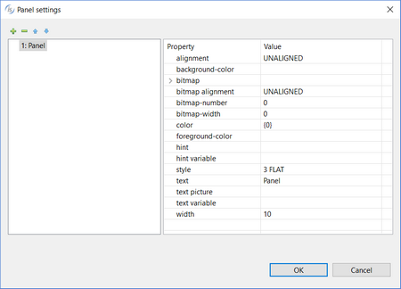

### STATUS BAR

Refer to [STATUS-BAR](../../../is-cobol-evolve/User-Interface/Controls-Reference/STATUS-BAR/STATUS.BAR) for details about properties, styles and events of this control.

| Properties | |
| --- | --- |
| (name) | Specifies the control name. This property is set automatically when the control is drawn |
| background-color | Opens a dialog that allows the user to choose the control background color.   |
| color | Opens a dialog that allows the user to choose the control color.   |
| custom-data | Specifies the value for the *Custom-Data* property. |
| font | Opens a dialog that allows the user to choose the control font.      The dialog lists the fonts installed in the system and allows you to load new fonts from disc files. Fonts loaded from disc are added to the list with an asterisk before their name. When one of these fonts is selected the *Copy Resource* option is enabled and can be activated. Activate the option to include the font disc file in the compiled class or be sure to distribute this file along with your application. |
| foreground-color | Opens a dialog that allows the user to choose the control foreground color.   |
| grip | TRUE... The *Grip* style is generated FALSE... The *Grip* style is not generated |
| help-id | Specifies the control *Help-id*. |
| id | Specifies the control id. This property is set automatically when the control is drawn. |
| lines | Specifies the control height as expressed in cells. This property is set automatically when the control is drawn |
| panel settings | Opens a dialog that allows the user to define panels   |
| pop up menu | Associates a pop-up menu with the control. The menu must have been drawn on the same screen. |
| notify-mouse | TRUE...The *Notify-Mouse* style is generated FALSE...The *Notify-Mouse* style is not generated |
| visible | NONE...The *Visible* property is not generated TRUE... *Visible=1* is generated FALSE...*Visible=0* is generated |
| width-in-cells | TRUE...The *Width-In-Cells* style is generated FALSE... The *Width-In-Cells* style is not generated |

| Events | |
| --- | --- |
| cmd-help event | Allows the user to create a paragraph to handle the CMD-HELP event in the Procedure Division |
| msg-mouse-clicked event | Allows the user to create a paragraph to handle the MSG-MOUSE-CLICKED event in the Procedure Division |
| msg-mouse-dblclick event | Allows the user to create a paragraph to handle the MSG-MOUSE-DBLCLICK event in the Procedure Division |
| msg-mouse-enter event | Allows the user to create a paragraph to handle the MSG-MOUSE-ENTER event in the Procedure Division |
| msg-mouse-exit event | Allows the user to create a paragraph to handle the MSG-MOUSE-EXIT event in the Procedure Division |
| msg-st-dblclick event | Allows the user to create a paragraph to handle the MSG-ST-DBLCLICK event in the Procedure Division |
| other event | Allows the user to create a custom paragraph |

| Exceptions | |
| --- | --- |
| cmd-help exception | Allows the user to create a paragraph to handle the CMD-HELP event when the Accept terminates with crt status = 96. This is an alternative to the event procedures described above |
| other exception | Allows the user to create a custom paragraph |

| Procedures | |
| --- | --- |
| Event procedure | Allows the user to create a paragraph to handle the control EVENT PROCEDURE |
| Exception procedure | Allows the user to create a paragraph to handle the control EXCEPTION PROCEDURE |

| Variables | |
| --- | --- |
| background-color variable | Numeric variable that hosts the background-color value |
| color variable | Numeric variable that hosts the color value |
| foreground-color variable | Numeric variable that hosts the foreground-color value |
| help-id variable | Numeric variable that hosts the control help id |
| id variable | Numeric variable that hosts the control id |
| status bar handle | Numeric variable that hosts the control handle |
