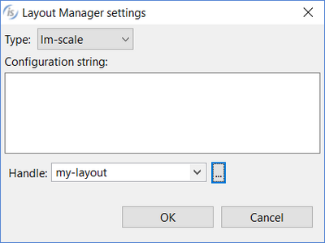

### TOOL BAR

Refer to [TOOL-BAR](../../../is-cobol-evolve/User-Interface/Controls-Reference/TOOL-BAR/TOOL-BAR) for details about properties, styles and events of this control.

| Properties | |
| --- | --- |
| (name) | Specifies the control name. This property is set automatically when the control is drawn |
| cell | TRUE... The *Cell-Width* and *Cell-Height* properties are generated and *Lines* is measured in cells. FALSE... The *Cell-Width* and *Cell-Height* properties are not generated and *Lines* is not measured in cells. |
| cell-height | Specifies the value for the *Cell-Height* property |
| call-width | Specifies the value for the *Cell-Width* property |
| background-bitmap | Opens a dialog box that allows the user to select an image file to load into the control.   |
| background-bitmap-scale | Allows the user to choose if the background-bitmap must be scaled to fit the control area. The Background-Bitmap-Scale property is generated according to this choice. |
| background-color | Opens a dialog that allows the user to choose the control background color.   |
| color | Opens a dialog that allows the user to choose the control color.     The dialog lists the fonts installed in the system and allows you to load new fonts from disc files. Fonts loaded from disc are added to the list with an asterisk before their name. When one of these fonts is selected the *Copy Resource* option is enabled and can be activated. Activate the option to include the font disc file in the compiled class or be sure to distribute this file along with your application. |
| control font | Opens a dialog that allows the user to choose the control font.    The dialog lists the fonts installed in the system and allows you to load new fonts from disc files. Fonts loaded from disc are added to the list with an asterisk before their name. When one of these fonts is selected the *Copy Resource* option is enabled and can be activated. Activate the option to include the font disc file in the compiled class or be sure to distribute this file along with your application. |
| custom-data | Specifies the value for the *Custom-Data* property. |
| foreground-color | Opens a dialog that allows the user to choose the control foreground color.   |
| gradient-color-1 | Opens a dialog that allows the user to choose the window gradient start color.   |
| gradient-color-2 | Opens a dialog that allows the user to choose the window gradient end color.   |
| gradient-orientation | Specifies the gradient orientation. Possible values are: None 0: NORTH-TO-SOUTH 1: NORTHEAST-TO-SOUTHWEST 2: EAST-TO-WEST 3: SOUTHEAST-TO-NORTHWEST 4: SOUTH-TO-NORTH 5: SOUTHWEST-TO-NORTHEAST 6: WEST-TO-EAST 7: NORTHWEST-TO-SOUTHEAST |
| laf-colors | TRUE... The LAF-COLORS style is generated FALSE... The LAF-COLORS style is not generated |
| layout manager | Opens a dialog that allows you to choose which layout manager should be associated to the toolbar. When either LM-SCALE or LM-RESPONSIVE is selected, it’s possible to specify the configuration string. In this dialog you also associate a handle to the layout manager.   |
| lines | Specifies the control height as expressed in cells. This property is set automatically when the control is drawn |
| lines pixels | Specifies the control height as expressed in pixels. This property is set automatically when the control is drawn |
| lines unit | DEFAULT... Either *CELLS* or nothing is generated after the *Lines* value depending on the window’s “cell” property setting None... Neither *CELLS* nor *PIXELS* are generated after the *Lines* value CELLS... *CELLS* is generated after the *Lines* value PIXELS... *PIXELS* is generated after the *Lines* value |
| lock | TRUE...Locks the control on the Screen Designer so that you cannot move it anymore by dragging it with the mouse. FALSE...You can move the control on the Screen Designer by dragging it with the mouse |
| moveable | TRUE... The *Moveable* style is generated FALSE... The *Moveable* style is not generated |
| multiline | TRUE... The *Multiline* style is generated FALSE... The *Multiline* style is not generated |
| pop up menu | Associates a pop-up menu with the control. The menu must have been drawn on the same screen. |
| tab order | Sets the ordinal position of the control in the Screen Section. This property is set automatically when the control is drawn |
| width-in-cells | TRUE...The *Width-In-Cells* style is generated FALSE... The *Width-In-Cells* style is not generated |

| Events | |
| --- | --- |
| No Events available. | |

| Exceptions |  |
| --- | --- |
| No Exceptions available. | |

| Procedures | |
| --- | --- |
| No Procedures available. | |

| Variables | |
| --- | --- |
| background-color variable | Numeric variable that hosts the value for the *Background-Color* property |
| color variable | Numeric variable that hosts the value for the *Color* property |
| custom-data variable | Alphanumeric variable that hosts the value for the *Custom-Data* property |
| foreground-color variable | Numeric variable that hosts the value for the *Foreground-Color* property |
| gradient-color-1 variable | Numeric variable that hosts the value for the *Gradient-Color-1* property |
| gradient-color-2 variable | Numeric variable that hosts the value for the *Gradient-Color-2* property |
| gradient-orientation variable | Numeric variable that hosts the value for the *Gradient-Orientation* property |
| toolbar-handle | Numeric variable that hosts the control handle |
