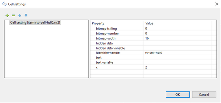
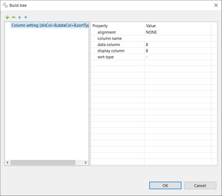
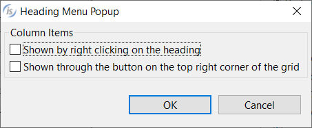
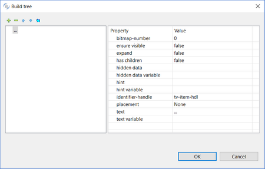

### TREE TABLE

Refer to [TREE-VIEW](../../../is-cobol-evolve/User-Interface/Controls-Reference/TREE-VIEW/TREE-VIEW) for details about properties, styles and events of this control.

| Properties | |
| --- | --- |
| (name) | Specifies the control name. This property is set automatically when the control is drawn |
| action | Specifies the value for the Action property |
| additional properties | Allows the user to specify additional properties and styles. The text you write here is generated as is and may generate compile errors if not correct. |
| adjustable columns | TRUE... The *Adjustable-Columns* style is generated FALSE... The *Adjustable-Columns* style is not generated |
| background-color | Opens a dialog that allows the user to choose the control background color.   |
| bitmap | Opens a dialog box that allows the user to select an image file to load into the control.It’s also possible to generate an image from a series of characters represented with a given font.   |
| bitmap-width | Specifies the value for the *Bitmap-Width* property |
| border | Allows the user to choose one of the following styles: 3-D BOXED NO-BOX |
| border-color | Opens a dialog that allows the user to choose the control border color.   |
| border-width | Opens a dialog that allows the user to choose the control border width.   |
| buttons | TRUE...The *Buttons* style is generated FALSE...The *Buttons* style is not generated |
| cell settings | Opens a dialog that allows the user to set cells content   |
| centered headings | TRUE... The *Centered-Headings* style is generated FALSE... The *Centered-Headings* style is not generated |
| color | Opens a dialog that allows the user to choose the control color.   |
| column | Specifies the X coordinate of the control as expressed in cells. This property is set automatically when the control is drawn. |
| column headings | TRUE... The *Column-Headings* style is generated FALSE... The *Column-Headings* style is not generated |
| column pixels | Specifies the X coordinate of the control as expressed in pixels. This property is set automatically when the control is drawn. |
| column settings | Opens a dialog that allows the user to configure columns   |
| css-base-style-name css-style-name | Specify the CSS style associated with the control. It works only in a WebDirect environment. See [Customize the WebDirect Layout using CSS](../../../is-cobol-EIS/WebDirect-option/Customize-the-WebDirect-Layout-using-CSS) for more information. |
| custom-data | Specifies the value for the *Custom-Data* property. |
| destroy type | AUTOMATIC...neither the *Temporary* nor Permanent styles are generated TEMPORARY...*Temporary* style is generated PERMANENT...*Permanent* style is generated |
| drag mode | No drag events... *Drag-Mode* is not generated Only MSG-DRAG... *Drag-Mode=1* is generated Only MSG-DROP... *Drag-Mode=2* is generated Both events... *Drag-Mode=3* is generated |
| enabled | NONE...*Enabled* property is not generated TRUE... *Enabled=1* is generated FALSE...*Enabled=0* is generated |
| end color | Opens a dialog to retrieve the value for the *End-Color* property   |
| event list | Opens a dialog that allows you to choose which events must be added to the event list of this control.   |
| exclude event list | NONE... The *Exclude-Event-List* property is not generated. 0... *Exclude-Event-List=0* is generated. 1... *Exclude-Event-List=1* is generated. |
| flat | TRUE... The *Flat* style is generated FALSE... The *Flat* style is not generated |
| font | Opens a dialog that allows the user to choose the control font.      The dialog lists the fonts installed in the system and allows you to load new fonts from disc files. Fonts loaded from disc are added to the list with an asterisk before their name. When one of these fonts is selected the *Copy Resource* option is enabled and can be activated. Activate the option to include the font disc file in the compiled class or be sure to distribute this file along with your application. |
| foreground-color | Opens a dialog that allows the user to choose the control foreground color.   |
| heading background color | Opens a dialog to retrieve the value for the *Heading-Background-Color* property   |
| heading color | Opens a dialog to retrieve the value for the *Heading-Color* property   |
| heading font | Opens a dialog that allows the user to choose the heading font.       The dialog lists the fonts installed in the system and allows you to load new fonts from disc files. Fonts loaded from disc are added to the list with an asterisk before their name. When one of these fonts is selected the *Copy Resource* option is enabled and can be activated. Activate the option to include the font disc file in the compiled class or be sure to distribute this file along with your application. |
| heading foreground color | Opens a dialog to retrieve the value for the *Heading-Foreground-Color* property   |
| heading menu popup | Opens a dialog that allows you to configure the heading menu.   |
| heading rollover background color | Opens a dialog to retrieve the value for the *Heading-Rollover-Background-Color* property   |
| heading rollover color | Opens a dialog to retrieve the value for the *Heading-Rollover-Color* property   |
| heading rollover foreground color | Opens a dialog to retrieve the value for the *Heading-Rollover-Foreground-Color* property   |
| height-in-cells | TRUE...The *Height-In-Cells* style is generated FALSE... The *Height-In-Cells* style is not generated |
| help-id | Specifies the control *Help-id*. |
| hint | Specifies the value for the *Hint* property. |
| id | Specifies the control id. This property is set automatically when the control is drawn. |
| item rollover background color | Opens a dialog that allows the user to choose the rollover background color.   |
| item rollover color | Opens a dialog that allows the user to choose the rollover color.   |
| item rollover foreground color | Opens a dialog that allows the user to choose the rollover foreground color.   |
| key | Specifies the value for the *Key* property. |
| layout-data | Opens a dialog that allows the user to choose the control resize rules.    If the option "Follows Layout-Manager defaults" is checked, the *Layout-Data* property is not generated. |
| line | Specifies the Y coordinate of the control as expressed in cells. This property is set automatically when the control is drawn |
| line pixels | Specifies the Y coordinate of the control as expressed in pixels. This property is set automatically when the control is drawn |
| lines | Specifies the control height as expressed in cells. This property is set automatically when the control is drawn |
| lines pixels | Specifies the control height as expressed in pixels. This property is set automatically when the control is drawn |
| lines at root | TRUE...The *Lines-At-Root* style is generated FALSE...The *Lines-At-Root* style is not generated |
| lines unit | DEFAULT... Either *CELLS* or nothing is generated after the *Lines* value depending on the window’s “cell” property setting None... Neither *CELLS* nor *PIXELS* are generated after the *Lines* value CELLS... *CELLS* is generated after the *Lines* value PIXELS... *PIXELS* is generated after the *Lines* value |
| lm-on-columns | NONE... *Lm-On-Columns* is not generated TRUE... *Lm-On-Columns=1* is generated FALSE... *Lm-On-Columns=0* is generated |
| lock | TRUE...Locks the control on the Screen Designer so that you cannot move it anymore by dragging it with the mouse. FALSE...You can move the control on the Screen Designer by dragging it with the mouse |
| mass-update | Specifies the value for the *Mass-Update* property |
| max-height | Specifies the control maximum height as expressed in cells |
| max-width | Specifies the control maximum width as expressed in cells |
| min-height | Specifies the control minimum height as expressed in cells |
| min-width | Specifies the control minimum width as expressed in cells |
| no-tab | TRUE...The *No-Tab* style is generated FALSE...The *No-Tab* style is not generated |
| notify-mouse | TRUE...The *Notify-Mouse* style is generated FALSE...The *Notify-Mouse* style is not generated |
| pop up menu | Associates a pop-up menu with the control. The menu must have been drawn on the same screen. |
| reordering columns | TRUE...The *Reordering-Columns* style is generated FALSE...The *Reordering-Columns* style is not generated |
| selection background color | Opens a dialog that allows the user to choose the selection background color.   |
| selection color | Opens a dialog that allows the user to choose the selection color.   |
| selection foreground color | Opens a dialog that allows the user to choose the selection foreground color.   |
| show lines | TRUE...The *Show-Lines* style is generated FALSE...The *Show-Lines* style is not generated |
| show selection always | TRUE...The *Show-Sel-Always* style is generated FALSE...The *Show-Sel-Always* style is not generated |
| size | Specifies the control width as expressed in cells. This property is set automatically when the control is drawn |
| size pixels | Specifies the control width as expressed in pixels. This property is set automatically when the control is drawn |
| size unit | DEFAULT... Either *CELLS* or nothing is generated after the *Size* value depending on the window’s “cell” property setting None... Neither *CELLS* nor *PIXELS* are generated after the *Size* value CELLS... *CELLS* is generated after the *Size* value PIXELS... *PIXELS* is generated after the *Size* value |
| sortable columns | TRUE...The *Sortable-Columns* style is generated FALSE...The *Sortable-Columns* style is not generated |
| tab order | Sets the ordinal position of the control in the Screen Section. This property is set automatically when the control is drawn |
| tiled headings | TRUE...The *Tiled-Headings* style is generated FALSE...The *Tiled-Headings* style is not generated |
| tree item settings | Opens a dialog that allows the user to define items   |
| value | Specifies the value for the *Value* property |
| virtual width | Specifies the value for the *Virtual-Width* property |
| visible | NONE...*Visible* property is not generated TRUE... *Visible=1* is generated FALSE...*Visible=0* is generated |
| vpadding | Specifies the value for the *Vpadding* property |
| width-in-cells | TRUE...The *Width-In-Cells* style is generated FALSE... The *Width-In-Cells* style is not generated |

| Events | |
| --- | --- |
| cmd-goto event | Allows the user to create a paragraph to handle the CMD-GOTO event in the Procedure Division |
| cmd-help event | Allows the user to create a paragraph to handle the CMD-HELP event in the Procedure Division |
| msg-begin-entry event | Allows the user to create a paragraph to handle the MSG-BEGIN-ENTRY event in the Procedure Division |
| msg-cancel-entry event | Allows the user to create a paragraph to handle the MSG-CANCEL-ENTRY event in the Procedure Division |
| msg-drag event | Allows the user to create a paragraph to handle the MSG-DRAG event in the Procedure Division |
| msg-drop event | Allows the user to create a paragraph to handle the MSG-DROP event in the Procedure Division |
| msg-end-menu event | Allows the user to create a paragraph to handle the MSG-END-MENU event in the Procedure Division |
| msg-finish-entry | Allows the user to create a paragraph to handle the MSG-FINISH-ENTRY event in the Procedure Division |
| msg-init-menu event | Allows the user to create a paragraph to handle the MSG-INIT-MENU event in the Procedure Division |
| msg-menu-input event | Allows the user to create a paragraph to handle the MSG-MENU-INPUT event in the Procedure Division |
| msg-mouse-clicked event | Allows the user to create a paragraph to handle the MSG-MOUSE-CLICKED event in the Procedure Division |
| msg-mouse-enter event | Allows the user to create a paragraph to handle the MSG-MOUSE-ENTER event in the Procedure Division |
| msg-mouse-exit event | Allows the user to create a paragraph to handle the MSG-MOUSE-EXIT event in the Procedure Division |
| msg-tv-dblclick event | Allows the user to create a paragraph to handle the MSG-TV-DBLCLICK event in the Procedure Division |
| msg-tv-expanded event | Allows the user to create a paragraph to handle the MSG-TV-EXPANDED event in the Procedure Division |
| msg-tv-expanding event | Allows the user to create a paragraph to handle the MSG-TV-EXPANDING event in the Procedure Division |
| msg-tv-selchanged event | Allows the user to create a paragraph to handle the MSG-TV-SELCHANGE event in the Procedure Division |
| msg-tv-selchange-out-next | Allows the user to create a paragraph to handle the MSG-TV-SELCHANGE-OUT-NEXT event in the Procedure Division |
| msg-tv-selchange-out-prev | Allows the user to create a paragraph to handle the MSG-TV-SELCHANGE-OUT-PREV event in the Procedure Division |
| msg-tv-selchanging event | Allows the user to create a paragraph to handle the MSG-TV-SELCHANGING event in the Procedure Division |
| msg-validate event | Allows the user to create a paragraph to handle the MSG-VALIDATE event in the Procedure Division |
| other event | Allows the user to create a custom paragraph |

| Exceptions | |
| --- | --- |
| cmd-goto exception | Allows the user to create a paragraph to handle the CMD-GOTO event when the Accept terminates with crt status = 96. This is an alternative to the event procedures described above |
| cmd-help exception | Allows the user to create a paragraph to handle the CMD-HELP event when the Accept terminates with crt status = 96. This is an alternative to the event procedures described above |
| other exception | Allows the user to create a custom paragraph |

| Procedures | |
| --- | --- |
| After procedure | Allows the user to create a paragraph to handle the control AFTER PROCEDURE |
| After procedure thru | Allows the user to optionally specify a THRU paragraph for the AFTER PROCEDURE. |
| Before procedure | Allows the user to create a paragraph to handle the control BEFORE PROCEDURE |
| Before procedure thru | Allows the user to optionally specify a THRU paragraph for the BEFORE PROCEDURE. |
| Event procedure | Allows the user to create a paragraph to handle the control EVENT PROCEDURE |
| Exception procedure | Allows the user to create a paragraph to handle the control EXCETPION PROCEDURE |

| Variables | |
| --- | --- |
| background-color variable | Numeric variable that hosts the value for the *Background-Color* property |
| bitmap-width variable | Numeric variable that hosts the value for the *Bitmap-Width* property |
| border color variable | Numeric variable that hosts the value for the *Border-Color* property |
| border width variable | Numeric variable that hosts the value for the *Border-Width* property. |
| color variable | Numeric variable that hosts the color value |
| column variable | Numeric variable that hosts the column value |
| css-style-name variable | Alphanumeric variable that hosts the css style associated with the control. It works only in a WebDirect environment. |
| drag-mode variable | Alphanumeric variable that hosts the value for the *Drag-Mode* property |
| enabled variable | Numeric variable that hosts the enabled state |
| end color variable | Numeric variable that hosts the value for the *End-Color* property |
| foreground-color variable | Numeric variable that hosts the value for the *Foreground-Color* property |
| heading background color variable | Numeric variable that hosts the value for the *Heading-Background-Color* property |
| heading color variable | Numeric variable that hosts the value for the *Heading-Color* property |
| heading cursor background color variable | Numeric variable that hosts the value for the *Heading-Cursor-Background-Color* property |
| heading cursor color variable | Numeric variable that hosts the value for the *Heading-Cursor-Color* property |
| heading cursor foreground color variable | Numeric variable that hosts the value for the *Heading-Cursor-Foreground-Color* property |
| heading foreground color variable | Numeric variable that hosts the value for the *Heading-Foreground-Color* property |
| heading rollover background color variable | Numeric variable that hosts the value for the *Heading-Rollover-Background-Color* property |
| heading rollover color variable | Numeric variable that hosts the value for the *Heading-Rollover-Color* property |
| heading rollover foreground color variable | Numeric variable that hosts the value for the *Heading-Rollover-Foreground-Color* property |
| help-id variable | Numeric variable that hosts the help id |
| hint variable | Alphanumeric variable that hosts the hint value. |
| id variable | Numeric variable that hosts the control id |
| item rollover background color variable | Numeric variable that hosts the value for the *Item-Rollover-Background-Color* property |
| item rollover color variable | Numeric variable that hosts the value for the *Item-Rollover-Color* property |
| item rollover foreground color variable | Numeric variable that hosts the value for the *Item-Rollover-Foreground-Color* property |
| key variable | Alphanumeric variable that hosts the value for the *Key* property |
| layout-data variable | Numeric variable that hosts the control resize rules |
| lines variable | Numeric variable that hosts the lines value |
| line variable | Numeric variable that hosts the line value |
| mass-update | Numeric variable that hosts the value for the *Mass-Update* property |
| max-height variable | Numeric variable that hosts the maximum height |
| max-width variable | Numeric variable that hosts the maximum width |
| min-height variable | Numeric variable that hosts the minimum height |
| min-width variable | Numeric variable that hosts the minimum width |
| record-data | Alphanumeric variable that hosts the value for the *Record-Data* property |
| selection background color variable | Numeric variable that hosts the value for the *Selection-Background-Color* property |
| selection color variable | Numeric variable that hosts the value for the *Selection-Color* property |
| selection foreground color variable | Numeric variable that hosts the value for the *Selection-Foreground-Color* property |
| size variable | Numeric variable that hosts the size value |
| value variable | Numeric variable that hosts the value for the *Value* property |
| visible variable | Numeric variable that hosts the visible state |
| vpadding variable | Numeric variable that hosts the value for the *Vpadding* property |
