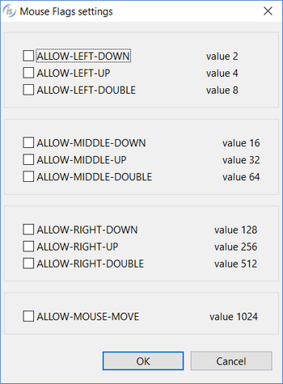

### WINDOW

Refer to [WINDOW](../../../is-cobol-evolve/User-Interface/Controls-Reference/WINDOW/WINDOW) for details about properties, styles and events of this control.

| Properties | |
| --- | --- |
| (name) | Specifies the window name. This property is automatically set as soon as the window is drawn |
| action | Allows you to set the initial state of the window. The choices are as follows: None (default) ACTION-MAXIMIZE ACTION-MAXIMIZE-POSTPONED ACTION-MINIMIZE |
| additional properties | Allows the user to specify additional properties and styles. The text you write here is generated as is and may generate compile errors if not correct. |
| allowing messages | Allows you to set the value for the ALLOWING MESSAGES clause. The choices are as follows: None (default) LAST THREAD ANY THREAD |
| auto fit | TRUE... the background image, if any, is resized to fit the window FALSE... the background image, if any, is not resized |
| auto minimize | TRUE... the AUTO-MINIMIZE style is generated FALSE... the AUTO-MINIMIZE style is not generated |
| auto-resize | TRUE... the AUTO-RESIZE style is generated FALSE... the AUTO-RESIZE style is not generated |
| background-bitmap | Opens a dialog box that allows the user to select an image file to load into the control. |
| background-bitmap-scale | Allows the user to choose if the background-bitmap must be scaled to fit the control area. The Background-Bitmap-Scale property is generated according to this choice. |
| background-color | Opens a dialog that allows the user to choose the window background color.   |
| background image | Allows you to choose a picture that will be used as a background for the window   |
| background intensity | None ... no background intensity clauses are generated in the DISPLAY WINDOW statement LOW... BACKGROUND-LOW is generated in the DISPLAY WINDOW statement HIGH... BACKGROUND-HIGH is generated in the DISPLAY WINDOW statement STANDARD... BACKGROUND-STANDARD is generated in the DISPLAY WINDOW statement |
| before time | Sets the timeout in hundreds of seconds for the Accept on this screen |
| bind to thread | TRUE... The BIND TO THREAD clause is generated FALSE... The BIND TO THREAD clause is not generated |
| boxed | TRUE... The BOXED clause is generated FALSE... The BOXED clause is not generated |
| cell-height | Sets the CELL HEIGHT value |
| cell measure | PIXELS ... the cell size is as expressed in pixels MEASURING CONTROL FONT... the font is used to calculate cell size |
| cell measuring control | None ... nothing is generated LABEL... CELL SIZE IS LABEL FONT is generated ENTRY-FIELD... CELL SIZE IS ENTRY-FIELD FONT is generated |
| cell measuring font | Allows you to choose a font to meausre the cell size:     The dialog lists the fonts installed in the system and allows you to load new fonts from disc files. Fonts loaded from disc are added to the list with an asterisk before their name. When one of these fonts is selected the *Copy Resource* option is enabled and can be activated. Activate the option to include the font disc file in the compiled class or be sure to distribute this file along with your application. |
| cell measuring style | NONE... nothing is generated after CELL SIZE OVERLAPPED... the OVERLAPPED clause is generated after CELL SIZE SEPARATE... the SEPARATE clause is generated after CELL SIZE |
| cell-width | Sets the CELL WIDTH value |
| color | Opens a dialog that allows the user to choose the control color.   |
| control font | Opens a dialog that allows the user to choose the control font.     The dialog lists the fonts installed in the system and allows you to load new fonts from disc files. Fonts loaded from disc are added to the list with an asterisk before their name. When one of these fonts is selected the *Copy Resource* option is enabled and can be activated. Activate the option to include the font disc file in the compiled class or be sure to distribute this file along with your application. |
| controls uncropped | TRUE... The CONTROLS-UNCROPPED clause is generated FALSE... The CONTROLS-UNCROPPED clause is not generated |
| custom-data | Specifies the value for the *Custom-Data* property. |
| enabled | NONE...*Enabled* property is not generated TRUE... *Enabled=1* is generated FALSE...*Enabled=0* is generated |
| erase screen | TRUE... The ERASE clause is generated FALSE... The ERASE clause is not generated |
| foreground-color | Opens a dialog that allows the user to choose the window foreground color.   |
| generate background-bitmap code | Specifies how to render the watermark image.Possible values are: • using background-bitmap-handle property • using Bitmap control   The first value is suitable for windows with some controls inside.The second value is suitable for empty windows. |
| generate display statement | TRUE... The DISPLAY WINDOW statement is generated FALSE... The DISPLAY WINDOW statement is not generated |
| gradient-color-1 | Opens a dialog that allows the user to choose the window gradient start color.   |
| gradient-color-2 | Opens a dialog that allows the user to choose the window gradient end color.   |
| gradient-orientation | Specifies the gradient orientation. Possible values are: None 0: NORTH-TO-SOUTH 1: NORTHEAST-TO-SOUTHWEST 2: EAST-TO-WEST 3: SOUTHEAST-TO-NORTHWEST 4: SOUTH-TO-NORTH 5: SOUTHWEST-TO-NORTHEAST 6: WEST-TO-EAST 7: NORTHWEST-TO-SOUTHEAST |
| graphical | TRUE... The GRAPHICAL clause is generated FALSE... The GRAPHICAL clause is not generated |
| height-in-cells | TRUE... The HEIGHT-IN-CELLSclause is generated FALSE... The HEIGHT-IN-CELLS clause is not generated |
| help-id | Specifies the control *help-id*. |
| icon | Opens a dialog that allows you to choose an image to be used as the window icon:   |
| iwc-dockable | TRUE... The IWC-DOCKABLE style is generated FALSE... The IWC-DOCKABLE style is not generated |
| label-offset | Sets the value for the LABEL-OFFSET property |
| laf-colors | TRUE... The LAF-COLORS style is generated FALSE... The LAF-COLORS style is not generated |
| layout manager | Opens a dialog that allows you to choose which layout manager should be associated to the window. When either LM-SCALE or LM-RESPONSIVE is selected, it’s possible to specify the configuration string. In this dialog you also associate a handle to the layout manager.   |
| lines | Specifies the control height as expressed in cells |
| lines pixels | Specifies the control height as expressed in pixels |
| link to thread | TRUE... The LINK TO THREAD clause is generated FALSE... The LINK TO THREAD clause is not generated |
| lock | TRUE...Locks the control on the Screen Designer so that you cannot move it anymore by dragging it with the mouse. FALSE...You can move the control on the Screen Designer by dragging it with the mouse |
| main menu | Associates a menu bar with the window. The menu must have been drawn on the same screen. |
| max lines | Sets the value for the MAX-LINES property |
| max size | Sets the value for the MAX-SIZE property |
| min lines | Sets the value for the MIN-LINES property |
| min size | Sets the value for the MIN-SIZE property |
| modeless | TRUE... The MODELESS clause is generated FALSE... The MODELESS clause is not generated |
| mouse flags | Opens a dialog that allows you to configure mouse flags   |
| no close | TRUE... The NO-CLOSE clause is generated FALSE... The NO-CLOSE clause is not generated |
| pop up menu | Associates a pop-up menu to the window. The menu must have been drawn on the same screen. |
| resizable | TRUE...RESIZABLE is not generated. FALSE...RESIZABLE is generated. |
| screen column | Specifies the value of *Screen Column* property as expressed in cells. |
| screen column pixels | Specifies the value of *Screen Column* property as expressed in pixels. |
| screen line | Specifies the value of *Screen Line* property as expressed in cells. |
| screen line pixels | Specifies the value of *Screen Line* property as expressed in pixels. |
| scroll | TRUE...*WITH NO SCROLL* is not generated. FALSE...*WITH NO SCROLL* is generated. |
| size | Specifies the window width as expressed in cells. |
| size pixels | Specifies the window width as expressed in pixels. |
| system-menu | TRUE... *WITH SYSTEM MENU* is generated FALSE...*WITH SYSTEM MENU* is not generated |
| title | Specifies the window title |
| title-bar | TRUE... *TITLE-BAR* is generated FALSE...*TITLE-BAR* is not generated |
| undecorated | TRUE... The *UNDECORATED* style is generated FALSE...The *UNDECORATED* style is not generated |
| unit | Allows you to choose the measuing unit. The choices are as follows: CELLS PIXELS |
| upon | Allows you to choose the MDI-PARENT window for the current MDI-CHILD window. |
| user gray | TRUE... *USER GRAY* is not generated FALSE...*USER GRAY* is generated |
| user white | TRUE... *USER WHITE* is not generated FALSE...*USER WHITE* is generated |
| visible | NONE...The *Visible* property is not generated TRUE... *Visible=1* is generated FALSE...*Visible=0* is generated |
| width-in-cells | TRUE... The WIDTH-IN-CELLS clause is generated FALSE... The WIDTH-IN-CELLS clause is not generated |
| window handle | allows you to customize the name of the window handle variable |
| window type | Allows you to choose the window type. The choices are as follows: STANDARD INITIAL INDEPENDENT FLOATING MDI-PARENT MDI-CHILD |
| wrap | TRUE... *NO WRAP* is not generated FALSE...*NO WRAP* is generated |

| Events | |
| --- | --- |
| cmd-activate event | Allows the user to create a paragraph to handle the CMD-ACTIVATE event in the Procedure Division |
| cmd-close event | Allows the user to create a paragraph to handle the CMD-CLOSE event in the Procedure Division |
| msg-close event | Allows the user to create a paragraph to handle the MSG-CLOSE event in the Procedure Division |
| msg-deiconified event | Allows the user to create a paragraph to handle the MSG-DEICONIFIED event in the Procedure Division |
| msg-end-menu event | Allows the user to create a paragraph to handle the MSG-END-MENU event in the Procedure Division |
| msg-iconified event | Allows the user to create a paragraph to handle the MSG-ICONIFIED event in the Procedure Division |
| msg-init-menu event | Allows the user to create a paragraph to handle the MSG-INIT-MENU event in the Procedure Division |
| msg-menu-input event | Allows the user to create a paragraph to handle the MSG-MENU-INPUT event in the Procedure Division |
| ntf-resized event | Allows the user to create a paragraph to handle the NTF-RESIZED event in the Procedure Division |
| other event | Allows the user to create a custom paragraph |

| Exceptions | |
| --- | --- |
| cmd-activate exception | Allows the user to create a paragraph to handle the CMD-ACTIVATE event when the Accept terminates with crt status = 96. This is an alternative to the event procedures described above |
| cmd-close exception | Allows the user to create a paragraph to handle the CMD-CLOSE event when the Accept terminates with crt status = 96. This is an alternative to the event procedures described above |
| ntf-resized exception | Allows the user to create a paragraph to handle the NTF-RESIZED event when the Accept terminates with crt status = 96. This is an alternative to the event procedures described above |
| other exception | Allows the user to create a custom paragraph |

| Procedures | |
| --- | --- |
| After Create | Allows you to create a paragraph that will be executed after the display of the window |
| After InitData | Allows you to create a paragraph that will be executed after opening files and loading resources |
| After procedure | Allows the user to create a paragraph to handle the screen AFTER PROCEDURE |
| After procedure thru | Allows the user to optionally specify a THRU paragraph for the AFTER PROCEDURE. |
| After Routine | Allows you to create a paragraph that will be executed after the Accept on the screen |
| Before Create | Allows you to create a paragraph that will be executed before the display of the window |
| Before InitData | Allows you to create a paragraph that will be executed before opening files and loading resources |
| Before procedure | Allows the user to create a paragraph to handle the screen BEFORE PROCEDURE |
| Before procedure thru | Allows the user to optionally specify a THRU paragraph for the BEFORE PROCEDURE. |
| Before Routine | Allows you to create a paragraph that will be executed before the Accept on the screen |
| Event procedure | Allows the user to create a paragraph to handle the screen EVENT PROCEDURE |
| Exception procedure | Allows the user to create a paragraph to handle the screen EXCEPTION PROCEDURE |
| Link To | Allows the user to create a paragraph that will be executed when an exception occurs in the Accept |

| Variables | |
| --- | --- |
| allowing messages thread | Numeric variable that hosts the handle of the thread whose messages should be received |
| background-bitmap-scale variable | Numeric variable that hosts the value for the *Background-Bitmap-Scale* property |
| background-color variable | Numeric variable that hosts the value for the *Background-Color* property |
| before time variable | Numeric variable that hosts the Accept timeout |
| cell-height variable | Numeric variable that hosts the value for the *Cell Height* property |
| cell-width variable | Numeric variable that hosts the value for the *Cell Width* property |
| color variable | Numeric variable that hosts the color value |
| column variable | Numeric variable that hosts the value for the *Column* property |
| custom-data variable | Alphanumeric variable that hosts the value of the *Custom-Data* property |
| enabled variable | Numeric variable that hosts the enabled state |
| gradient-color-1 variable | Numeric variable that hosts the value for the *Gradient-Color-1* property |
| gradient-color-2 variable | Numeric variable that hosts the value for the *Gradient-Color-2* property |
| gradient-orientation variable | Numeric variable that hosts the value for the *Gradient-Orientation* property |
| lines variable | Numeric variable that hosts the lines value |
| line variable | Numeric variable that hosts the value for the *Line* property |
| max lines variable | Numeric variable that hosts the value for the *Max-Lines* property |
| max size variable | Numeric variable that hosts the value for the *Max-Size* property |
| min lines variable | Numeric variable that hosts the value for the *Min-Lines* property |
| min size variable | Numeric variable that hosts the value for the *Min-Size* property |
| mouse flags variable | Numeric variable that hosts the value for the *Mouse-Flags* property |
| screen column variable | Numeric variable that hosts the value for the *Screen Column* property |
| screen index variable | Numeric variable that hosts the value for the *Screen Index* property |
| screen line variable | Numeric variable that hosts the value for the *Screen Line* property |
| size variable | Numeric variable that hosts the size value |
| title variable | Numeric variable that hosts the value for the *Title* property |
| upon variable | Numeric variable that hosts the handle of the parent window |
| visible variable | Numeric variable that hosts the visible state |
