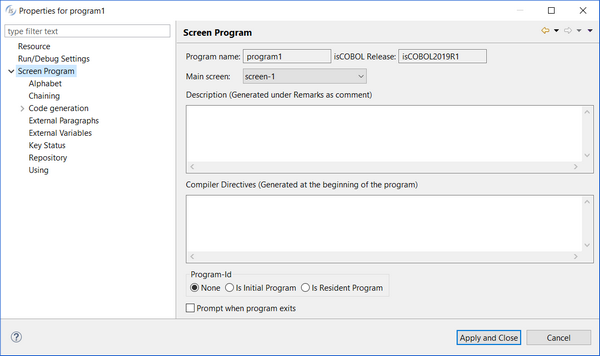
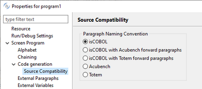
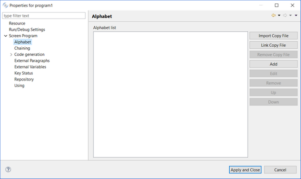
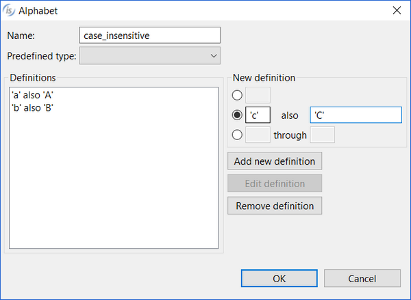

## Screen Program properties

To set Screen Program properties, right click on the program name and choose “Properties” from the pop-up menu. The following panel appears.

From the main screen you can set:

| | |
| --- | --- |
| *Program name* | Name of the program |
| *Main screen* | Initial window |
| *Description* | Comments that are generated in the REMARKS paragraph. |
| *Compiler Directives* | Directives that are generated at the beginning of the source file. See [Compiler Directives](../../is-cobol-evolve/SDK-Users-Guide/Compiler-and-Runtime/Compiler/Compiler-Directives/Compiler-Directives) for the list of available directives. |
| *Program-Id* | Type of program (Resident, Initial, None). |
| *Prompt when program exits* | If set, additional code is generated to handle the program exit. The user will be asked to confirm the closing of the main window. |
| *Chaining* | Provides the list of data items defined in the Working-Storage Section and allows you to choose which ones must be declared in the Procedure Division’s CHAINING clause. The CHAINING clause is generated only if there are no Linkage Section parameters in the USING clause (see below). |
| *Code generation* | Specifies which parts of the source code must be generated. By default, the whole source is generated and these settings are inherited by the general Preferences.   It’s also possible to specify the paragraph naming convention, for compatibility with other COBOLs:  Note - The compatibility is automatically set to ‘Acubench’ or ‘Totem’ when you import programs from these environments. For brand new programs created with the IDE, instead, the compatibility is set to ‘isCOBOL’ by default. The ‘with forward paragraphs’ clause means that the IDE should preserve the original Acubench/Totem paragraph names and link to them instead of replacing them in the generated code. |
| *External Paragraphs* | Provides a list of the paragraphs found in the program and allows you to check the ones that shouldn’t be generated by the IDE. The selected paragraphs are considered external, meaning that they’re externally provided by the user via code editing or copy files. |
| *External Variables* | Provides a list of the variables found in the program and allows you to check the ones that shouldn’t be generated by the IDE. The selected variables are considered external, meaning that they’re externally provided by the user via code editing or copy files. |
| *Key Status* | Specifies the name and the picture of the crt status data-item, as well as some condition names for the most common values. |
| *Repository* | Specifies the program [Repository](./Repository). |
| *Using* | Provides the list of data items defined in the Linkage Section and allows you to choose which ones must be declared in the Procedure Division’s USING clause. |

The *Alphabet* screen allows you to provide alternate collating sequences to the program.

- Click on the *Add* button to add a new alphabet to the list (opens the dialog explained below)
- Click on the *Edit* button to edit the selected alphabet (opens the dialog explained below)
- Click on the *Remove* button to remove the selected alphabet from the list
- Click on the *Up* and *Down* buttons to move the selected alphabet up or down in the list controlling the order alphabets will appear in the program Special-Names

*Add* and *Edit* open a dialog where you can provide the alphabet name and the alphabet definitions. The screenshot below shows a work in progress case insensitive alphabet.

- Provide a name for your alphabet by filling the *Name*: field
- Compile *New Definition* fields and click the *Add new definition* button to add definitions
- Select a definition from the list and click *Edit definition* to modify it or *Remove definitio*n to remove it
