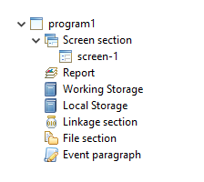

## Screen Program structure

Screen Section contains all the screens of the program. In this section it is possible to maintain the screens by drawing controls and setting their properties.

Report contains print reports. In this section it is possible to maintain the reports layout by drawing controls and setting their properties.

Working Storage contains variables, constants and copybooks that will appear in the program Working-Storage Section.

Linkage Section contains variables, constants and copybooks that will appear in the program’s Linkage Section.

File Section contains FD/SL copybooks that will appear in the program. It also contains datasets that are files created through the IDE, in which FD/SL and I/O procedures will be automatically generated.

Event Paragraph contains the Procedure Division code written by the user. This code will be generated in addition to the code automatically generated by the IDE.
