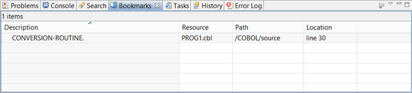

## Bookmarks

The Bookmarks view displays all Bookmarks set in the current Workspace.

To create a new Bookmark, right click on the vertical gray bar at the left of the Code Editor and choose *Add Bookmark*... from the popup menu.

To reach a Bookmark, double click on its row in the view.
