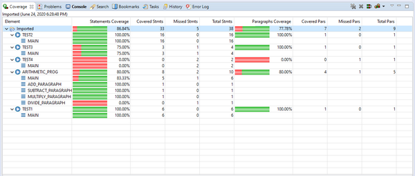
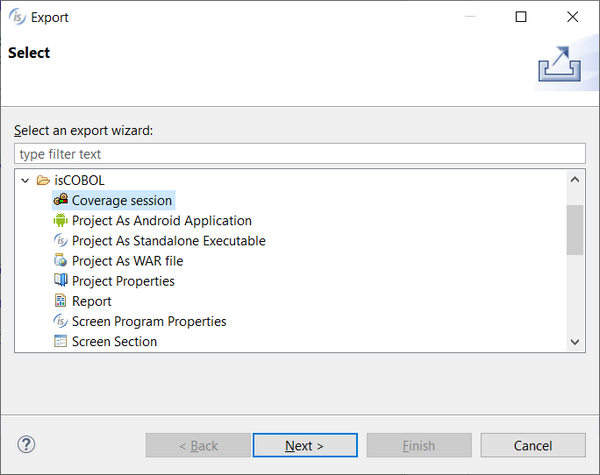
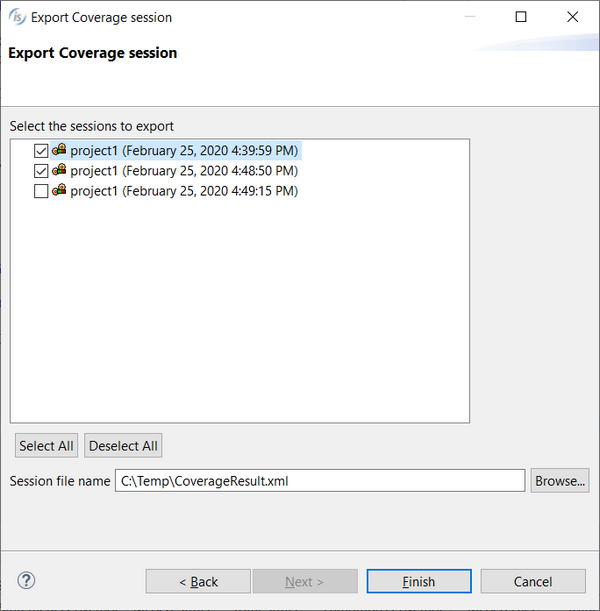
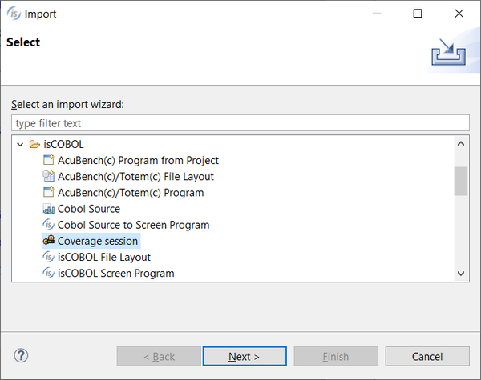
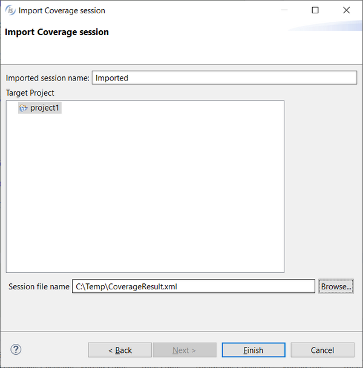

## Coverage

The Coverage view shows the result of a test coverage. See [Running an application with isCOBOL Code Coverage from the IDE](../../is-cobol-evolve/SDK-Users-Guide/Advanced-Features/isCOBOL-Code-Coverage/Running-an-application-with-isCOBOL-Code-Coverage-from-the-IDECoverage-Report) for more information.

The view shows the result of the last covered session by default.

Use the “Select active session” button to switch to another session.

Use the “Merge sessions” button to merge multiple sessions together.

Use the “Remove active session” button to delete the active session.

Use the “Remove all sessions” button to clear the view.

### Import / Export of Coverage sessions

To export Coverage sessions:

1. Click on the *File* menu
2. Choose *Export*
3. Expand *isCOBOL*
4. Choose *Coverage session*

5. Select the sessions that you wish to export
6. Provide the destination file

7. Click *Finish*

To import Coverage sessions:

1. Click on the *File* menu
2. Choose *Import*
3. Expand *isCOBOL*
4. Choose *Coverage session*

5. Provide a name for the imported session
6. Select the destination project
7. Provide the file that includes the sessions to be imported

8. Click *Finish*

The import/export of Coverage sessions is also available in the context menu of the Coverage view.
