### Code Editor

The Code Editor modifies COBOL code as well as other text. COBOL keywords are shown with a different color so they can be easily distinguished from strings, numbers and standard text. The Code Editor also offers a code completion feature and is used as an integrated Debugger.

On the left side of the Code Editor, Bookmarks, Tasks, compiler errors and Debugger breakpoints are shown.

Vertical lines are shown to help you align the code according to the active source format. You can change the active format at any time by right clicking in the editor area and choosing *COBOL Source* from the pop-up menu.

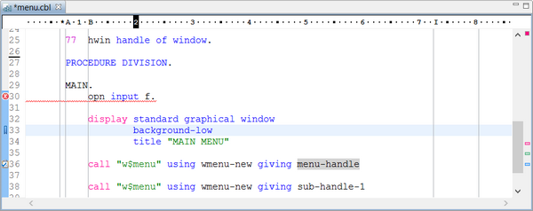

#### Code Completion

In order to take advantage of the code completion feature, you can press Ctrl+Space or right click and select “Code Completion” from the pop-up menu. The Editor will suggest some possible items depending on the context.

For object oriented programming, the code completion is automatic. For example, if you write the name of an object reference, followed by “:>” the Editor will automatically list the object methods along with their javadoc.

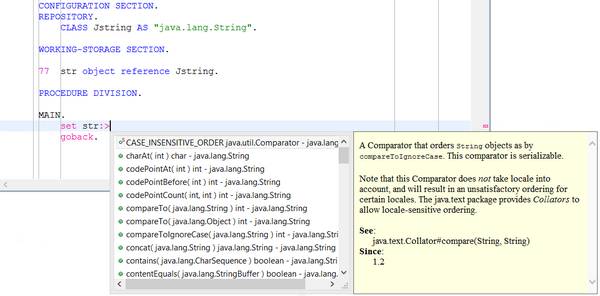

#### Data Items highlight

If you left click on a data-item name, all occurrences of that data-item in the current source file are highlighted.

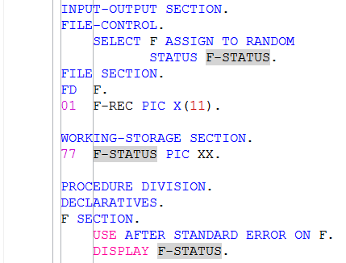

When a data-item has been highlighted, it’s possible to add it to the list of monitored variables in the Debugger perspective. Right click on the item name and select “Add variable” from the pop-up menu.

#### Tooltip items definition

When you leave the mouse pointer on the name of a data item, a tooltip appears and shows the item definition.

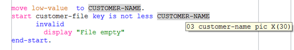

#### Hyperlink to item definition

By leaving the mouse pointer over a paragraph name or a data item name, in addition to the data definition tooltip mentioned above, you get the following feature: the mouse pointer changes to a hand shape and the item name is underlined. By left clicking in that moment, the Editor jumps to the item definition.

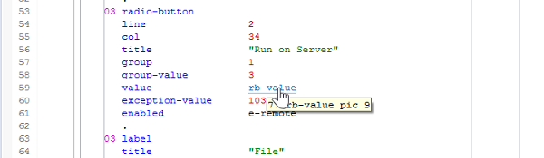

#### Text Selection upon mouse clicks

By multiple clicking within a text string, you can obtain different text selections.

One click places the cursor within the string: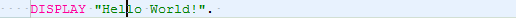

Two clicks among the letters of a word select the whole word: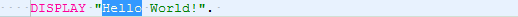

Two clicks between the quotes and the first digit after the quotes select all the quoted text: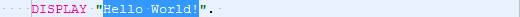

Three clicks select the whole line:

#### Block Selection

This feature allows the user to select a block of code by drawing a rectangle in the source area. This is also known as Rectangle Selection or Vertical Selection. To activate this feature press Alt+Shift+A. The cursor shape will change to a cross and it will be possible to select a block of text like shown in the picture below. To restore the standard cursor and stop taking advantage of the feature, press Alt+Shift+A again.

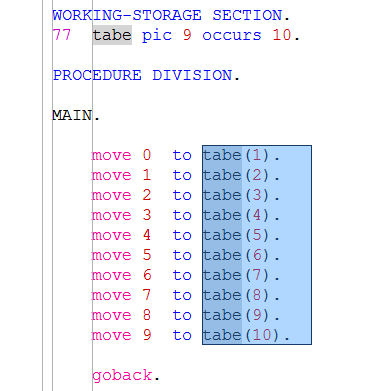

#### Text case altering

When a block of text is selected, you can change the case of its words with one of the following shortcuts.

| | |
| --- | --- |
| CTRL+G | capitalize text |
| CTRL+U | make text lower case |
| CTRL+SHIFT+U | make text upper case |
| | |

The same functions are available in the Source menu.

#### Correct Indentation

When a block of text is selected, you can ask the Editor to correct the indentation of the rows with the following shortcut.

```cobol
CTRL+I
```

The same function is available in the COBOL Source menu.

#### Open Declaration

This feature allows the user to jump to a paragraph or variable declaration. To take advantage of it, select the variable or paragraph name, then press F3 or right click and select “Open Declaration” from the pop-up menu.

The function moves the cursor in the Editor to highlight the line where the item is defined. If you don’t like this behavior, check the option “Open Declaration feature always in a new editor” in Editor’s preferences (see [Setting Editor preferences](../../Configuration/Customization/Setting-Editor-preferences)). In this case, the funcion opens a new Editor with a copy of the source. In the new Editor the cursor is on the item declaration, while in the original editor the cursor is still on the line where the function was invoked.

#### Horizontal Ruler

This feature causes a ruler bar to be shown at the top of the editor. It helps to monitor the cursor position while typing text.

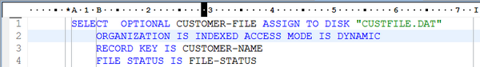

The ruler is not shown by default, it must be activated in the Preferences. See [Setting Editor preferences](../../Configuration/Customization/Setting-Editor-preferences) for details.

#### Find Scope

This feature allows you to highlight a block. This is useful to double check if all blocks are closed correctly in a source file where there are a lot of nested statements. To take advantage of this feature, place the cursor on a statement or on a END-statement.

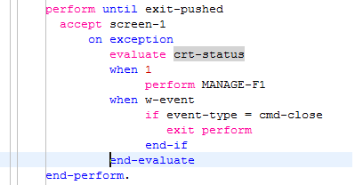

After it, press CTRL+SHIFT+S to highglight the whole block. Alternatively it’s possible to right click and choose *COBOL Source -> Find Scope* from the pop-up menu.

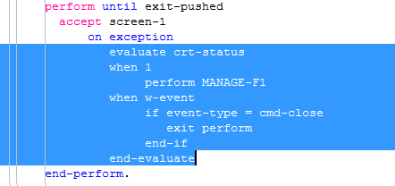

#### Sequence Number

This feature allows you to generate line numbers in the sequence number area (columns 1 to 6) of ANSI source files. To activate it, click on the *COBOL Source* menu in the menu bar or right click in the code editor and choose *COBOL Source* from the pop-up menu, then choose *Sequence Number*. The following dialog is shown allowing to provide line numbering rules.

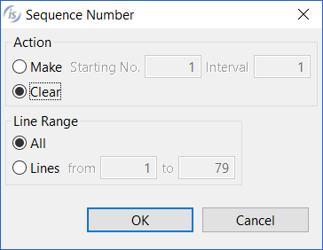

Action allows you to choose between clearing existing line numbers or generating new ones starting from a given number (default: 1) and using a given interval (default: 1).

Line Range allows you to specify which lines in the source file will be updated. By default, all lines are updated.

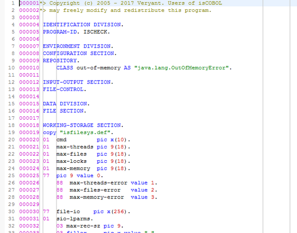

#### List of referenced items

Every time the source file in the Code Editor is automatically or manually compiled, the [Properties](../Properties) view is populated by three lists:

- the list of referenced copybooks
- the list of called programs
- the list of invoked objects

By double clicking on the name of a copybook, the file is opened in a new editor panel.

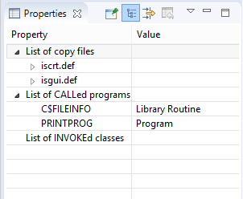

#### Folding and Custom Folding

The Code Editor provides the ability to expand and collapse blocks of code. By default, the Editor creates a block of code for each division, section and paragraph, but it’s also possible to define custom blocks of code. Collapsing blocks of code that you’re not reviewing can improve readability when you’re editing huge source files.

To collapse a block of code, find the icon with a minus symbol (-) in the folding bar, near the line number bar and click it. To expand a block of code, find the icon with a plus symbol (+) in the folding bar, near the line number bar and click it.

When blocks of code are collapsed, the Editor looks like this:

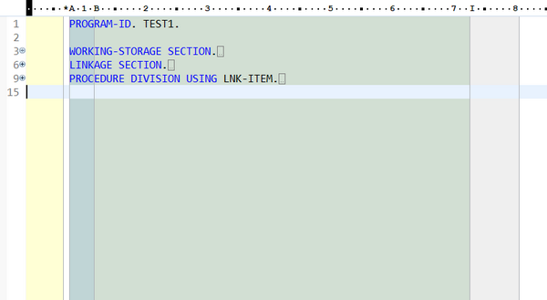

When blocks of code are expanded, the Editor looks like this:

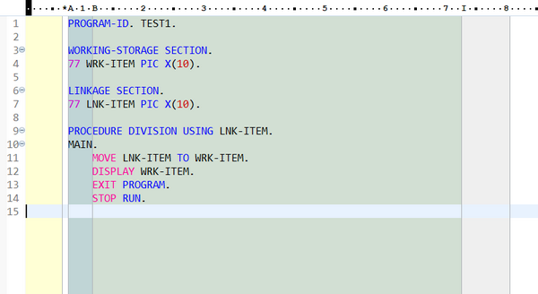

To activate a custom folding

1. select the desired lines of code in the editor,
2. right click on the folding bar, near the line number bar,
3. select “Add custom folding” from the pop-up menu.

Note that it’s not possible to include parts of existing foldings in the custom folding.

The folding feature could be disabled to improve performance. See [Setting Editor preferences](../../Configuration/Customization/Setting-Editor-preferences) for more details.

#### Excluded code highlight

When using the [IF Directive](../../../is-cobol-evolve/SDK-Users-Guide/Compiler-and-Runtime/Compiler/Compiler-Directives/IF-Directive) or the [EVALUATE Directive](../../../is-cobol-evolve/SDK-Users-Guide/Compiler-and-Runtime/Compiler/Compiler-Directives/EVALUATE-Directive), the portions of code that don’t match with the condition are skipped by the compilation process. The Code Editor allows you to easily identify these portions of code by rendering them with monochrome text.

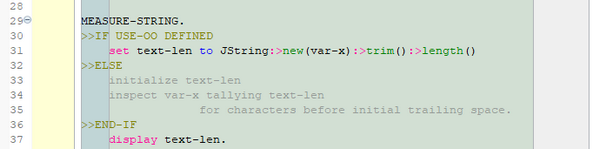
