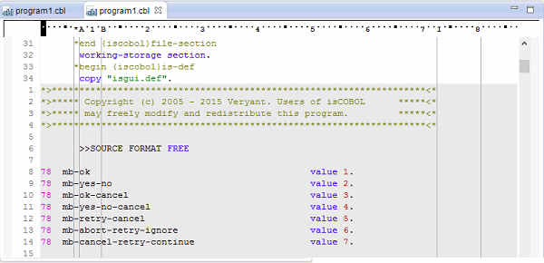

### Copy View Editor

The Copy View Editor allows you to see copybooks content in the same Editor as the source file, without opening them in separate tabs. It is useful to have a COBOL source with the inclusion of all copy files to make a full text search that includes also all used copy files.

To open a cobol file with the expanded editor you have to select it in the source folder, right-click and select *Open With -> isCOBOL Copy View Editor*.

The expanded editor is read-only, but it will reflect the changes of the original sources if they have been done with another eclipse text editor, e.g. with the standard Code Editor.

The lines of the copybooks have a different background and the line number is relative to the original file.

By typing F4, or selecting the *Open isCOBOL Editor* item in the editor's context menu, you can open the standard Code Editor for the file that corresponds to the current line of the Copy View Editor (i.e. the line of the current cursor position).

The copybooks background color can be configured. See [Setting Editor preferences](../../Configuration/Customization/Setting-Editor-preferences) for details.
