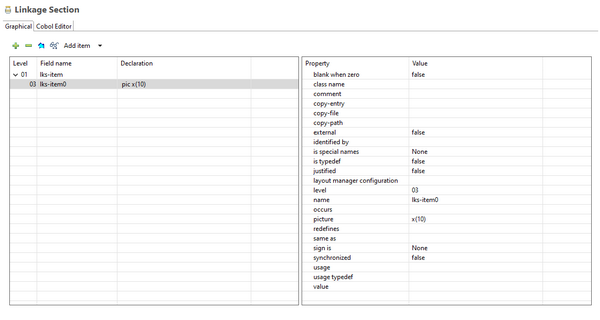

### Linkage Section Designer

The Linkage Section Designer defines data items for the program’s Linkage Section as well as including existing copybooks. The isCOBOL IDE will generate the COBOL code for the program’s Linkage Section.

It’s also possible to write Linkage code by hand, after switching to the *Cobol Editor* page. The code you type here will be generated at the bottom of the Linkage Section of the program.

